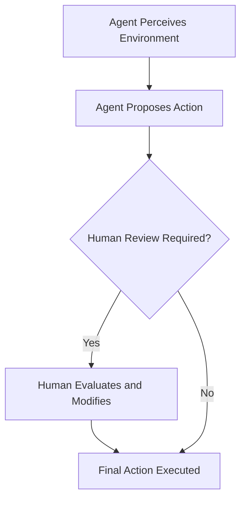
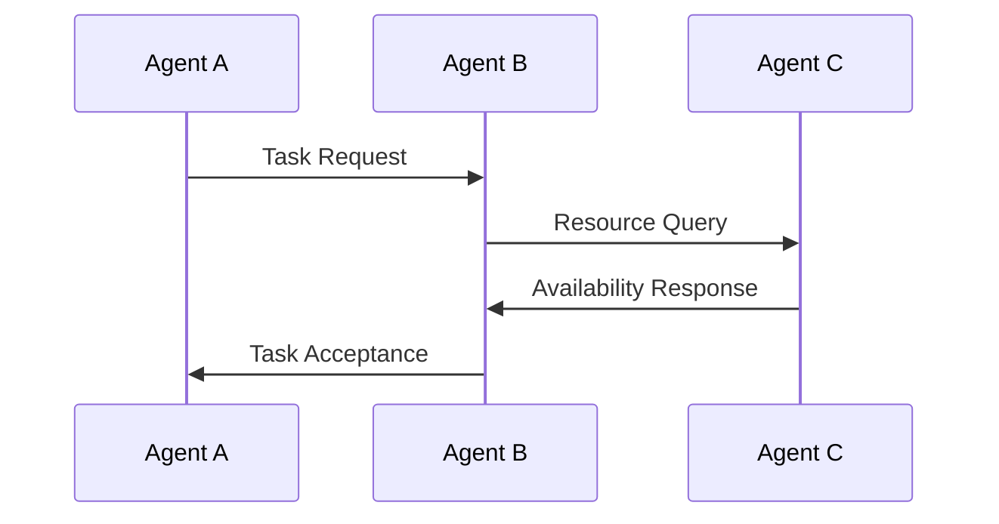
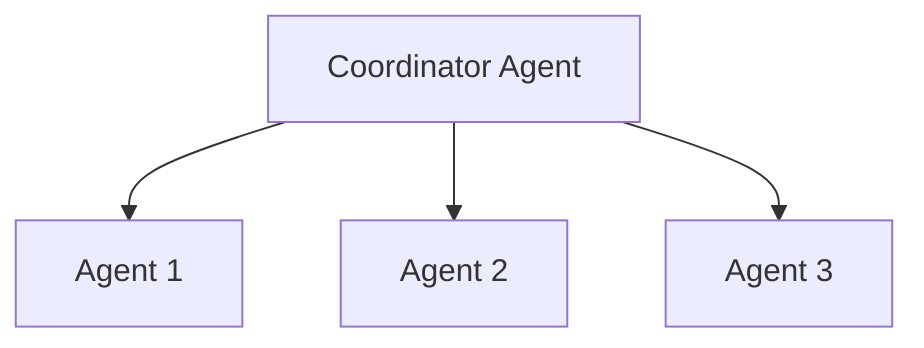
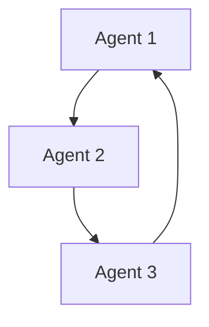
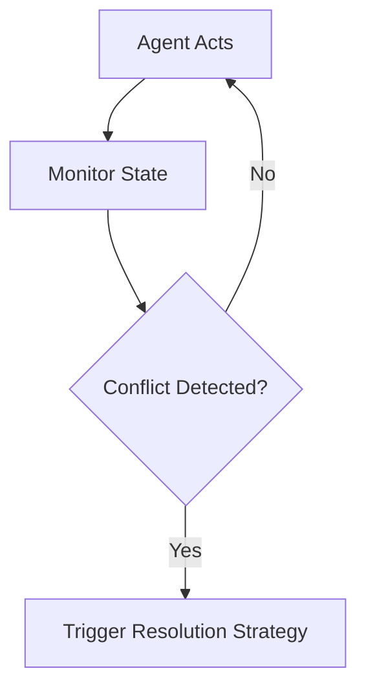
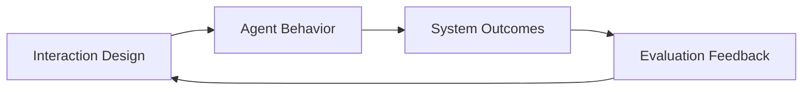

# Designing and Building Agentic Systems: Human-Agent and Agent-Agent Interaction

## Learning Objectives

- Design effective human-agent interaction models
- Analyze coordination strategies in multi-agent systems
- Evaluate interaction quality and system outcomes

---

## Introduction

This chapter examines interaction patterns between agents and humans, as well as coordination among multiple agents in shared environments.

---

---

As agentic systems become more capable and autonomous, their success increasingly depends not only on *what* they can do, but *how* they interact—both with humans and with other agents. An intelligent agent that makes perfect decisions but communicates poorly, ignores human intent, or fails to coordinate with peers can quickly become ineffective or even harmful.

This chapter focuses on **interaction as a first-class design concern** in agentic systems. We explore how humans remain involved in agent decision-making, how agents communicate through structured protocols, and how multiple agents collaborate, negotiate, and resolve conflicts in shared environments. Rather than treating interaction as an afterthought, we treat it as a core system capability that shapes trust, performance, safety, and long-term outcomes.

By the end of this chapter, you will understand not only the *mechanics* of interaction, but also the *design reasoning* behind different interaction patterns—when to use them, why they matter, and how to evaluate whether they are working effectively.

---

By the end of this chapter, you will be able to:

- Design effective **human-agent interaction models** that balance autonomy and oversight  
- Analyze **coordination strategies** used in multi-agent systems  
- Evaluate **interaction quality and system outcomes** using qualitative and quantitative measures  

---

## Human-in-the-Loop Agentic Systems

Human-in-the-loop (HITL) agentic systems are designed with the assumption that **humans remain active participants** in the agent’s decision-making process. Rather than replacing human judgment, these systems augment it by combining computational efficiency with human values, intuition, and contextual understanding.

At a high level, HITL systems acknowledge an important reality: no matter how advanced an agent is, it may lack situational awareness, ethical grounding, or accountability. Humans, on the other hand, can interpret ambiguous situations, apply social norms, and take responsibility for outcomes. Designing HITL systems is therefore not about limiting agents, but about **placing humans at strategically meaningful control points**.

### Why Human-in-the-Loop Matters

Human involvement is especially critical in domains where decisions are:
- **High-risk** (e.g., healthcare, finance, autonomous vehicles)
- **Value-laden** (e.g., hiring, content moderation)
- **Context-sensitive** (e.g., emergency response, legal reasoning)

Consider a medical diagnosis agent. The agent may analyze imaging data faster than a doctor, but a human clinician must:
- Interpret results within a broader patient history
- Weigh ethical trade-offs
- Communicate decisions empathetically to patients

Without a human in the loop, such systems risk being accurate but unsafe, efficient but untrustworthy.

### Patterns of Human Involvement

Human-in-the-loop systems vary based on *when* and *how* humans intervene. These patterns represent different trade-offs between autonomy and control.

| Interaction Pattern | Description | Typical Use Cases | Risk Level |
|--------------------|-------------|------------------|------------|
| Human-in-the-Loop | Human approves or modifies agent decisions | Medical diagnosis, credit approval | Low |
| Human-on-the-Loop | Human monitors and intervenes if needed | Autonomous drones, trading bots | Medium |
| Human-out-of-the-Loop | Agent operates fully autonomously | Recommendation systems | High |

In practice, many systems combine these patterns dynamically. For example, an autonomous vehicle may operate independently under normal conditions but request human intervention during uncertainty.

### Decision Flow in a Human-in-the-Loop System

This flow highlights an important design principle: **human involvement should be conditional and purposeful**, not constant. Excessive human intervention slows systems down, while too little increases risk.

### Designing Effective HITL Interfaces

The success of HITL systems depends heavily on interface design. Poorly designed interfaces can overwhelm humans with information or obscure critical system states.

Effective interfaces should:
- Explain *why* the agent recommends an action (explainability)
- Highlight uncertainty and confidence levels
- Allow easy override or adjustment

| Interface Feature | Purpose | Example |
|------------------|---------|---------|
| Confidence Scores | Signal uncertainty | Risk level indicators |
| Action Rationale | Build trust | “Recommended because…” |
| Override Controls | Maintain human authority | Approve / Reject buttons |

A helpful analogy is a **co-pilot** rather than an autopilot. The agent assists, suggests, and warns—but the human remains accountable.

---

## Communication Protocols and Interfaces

Communication is the backbone of interaction in agentic systems. Whether agents are interacting with humans or with other agents, **clear, structured communication protocols** ensure that information is exchanged accurately, efficiently, and safely.

At its core, a communication protocol defines:
- What messages can be sent
- How messages are structured
- When messages are exchanged
- How misunderstandings are handled

Without well-defined protocols, even intelligent agents may fail to coordinate or interpret intent correctly.

### Human-Agent Communication

Human-agent communication must bridge a significant gap: humans think in natural language and mental models, while agents operate on formal representations and internal states.

Effective human-agent communication interfaces often include:
- Natural language (text or voice)
- Visual dashboards
- Interactive feedback loops

For example, a personal productivity agent might accept natural language commands like *“Reschedule my meetings next week”* while internally translating them into structured actions.

| Communication Mode | Strengths | Limitations |
|-------------------|-----------|-------------|
| Natural Language | Intuitive, flexible | Ambiguity |
| Visual Dashboards | High information density | Learning curve |
| Forms & Controls | Precision | Low flexibility |

Designers must carefully balance **usability and precision**, often combining multiple modes.

### Agent-Agent Communication

When agents communicate with each other, clarity and efficiency take priority over intuitiveness. Agent-agent protocols are typically:
- Machine-readable
- Standardized
- Optimized for speed and reliability

Common approaches include message-passing systems, shared blackboards, and publish-subscribe models.

This sequence shows how agents can coordinate tasks without human involvement, provided the protocol is well-defined.

### Interface Design as Translation

A useful way to think about interfaces is as **translation layers**:
- Human intent → agent commands
- Agent state → human-understandable feedback

| Interface Role | Input | Output |
|---------------|-------|--------|
| Human Interface | Natural language, clicks | Agent goals |
| Agent Interface | Internal state | Explanations, alerts |

When interfaces fail, it is often because this translation is incomplete or misleading.

---

## Collaboration and Negotiation Among Agents

In multi-agent systems, agents rarely operate in isolation. They must collaborate to achieve shared goals, divide labor, and negotiate over limited resources. This introduces challenges similar to those faced by human teams—coordination, trust, and conflict.

Collaboration involves **working together toward a common objective**, while negotiation involves **resolving differing preferences or constraints**.

### Models of Collaboration

There are several common collaboration models in agentic systems:

| Collaboration Model | Description | Example |
|--------------------|-------------|---------|
| Centralized | One agent coordinates others | Master scheduler |
| Decentralized | Agents self-organize | Swarm robotics |
| Hybrid | Mixed control | Smart grids |

Centralized systems are easier to design but less robust. Decentralized systems are more flexible but harder to predict.

The first diagram shows centralized coordination; the second illustrates decentralized peer-to-peer collaboration.

### Negotiation Mechanisms

Negotiation occurs when agents have:
- Competing goals
- Shared resources
- Different priorities

For example, delivery agents may negotiate over delivery routes to minimize overall travel time.

Common negotiation strategies include:
- Rule-based negotiation
- Utility-based optimization
- Auction mechanisms

| Negotiation Strategy | Strength | Weakness |
|---------------------|----------|----------|
| Rule-Based | Predictable | Inflexible |
| Utility-Based | Optimal outcomes | Computationally expensive |
| Auctions | Scalable | Requires valuation models |

Negotiation is not about winning—it is about **reaching stable, acceptable outcomes**.

---

## Conflict Resolution and Coordination

Conflict is inevitable in systems where multiple agents pursue goals simultaneously. Effective agentic systems are not those that avoid conflict, but those that **detect, manage, and resolve conflict gracefully**.

Conflicts may arise due to:
- Resource contention
- Inconsistent beliefs
- Miscommunication

### Conflict Detection

Before resolving a conflict, agents must recognize it. Detection mechanisms include:
- Constraint violations
- Goal incompatibility checks
- Performance degradation signals

### Resolution Strategies

Once detected, conflicts can be resolved in several ways:

| Strategy | Description | Example |
|--------|-------------|---------|
| Priority Rules | Higher-priority agent wins | Emergency override |
| Negotiation | Agents adjust goals | Resource sharing |
| Arbitration | Third agent decides | Traffic control agent |

Choosing the right strategy depends on the domain. Safety-critical systems often favor priority rules, while collaborative environments benefit from negotiation.

### Coordination Mechanisms

Coordination ensures agents’ actions are **aligned over time**. Common mechanisms include:
- Shared plans
- Synchronization points
- Temporal constraints

A helpful analogy is a **sports team**: players follow shared strategies, adapt to teammates’ actions, and resolve conflicts through rules and referees.

---

## Evaluating Interaction Effectiveness

Designing interaction mechanisms is only half the challenge. The other half is **evaluating whether they actually work**. Interaction effectiveness measures how well humans and agents, or agents among themselves, achieve desired outcomes.

### Key Evaluation Dimensions

Interaction effectiveness can be evaluated along multiple dimensions:

| Dimension | Description | Example Metric |
|----------|-------------|----------------|
| Efficiency | Speed and resource use | Task completion time |
| Accuracy | Quality of decisions | Error rate |
| Trust | Human confidence | Survey scores |
| Robustness | Performance under stress | Failure recovery time |

No single metric is sufficient. Effective evaluation combines quantitative data with qualitative insights.

### Human-Centered Evaluation

When humans are involved, subjective experience matters. Important questions include:
- Do users understand the agent’s behavior?
- Do they feel in control?
- Do they trust the system’s recommendations?

Methods include usability testing, interviews, and longitudinal studies.

### System-Level Outcomes

At the system level, evaluation focuses on:
- Overall goal achievement
- Stability under scale
- Emergent behaviors

This feedback loop emphasizes that evaluation is not a one-time activity, but an ongoing design process.

---

## Summary

In this chapter, we explored interaction as a foundational element of agentic system design. We examined how human-in-the-loop systems balance autonomy and oversight, how communication protocols enable meaningful exchange, and how agents collaborate, negotiate, and resolve conflicts in shared environments. Finally, we discussed methods for evaluating interaction effectiveness to ensure systems remain safe, efficient, and trustworthy.

Designing interaction is not merely about interfaces or messages—it is about **shaping relationships** between humans and agents, and among agents themselves. Well-designed interactions lead to systems that are not only intelligent, but also reliable, explainable, and aligned with human goals.

---

## Reflection Questions

1. In which domains should humans always remain in the loop, and why?  
2. How do communication protocols influence trust between agents and humans?  
3. What trade-offs exist between centralized and decentralized coordination?  
4. How can interaction evaluation uncover hidden system risks?  
5. If you were designing a multi-agent system today, which interaction challenges would you prioritize first?

---