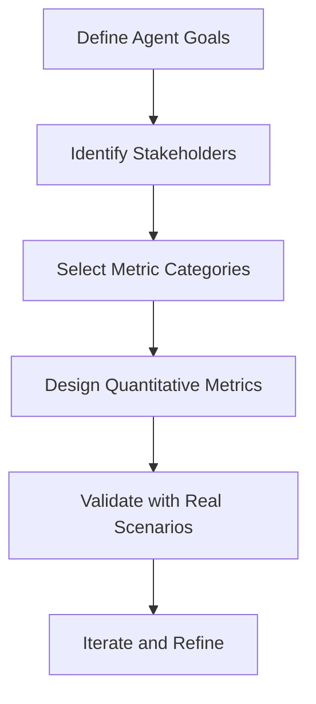
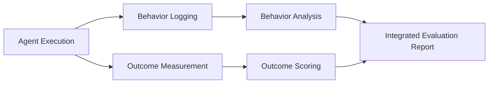
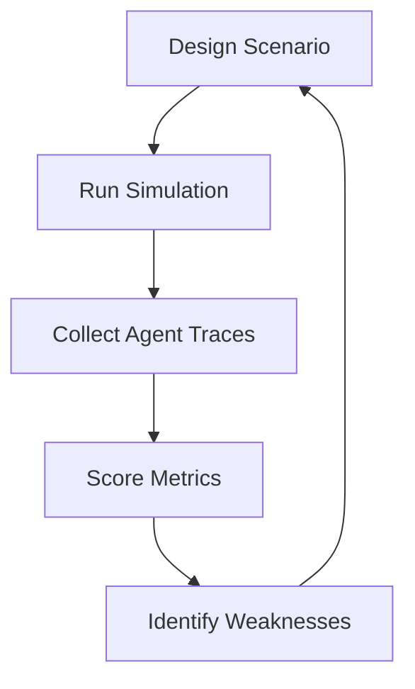
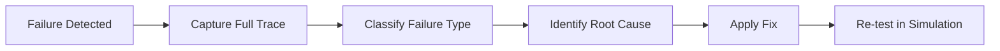
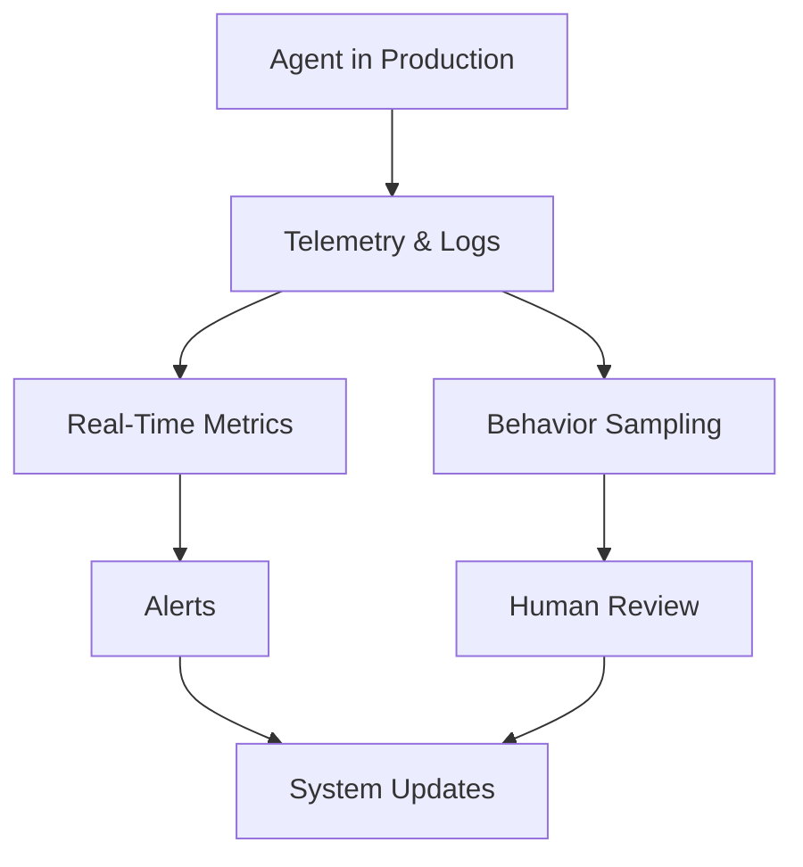

# Operationalizing Agentic AI: Evaluation and Metrics for Agentic Systems

## Learning Objectives

- Define measurable success criteria for agentic systems
- Apply evaluation techniques to assess agent behavior
- Analyze failures to improve system reliability

---

## Introduction

This chapter introduces methods for measuring the effectiveness, reliability, and impact of agentic behavior.

---

---

As agentic AI systems move from research prototypes into real-world products, one critical question consistently arises: **How do we know if an agent is actually doing a good job?** Unlike traditional software systems, agentic systems are autonomous, adaptive, and often operate over extended periods with limited human oversight. They make decisions, set sub-goals, recover from errors, and interact with dynamic environments. This makes evaluation significantly more complex than checking whether a function returns the correct output.

Operationalizing agentic AI requires **clear, reliable, and repeatable evaluation methods**. Without proper metrics and evaluation strategies, organizations risk deploying agents that are inefficient, unsafe, unpredictable, or misaligned with business goals. Evaluation is not just about ranking models—it is about understanding behavior, diagnosing failures, and ensuring long-term reliability.

This chapter introduces a structured approach to **measuring the effectiveness, reliability, and impact of agentic behavior**. You will learn how to define success criteria, evaluate both behaviors and outcomes, simulate challenging environments, analyze failures, and continuously monitor agents in production. By the end of this chapter, you should be able to design evaluation frameworks that turn agentic AI from an experimental capability into a dependable operational system.

---

By the end of this chapter, you will be able to:

- Define **measurable success criteria** tailored to agentic systems  
- Apply **behavioral and outcome-based evaluation techniques**  
- Design **simulations and stress tests** to assess agent robustness  
- Perform **failure analysis and debugging** for autonomous agents  
- Implement **continuous evaluation pipelines** for agents in production  

---

## Defining Success Metrics for Agents

Defining success for an agentic system is fundamentally different from defining success for a static model. Traditional machine learning systems often rely on simple metrics such as accuracy, precision, or loss. In contrast, agentic systems operate over time, pursue goals, and adapt to changing conditions. This means success must be measured **across sequences of actions**, not just single outputs.

A useful mental model is to think of an agent like a human employee rather than a calculator. You would not evaluate an employee solely on one decision; instead, you assess productivity, reliability, adaptability, and alignment with organizational goals. Similarly, agent success metrics must capture **task completion**, **decision quality**, **efficiency**, and **safety**.

### Types of Success Metrics

Agent metrics generally fall into several complementary categories. Each category answers a different question about agent performance.

- **Task-based metrics**: Did the agent achieve its assigned goals?
- **Efficiency metrics**: How quickly and resource-efficiently did it act?
- **Reliability metrics**: How consistently does it succeed under similar conditions?
- **Safety and alignment metrics**: Did it avoid harmful or disallowed actions?
- **Human satisfaction metrics**: Are users satisfied with the agent’s behavior?

These metrics should not be used in isolation. A highly efficient agent that frequently violates constraints is not successful, just as a perfectly safe agent that never completes tasks is not useful.

### Example: Customer Support Agent

Consider an AI agent designed to resolve customer support tickets autonomously.

- Task success: Percentage of tickets resolved without human escalation  
- Efficiency: Average time to resolution  
- Reliability: Variance in performance across different ticket categories  
- Safety: Rate of policy violations or incorrect commitments  
- Satisfaction: Customer feedback scores  

Together, these metrics provide a **multi-dimensional view** of success that reflects real-world expectations.

### Common Agent Metric Categories

| Metric Category | What It Measures | Example Metrics | Why It Matters |
|---------------|-----------------|----------------|----------------|
| Task Success | Goal achievement | Completion rate, success probability | Core effectiveness |
| Efficiency | Resource usage | Time, cost, API calls | Scalability and cost control |
| Reliability | Consistency | Failure rate, variance | Trust and predictability |
| Safety & Alignment | Constraint adherence | Policy violations | Risk reduction |
| Human Feedback | User perception | Ratings, complaints | Adoption and trust |

### Metric Definition Workflow

Defining metrics is not a one-time activity. As agents evolve, new behaviors emerge, and metrics must be refined to capture what truly matters.

---

## Behavioral and Outcome-Based Evaluation

Evaluating agentic systems requires looking at both **what the agent does** and **what the agent achieves**. These are related but distinct perspectives. An agent may achieve the correct outcome through undesirable behavior (e.g., excessive retries), or behave elegantly while failing to complete the task.

Behavioral evaluation focuses on **decision-making processes, action sequences, and policy adherence**. Outcome-based evaluation focuses on **end results and measurable impact**. Effective evaluation frameworks balance both.

### Behavioral Evaluation: Understanding the “How”

Behavioral evaluation examines the internal and external actions taken by an agent over time. This is especially important for debugging, safety assurance, and compliance.

Key behavioral aspects include:

- Action selection patterns  
- Tool usage correctness  
- Adherence to constraints and policies  
- Recovery from errors or unexpected states  

For example, a planning agent that frequently replans unnecessarily may still succeed but wastes resources and introduces risk.

### Outcome-Based Evaluation: Measuring the “What”

Outcome-based evaluation answers simpler but critical questions: Did the agent achieve its goal? Did it produce value?

Outcome metrics are often easier to quantify and communicate to stakeholders, but they may obscure underlying issues. A system that succeeds 95% of the time may still have unacceptable failure modes hidden in the remaining 5%.

### Behavioral vs Outcome Comparison

| Aspect | Behavioral Evaluation | Outcome-Based Evaluation |
|------|----------------------|--------------------------|
| Focus | Process and actions | Final results |
| Visibility | High (detailed logs) | Medium to low |
| Debugging Value | Very high | Limited |
| Stakeholder Appeal | Medium | High |
| Safety Insights | Strong | Weak |

### Combined Evaluation Pipeline

### Case Study: Autonomous Research Agent

An autonomous research agent tasked with summarizing scientific papers may achieve accurate summaries (outcome success) but exhibit poor behavior such as:

- Excessive web searches  
- Ignoring citation guidelines  
- Redundant tool calls  

Behavioral evaluation identifies inefficiencies and risks, while outcome evaluation confirms usefulness. Together, they guide targeted improvements.

---

## Simulation and Stress Testing

Agentic systems often fail not under normal conditions, but under **edge cases, rare events, or adversarial environments**. Simulation and stress testing allow teams to expose agents to controlled yet challenging scenarios before deployment.

Simulation provides a safe, repeatable environment where agents can be evaluated at scale. Stress testing intentionally pushes agents beyond expected operating conditions to reveal brittleness.

### Why Simulation Matters for Agents

Real-world deployment is expensive and risky. Simulation enables:

- Rapid experimentation  
- Safe failure exploration  
- Reproducible evaluations  
- Coverage of rare but critical scenarios  

For agentic systems, simulation is particularly valuable because behavior emerges over time and across interactions.

### Types of Simulation Environments

- **Deterministic simulations**: Same input always yields same outcome  
- **Stochastic simulations**: Randomness introduces variability  
- **Adversarial simulations**: Environment actively challenges the agent  
- **Multi-agent simulations**: Agents interact with other agents  

### Stress Testing Dimensions

| Stress Dimension | Example | What It Reveals |
|-----------------|---------|-----------------|
| Scale | 10× workload | Performance degradation |
| Noise | Corrupted inputs | Robustness |
| Latency | Delayed tools | Planning resilience |
| Resource Limits | API quotas | Graceful degradation |

### Simulation-Based Evaluation Loop

### Example: Logistics Planning Agent

A logistics agent may perform well under normal demand but fail when:

- Delivery times fluctuate  
- Inventory data is partially missing  
- Multiple objectives conflict  

Stress testing these conditions in simulation reveals whether the agent can adapt or collapses under pressure.

---

## Failure Analysis and Debugging

Failures in agentic systems are inevitable. What differentiates robust systems from fragile ones is the ability to **understand, categorize, and fix failures systematically**. Failure analysis turns unexpected behavior into actionable insights.

Unlike traditional bugs, agent failures often involve **chains of decisions**, making root cause analysis more complex. Logs, traces, and intermediate reasoning steps become essential tools.

### Common Failure Modes in Agentic Systems

- Goal misinterpretation  
- Tool misuse or overuse  
- Infinite loops or oscillations  
- Unsafe or policy-violating actions  
- Overconfidence in uncertain situations  

Each failure mode requires a different debugging strategy.

### Structured Failure Analysis Approach

### Failure Classification Table

| Failure Type | Symptom | Likely Cause | Typical Fix |
|-------------|---------|--------------|-------------|
| Planning Failure | Wrong action order | Poor reward shaping | Adjust planning heuristics |
| Tool Failure | Incorrect API use | Ambiguous tool schema | Improve tool descriptions |
| Safety Failure | Policy violation | Missing constraints | Add guardrails |
| Efficiency Failure | Excessive steps | Weak termination criteria | Add stop conditions |

### Example: Debugging a Sales Agent

A sales outreach agent repeatedly contacts the same customer despite a “do not contact” flag. Failure analysis reveals:

- The agent read the flag but did not prioritize it  
- Safety constraints were advisory, not enforced  

The fix involved converting soft constraints into hard blocking rules and retraining with explicit negative examples.

---

## Continuous Evaluation in Production

Evaluation does not stop at deployment. In fact, production environments often reveal behaviors that were impossible to predict during development. Continuous evaluation ensures that agentic systems remain **reliable, aligned, and effective over time**.

Agents may drift due to:

- Changing user behavior  
- New data distributions  
- Tool updates  
- Model upgrades  

Without continuous monitoring, these changes can silently degrade performance.

### Key Components of Continuous Evaluation

- **Live metrics dashboards**  
- **Behavior sampling and audits**  
- **Automated alerts for anomalies**  
- **Human-in-the-loop review processes**  

### Offline vs Online Evaluation

| Dimension | Offline Evaluation | Online Evaluation |
|---------|-------------------|------------------|
| Timing | Before deployment | During operation |
| Data | Historical | Live |
| Risk | Low | High |
| Coverage | Limited scenarios | Real-world complexity |

### Continuous Evaluation Architecture

### Example: Continuous Monitoring for a Financial Agent

A financial planning agent is continuously monitored for:

- Recommendation accuracy  
- Regulatory compliance  
- User complaints  

When anomaly thresholds are crossed, the system automatically flags cases for human review, preventing systemic risk.

---

## Summary

Operationalizing agentic AI requires moving beyond intuition and anecdotal success stories toward **rigorous, multi-dimensional evaluation frameworks**. In this chapter, we explored how to define success metrics tailored to autonomous agents, balancing task outcomes with behavioral quality.

We examined the importance of combining behavioral and outcome-based evaluation, using simulations and stress testing to uncover hidden weaknesses, and applying structured failure analysis to improve reliability. Finally, we emphasized that evaluation is an ongoing process, requiring continuous monitoring and adaptation in production environments.

Together, these practices transform agentic AI from experimental systems into **trustworthy, scalable, and maintainable operational solutions**.

---

## Reflection Questions

1. How would you define success differently for an agent that operates autonomously for months versus one that performs short tasks?  
2. What risks arise when organizations rely only on outcome-based metrics for agent evaluation?  
3. How might simulation environments introduce blind spots, and how can they be mitigated?  
4. Which failure modes do you think are hardest to detect in production, and why?  
5. How would continuous evaluation change the way teams deploy and update agentic systems?

---