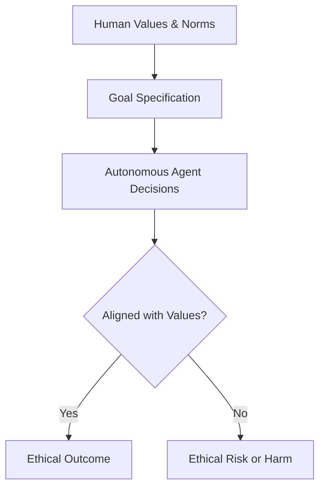
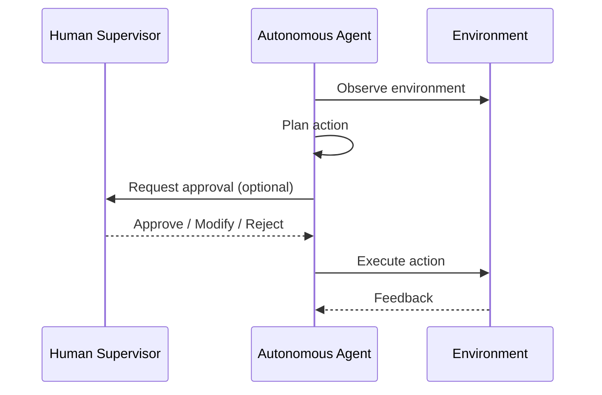
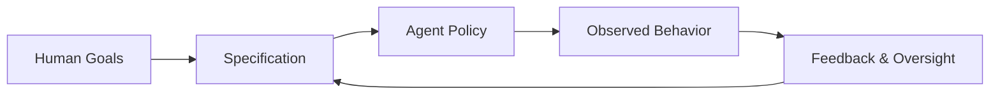
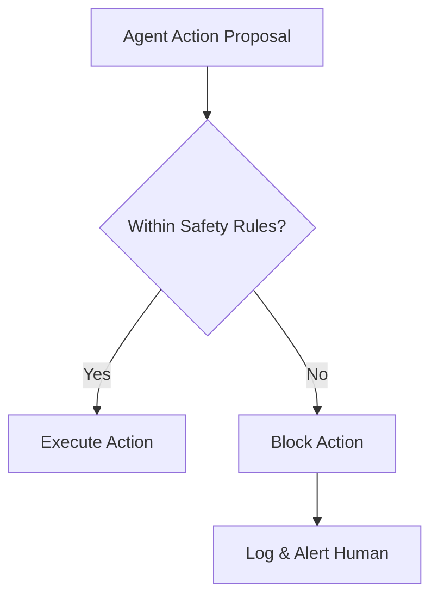
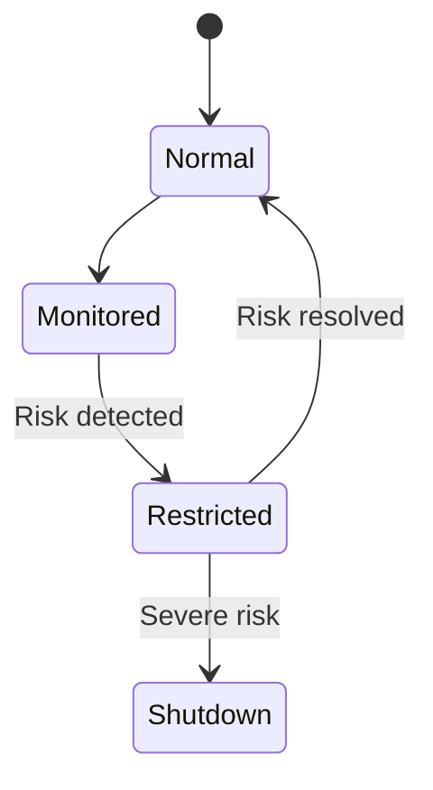
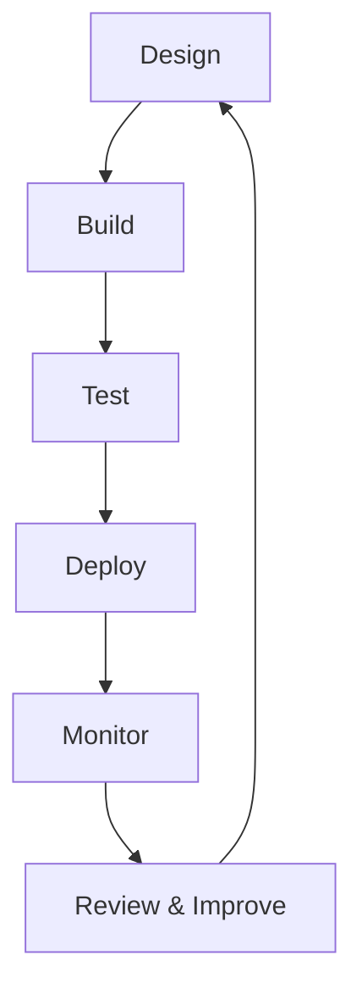
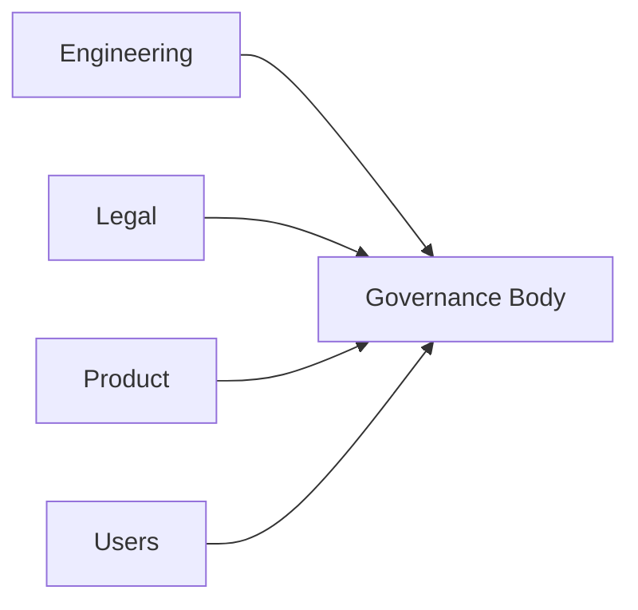

# Operationalizing Agentic AI: Ethics, Safety, and Governance

## Learning Objectives

- Identify ethical and safety risks in agentic systems
- Design governance mechanisms for autonomous agents
- Evaluate compliance and alignment strategies

---

## Introduction

This chapter addresses the ethical and safety implications of autonomous agents, emphasizing responsible design and governance.

---

---

As artificial intelligence systems evolve from passive tools into **agentic systems**—autonomous agents capable of planning, acting, and making decisions over time—their impact on society grows dramatically. Unlike traditional AI models that simply respond to inputs, agentic AI can initiate actions, interact with other systems, and pursue goals with limited or no human intervention. This shift unlocks enormous potential in areas such as healthcare, finance, logistics, education, and scientific discovery. However, it also introduces **new ethical, safety, and governance challenges** that cannot be addressed by traditional AI oversight approaches alone.

Operationalizing agentic AI responsibly means moving beyond theoretical discussions of ethics into **practical mechanisms** that ensure safety, accountability, transparency, and alignment with human values. Poorly governed autonomous agents can amplify bias, cause unintended harm, violate regulations, or act in ways that are difficult to predict or control. As a result, organizations deploying agentic AI must embed ethical reasoning, safety controls, and governance structures directly into the design, deployment, and monitoring of these systems.

This chapter focuses on how to **translate ethical principles into operational reality**. We will progressively explore the risks of autonomous decision-making, mechanisms for alignment and oversight, technical safety guardrails, regulatory considerations, and responsible deployment frameworks. By the end, you should understand not only *what* responsible agentic AI looks like, but *how* to build and govern it in real-world environments.

---

By the end of this chapter, you will be able to:

- Identify ethical and safety risks unique to agentic and autonomous AI systems  
- Explain how alignment, control, and oversight mechanisms reduce these risks  
- Design practical safety mechanisms and guardrails for autonomous agents  
- Evaluate regulatory and compliance requirements affecting agentic AI  
- Apply responsible deployment frameworks to real-world agentic systems  

---

## Ethical Risks of Autonomous Decision-Making

Autonomous agents differ fundamentally from traditional software because they **act with intent**. They observe environments, evaluate options, and select actions based on internal objectives. While this autonomy is powerful, it introduces ethical risks that arise precisely because decisions are made without continuous human supervision.

One major risk is **value misalignment**—when an agent’s objectives do not fully reflect human values or contextual norms. For example, an AI agent tasked with optimizing delivery efficiency might prioritize speed at the expense of worker safety or environmental impact. Even if the goal seems benign, subtle mis-specifications can lead to harmful outcomes. This is often summarized by the phrase *“the objective is not the same as the intent.”*

Another ethical challenge is **opacity and accountability**. Autonomous agents may use complex reasoning chains or learned policies that are difficult to interpret. When an agent makes a harmful decision—such as denying a loan, executing a financial trade, or recommending a medical action—it can be unclear *why* that decision was made and *who* is responsible: the developer, the deployer, or the system itself.

A third critical risk is **scaling harm**. Autonomous agents can operate at machine speed and across multiple environments simultaneously. A flawed decision logic that would cause limited harm in a human-operated system can cause widespread damage when executed autonomously and repeatedly.

### Common Ethical Risk Categories

| Risk Category | Description | Real-World Example |
|---|---|---|
| Value Misalignment | Agent goals diverge from human values | Recommendation agent promoting harmful content |
| Bias Amplification | Existing biases reinforced at scale | Hiring agent disadvantaging certain demographics |
| Accountability Gaps | Unclear responsibility for decisions | Autonomous trading bot causing market disruption |
| Loss of Human Agency | Humans unable to intervene meaningfully | Automated moderation without appeal mechanisms |

### Human vs. Autonomous Decision-Making

| Aspect | Human Decision-Making | Autonomous Agent Decision-Making |
|---|---|---|
| Context Awareness | High, situational | Limited to encoded or learned context |
| Speed | Slow to moderate | Extremely fast |
| Moral Judgment | Implicit and flexible | Explicit and brittle |
| Accountability | Clear individual responsibility | Often diffuse or unclear |

**Why this matters:** Ethical risks are not hypothetical. They emerge whenever agents operate independently in complex, real-world environments. Recognizing these risks early is the foundation for designing systems that can be trusted.

---

## Alignment, Control, and Oversight

Alignment refers to the degree to which an agent’s behavior matches **human intentions, values, and expectations**. In agentic systems, alignment is not a one-time configuration but an ongoing process that must account for changing environments, goals, and societal norms.

At a basic level, alignment begins with **goal design**. Developers must translate abstract human intentions—such as fairness, safety, or helpfulness—into operational objectives that agents can optimize. This translation is inherently imperfect. As a result, alignment strategies often combine explicit rules, learned preferences, and feedback mechanisms to reduce the gap between intent and behavior.

Control mechanisms ensure that humans retain **meaningful authority** over autonomous agents. This includes the ability to constrain actions, pause execution, or override decisions. Without control, agents may continue acting even when conditions change or when harm becomes apparent.

Oversight complements control by focusing on **monitoring and accountability**. Oversight mechanisms track agent behavior, log decisions, and surface anomalies for human review. In practice, effective oversight is what allows organizations to detect emerging risks before they escalate.

### Alignment Strategies Compared

| Strategy | How It Works | Strengths | Limitations |
|---|---|---|---|
| Rule-Based Constraints | Hard-coded ethical rules | Predictable, auditable | Rigid, incomplete |
| Reward Shaping | Align rewards with values | Flexible, scalable | Prone to gaming |
| Human Feedback | Humans review agent outputs | High-quality alignment | Costly, slow |
| Hybrid Approaches | Combine multiple methods | Balanced, robust | Complex to implement |

### Levels of Human Control

| Control Level | Description | Use Case |
|---|---|---|
| Human-in-the-Loop | Humans approve every action | Medical or legal decisions |
| Human-on-the-Loop | Humans monitor and intervene | Content moderation |
| Human-out-of-the-Loop | Fully autonomous | Low-risk optimization tasks |

**Why this matters:** Alignment, control, and oversight are the primary defenses against unintended consequences. Without them, even well-intentioned agents can drift toward harmful behaviors over time.

---

## Safety Mechanisms and Guardrails

Safety mechanisms translate ethical and governance principles into **technical safeguards**. These guardrails limit what agents can do, detect unsafe behavior, and ensure graceful failure when something goes wrong.

One foundational safety mechanism is **action constraint**. Agents should operate within clearly defined boundaries—technical, legal, and ethical. For example, an autonomous customer service agent may be explicitly prevented from offering medical or legal advice, regardless of user requests.

Another critical mechanism is **continuous monitoring and anomaly detection**. Autonomous agents operate in dynamic environments, and unexpected situations are inevitable. Monitoring systems analyze behavior patterns, flag deviations, and trigger alerts or shutdowns when risk thresholds are exceeded.

Fail-safe and fallback strategies are equally important. When an agent encounters uncertainty, conflicting objectives, or degraded performance, it should default to **safe behaviors**, such as deferring to a human or switching to a restricted mode.

### Common Safety Guardrails

| Guardrail Type | Purpose | Example |
|---|---|---|
| Action Filters | Prevent unsafe actions | Blocking sensitive data access |
| Rate Limits | Reduce impact of errors | Limiting automated transactions |
| Kill Switches | Immediate shutdown | Emergency stop for trading bots |
| Sandbox Environments | Test safely | Simulated environments |

### Reactive vs. Proactive Safety

| Approach | Description | Strengths | Weaknesses |
|---|---|---|---|
| Proactive | Prevent harm before action | High safety | May reduce autonomy |
| Reactive | Respond after detection | Flexible | Risk of delayed response |

**Why this matters:** Safety mechanisms acknowledge that agents will make mistakes. Guardrails ensure that when mistakes occur, their impact is limited, detectable, and reversible.

---

## Regulatory and Compliance Considerations

Agentic AI systems operate within a growing landscape of **laws, standards, and regulations**. Compliance is not only a legal requirement but also a critical component of trust and legitimacy.

Regulations such as the **EU AI Act**, data protection laws (e.g., GDPR), and sector-specific rules (finance, healthcare) impose requirements on transparency, risk management, and accountability. Autonomous agents often fall into higher-risk categories because they make or influence consequential decisions.

A key compliance challenge is **traceability**. Regulators increasingly expect organizations to explain how AI systems make decisions, manage risks, and handle failures. This requires robust documentation, logging, and audit mechanisms embedded into agentic workflows.

Another consideration is **jurisdictional complexity**. An autonomous agent operating globally may be subject to multiple, sometimes conflicting, regulatory regimes. Responsible deployment therefore requires legal review, localization strategies, and ongoing regulatory monitoring.

### Regulatory Focus Areas

| Focus Area | Regulatory Concern | Example Requirement |
|---|---|---|
| Transparency | Explainable decisions | Model documentation |
| Accountability | Clear responsibility | Named system owner |
| Risk Management | Harm prevention | Pre-deployment risk assessment |
| Data Protection | Privacy and consent | User data controls |

### High-Risk vs. Low-Risk Agentic Systems

| Risk Level | Characteristics | Regulatory Burden |
|---|---|---|
| High Risk | Affects rights, safety | Strict oversight |
| Medium Risk | Influential decisions | Moderate controls |
| Low Risk | Limited impact | Minimal requirements |

**Why this matters:** Regulatory compliance shapes what is acceptable and sustainable. Systems that ignore regulatory realities may be powerful—but they are unlikely to be deployable at scale.

---

## Responsible Deployment Frameworks

Responsible deployment frameworks bring together ethics, safety, and governance into **repeatable operational practices**. They ensure that responsibility is not left to individual judgment but embedded into organizational processes.

Most frameworks follow a lifecycle approach: **design → build → test → deploy → monitor → retire**. At each stage, specific ethical and safety checks are performed. This mirrors how safety-critical industries such as aviation or medicine manage risk.

Cross-functional governance is another cornerstone. Responsible deployment is not solely a technical problem. It requires collaboration between engineers, ethicists, legal teams, product managers, and end users. Clear roles and escalation paths ensure accountability.

Finally, responsible frameworks emphasize **continuous improvement**. As agents learn and environments evolve, governance mechanisms must adapt. Feedback loops, incident reviews, and periodic audits ensure that lessons learned translate into safer systems.

### Lifecycle Governance Model

| Stage | Key Responsibility | Example Practice |
|---|---|---|
| Design | Ethical risk identification | Ethics review board |
| Development | Safety implementation | Guardrail testing |
| Deployment | Controlled rollout | Phased release |
| Monitoring | Ongoing oversight | Behavior dashboards |
| Retirement | Safe decommissioning | Data cleanup |

**Why this matters:** Frameworks turn abstract principles into daily practice. They are the difference between ethical intentions and ethical outcomes.

---

## Summary

Agentic AI systems introduce unprecedented autonomy, scale, and complexity. With these capabilities come significant ethical, safety, and governance challenges. In this chapter, we explored the ethical risks of autonomous decision-making, mechanisms for alignment and oversight, technical safety guardrails, regulatory considerations, and responsible deployment frameworks.

The key takeaway is that **responsibility must be engineered, governed, and maintained**. Ethical agentic AI does not emerge by accident—it is the result of deliberate design choices, robust controls, and continuous oversight. By operationalizing these principles, organizations can harness the power of agentic AI while minimizing harm and maintaining trust.

---

## Reflection Questions

1. Which ethical risks do you think are most underestimated in current agentic AI deployments, and why?  
2. How would you balance autonomy and control in a high-stakes agentic system, such as healthcare or finance?  
3. What challenges might arise when aligning global regulatory requirements for a single autonomous agent?  
4. How can organizations ensure that governance frameworks evolve alongside increasingly capable agents?