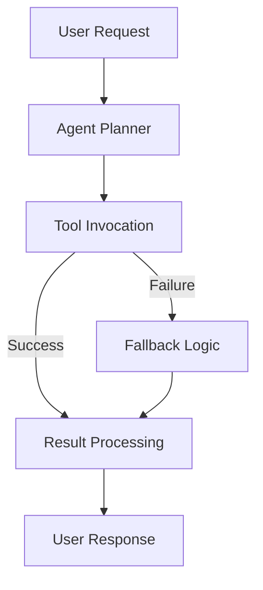
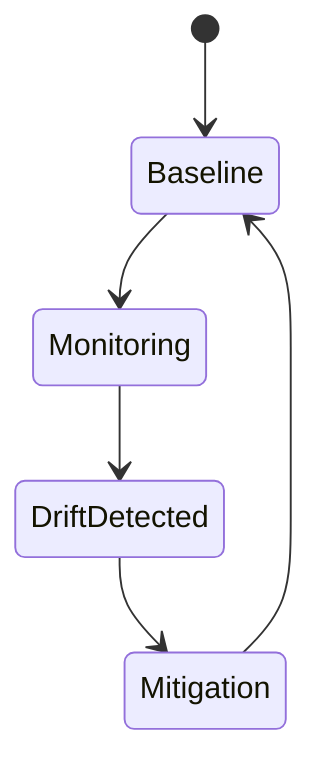
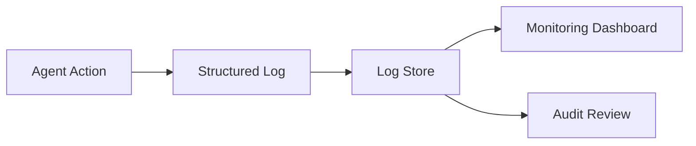
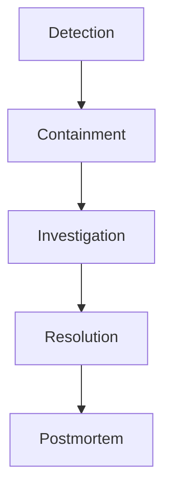
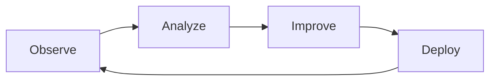

# Operationalizing Agentic AI: Operational Best Practices

## Learning Objectives

- Apply best practices to maintain stable agentic systems
- Detect and mitigate performance degradation
- Establish continuous improvement processes

---

## Introduction

This chapter consolidates best practices derived from real-world deployments, focusing on reliability, maintainability, and trust.

---

---

Building an agentic AI system is only the beginning of the journey. While prototypes often work well in controlled environments, real-world deployment introduces complexity, uncertainty, and risk. Agentic systems operate continuously, make autonomous decisions, interact with external tools, and evolve over time. Without strong operational practices, even well-designed agents can become unreliable, unsafe, or untrustworthy.

This chapter focuses on **operationalizing agentic AI**—turning intelligent agents into dependable, maintainable, and auditable systems that organizations can trust. Rather than emphasizing model architecture or prompt design, we concentrate on **how agents behave in production over time**. We draw on lessons from real-world deployments to highlight best practices that improve reliability, resilience, and long-term value.

You will learn how to design for failure, detect and manage agent drift, establish strong logging and transparency, respond effectively to incidents, and implement continuous improvement cycles. Think of this chapter as an operational playbook: it helps ensure that agentic AI systems remain useful not just today, but months and years into the future.

---

By the end of this chapter, you will be able to:

- Apply operational best practices to maintain stable and resilient agentic systems  
- Detect, diagnose, and mitigate agent performance degradation and drift  
- Design logging, auditing, and transparency mechanisms for trust and compliance  
- Implement effective incident response and rollback strategies  
- Establish continuous improvement cycles for long-term agent evolution  

---

## Design for Reliability and Resilience

Reliability is the foundation of any production system. For agentic AI, reliability means that agents consistently perform their intended tasks, handle failures gracefully, and recover quickly when things go wrong. Resilience goes a step further—it is the system’s ability to adapt and continue operating under stress, unexpected inputs, or partial outages.

Unlike traditional software, agentic systems rely on probabilistic models, external APIs, and dynamic environments. This makes failures inevitable rather than exceptional. Designing for reliability is not about preventing all failures, but about **anticipating failure and minimizing its impact**.

### Core Principles of Reliable Agent Design

At a high level, reliable agentic systems share a few core design principles:

- **Fail-safe defaults**: When uncertain, agents should choose the safest possible action  
- **Graceful degradation**: Partial functionality is better than total failure  
- **Redundancy**: Critical components should not have single points of failure  
- **Observability**: System behavior must be visible and measurable  

A useful analogy is aviation. Planes are designed with the assumption that components will fail. Redundant systems, clear procedures, and continuous monitoring ensure that failure does not automatically lead to disaster.

### Architectural Patterns for Resilience

Agentic systems often consist of multiple interacting components: planners, executors, memory stores, tools, and external services. Resilience depends on how these components are connected.

**Common resilience patterns include:**

- Circuit breakers to stop repeated failing calls to tools or APIs  
- Timeouts and retries with exponential backoff  
- Sandboxed execution environments for risky actions  
- Health checks for agent subcomponents  

The table below compares fragile versus resilient agent architectures:

| Aspect | Fragile Architecture | Resilient Architecture |
|---|---|---|
| Error handling | Errors propagate unchecked | Errors are caught and handled |
| External tools | Hard dependency | Fallback strategies |
| State management | Implicit, hidden | Explicit, recoverable |
| Monitoring | Minimal or none | Continuous and granular |

### Example: Customer Support Agent

Consider a customer support agent that retrieves order data from an external API. In a fragile design, if the API fails, the agent crashes or returns nonsense. In a resilient design:

- The agent detects the failure  
- Switches to a cached response or apologetic fallback  
- Logs the issue for later investigation  

This preserves user trust even during partial outages.

### Reliability-Oriented Workflow

### Reliability vs. Robustness

While often used interchangeably, these concepts differ subtly:

| Concept | Meaning | Example |
|---|---|---|
| Reliability | Consistent correct behavior | Agent answers correctly 99% of the time |
| Robustness | Handles unexpected inputs | Agent handles malformed queries |
| Resilience | Recovers from failure | Agent restarts after crash |

Designing for all three leads to systems that users can depend on in real-world conditions.

---

## Managing Agent Drift and Degradation

Agentic systems do not remain static after deployment. Over time, their performance can degrade due to changes in data, environment, user behavior, or external tools. This phenomenon is known as **agent drift**. Left unmanaged, drift can silently erode system quality and trust.

Drift is particularly dangerous because it is often gradual. The agent still “works,” but does so less accurately, less safely, or less efficiently than before.

### Types of Agent Drift

Drift can occur in several forms, each requiring different detection and mitigation strategies:

| Drift Type | Description | Example |
|---|---|---|
| Data drift | Input data distribution changes | New customer language patterns |
| Tool drift | External tools change behavior | API schema updates |
| Goal drift | Agent objectives subtly shift | Optimizing speed over accuracy |
| Model drift | Model performance degrades | Outdated training data |

### Why Drift Happens in Agentic Systems

Agentic AI is especially prone to drift because:

- Agents learn from or adapt to interactions  
- External tools and APIs evolve independently  
- User expectations and behaviors change  
- Memory systems accumulate outdated context  

An analogy is a GPS system using outdated maps—it still functions, but increasingly sends users down inefficient or incorrect routes.

### Detecting Degradation Early

Early detection is critical. Effective strategies include:

- **Performance baselines**: Compare current metrics to historical norms  
- **Canary agents**: Run new configurations alongside stable ones  
- **Behavioral audits**: Periodic review of agent decisions  
- **User feedback signals**: Complaints, overrides, or abandonment  

The table below shows common detection signals and what they indicate:

| Signal | What It Suggests |
|---|---|
| Increased retries | Tool instability or planner confusion |
| Longer response times | Inefficient reasoning paths |
| More user corrections | Declining answer quality |
| Edge-case failures | Reduced robustness |

### Drift Monitoring Lifecycle

### Mitigation Strategies

Once drift is detected, teams can respond in several ways:

- Update prompts, rules, or constraints  
- Refresh or retrain underlying models  
- Prune or reset agent memory  
- Roll back to a known-good configuration  

### Example: Sales Recommendation Agent

A sales agent initially performs well, but over time begins recommending discounted products excessively. Monitoring reveals goal drift caused by over-weighting conversion metrics. The fix involves rebalancing objectives and revalidating recommendations against business rules.

Managing drift is not a one-time task—it is an ongoing responsibility throughout the agent’s lifecycle.

---

## Logging, Auditing, and Transparency

Trust is essential for agentic AI adoption. Users, operators, and regulators need to understand **what agents are doing and why**. Logging, auditing, and transparency provide this visibility.

Without proper logs, diagnosing failures becomes guesswork. Without audits, harmful behavior may go unnoticed. Without transparency, users lose confidence in autonomous systems.

### What Should Be Logged?

Agentic systems produce rich internal signals that can be logged at different levels:

- Inputs and outputs  
- Intermediate reasoning steps (when appropriate)  
- Tool calls and responses  
- Decisions and confidence scores  
- Errors and exceptions  

Not all logs need to be user-visible, but they should be accessible to operators.

### Levels of Transparency

Transparency exists on a spectrum:

| Level | Audience | Purpose |
|---|---|---|
| Operational logs | Engineers | Debugging and optimization |
| Audit trails | Compliance teams | Accountability and review |
| User explanations | End users | Trust and understanding |

### Example: Financial Advisory Agent

A financial agent that recommends investments must log:

- Market data used  
- Risk assumptions  
- Constraints applied  
- Final recommendation rationale  

This enables audits and builds regulatory confidence.

### Logging Architecture

### Balancing Transparency and Privacy

Logging must be balanced against privacy and security concerns. Best practices include:

- Redacting sensitive user data  
- Using role-based access to logs  
- Retaining logs for defined periods  
- Encrypting logs at rest and in transit  

### Auditing for Accountability

Audits answer questions like:

- Why did the agent make this decision?  
- Was it within policy?  
- Could harm have been prevented?  

Auditable agentic systems resemble well-run organizations: decisions are documented, justified, and reviewable.

---

## Incident Response and Rollback Strategies

Even with the best design, incidents will occur. An **incident** is any situation where an agent behaves unexpectedly, unsafely, or fails to meet operational standards. What distinguishes mature systems is not the absence of incidents, but how effectively they respond.

### Defining Agent Incidents

Agent incidents can include:

- Harmful or unsafe outputs  
- Tool misuse or runaway actions  
- Data leaks or policy violations  
- Severe performance degradation  

Clear definitions help teams react quickly and consistently.

### Incident Response Phases

A structured response process reduces chaos during critical moments:

### Rollback Mechanisms

Rollback allows teams to revert to a known-safe state. Common rollback targets include:

- Prompt versions  
- Tool configurations  
- Model versions  
- Memory states  

The table below compares rollback approaches:

| Approach | Speed | Risk | Use Case |
|---|---|---|---|
| Full rollback | Fast | Low | Severe incidents |
| Partial rollback | Medium | Medium | Localized issues |
| Feature flags | Very fast | Low | Experimental features |

### Example: Autonomous IT Agent

An IT automation agent accidentally deprovisions resources due to a faulty rule update. A feature flag disables the new rule, restoring stability while engineers investigate.

### Post-Incident Learning

After resolution, teams should conduct postmortems:

- What happened?  
- Why did it happen?  
- How can it be prevented?  

This transforms incidents into learning opportunities rather than repeated failures.

---

## Continuous Improvement Cycles

Operational excellence is not a destination—it is a continuous process. Agentic systems improve over time through deliberate feedback loops that connect observation, learning, and action.

### The Improvement Mindset

Continuous improvement assumes:

- No deployment is perfect  
- User needs evolve  
- Systems must adapt responsibly  

This mindset shifts teams from reactive fixes to proactive evolution.

### Improvement Loop Components

A typical continuous improvement cycle includes:

### Sources of Improvement Signals

Improvements can be driven by:

- Monitoring metrics  
- User feedback  
- Incident postmortems  
- Periodic audits  

The table below summarizes signal types:

| Signal Source | Insight Provided |
|---|---|
| Metrics | Quantitative performance |
| Logs | Behavioral patterns |
| Feedback | User satisfaction |
| Audits | Policy compliance |

### Example: HR Screening Agent

An HR agent initially screens resumes effectively, but feedback reveals bias toward certain formats. Analysis leads to prompt refinements and evaluation updates, improving fairness over time.

### Institutionalizing Improvement

Best practices include:

- Regular review cadences  
- Clear ownership of agent performance  
- Versioned improvements with documentation  
- Cross-functional involvement (engineering, legal, UX)  

Continuous improvement ensures that agentic AI remains aligned with organizational values and goals.

---

## Summary

Operationalizing agentic AI requires more than technical brilliance—it demands disciplined operational practices. In this chapter, we explored how to design for reliability and resilience, manage drift and degradation, establish logging and transparency, respond effectively to incidents, and create continuous improvement cycles.

Key takeaways include:

- Failure is inevitable; resilience is intentional  
- Drift is gradual but detectable with the right signals  
- Transparency builds trust and accountability  
- Incident response must be structured and practiced  
- Continuous improvement sustains long-term value  

By applying these best practices, teams can move from experimental agents to production-ready systems that users and organizations can truly rely on.

---

## Reflection Questions

1. Which operational risk (reliability, drift, incidents) is most underestimated in your organization, and why?  
2. How transparent should an agent be to end users versus internal teams?  
3. What signals would you monitor first to detect early agent degradation?  
4. How could post-incident reviews improve not just agents, but team processes?  
5. What would a mature continuous improvement cycle look like for your agentic system?