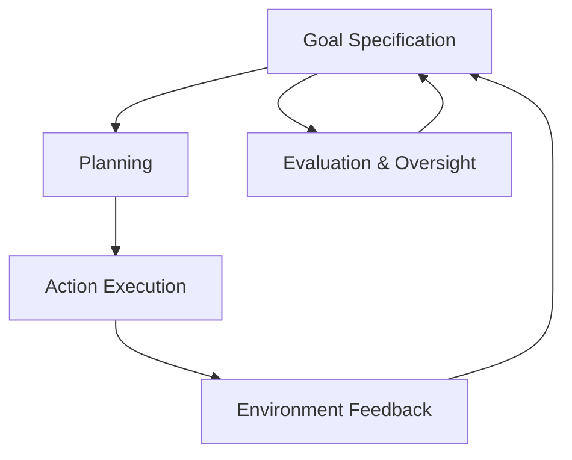
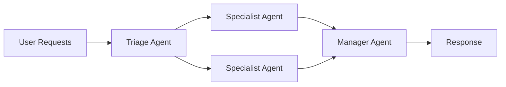
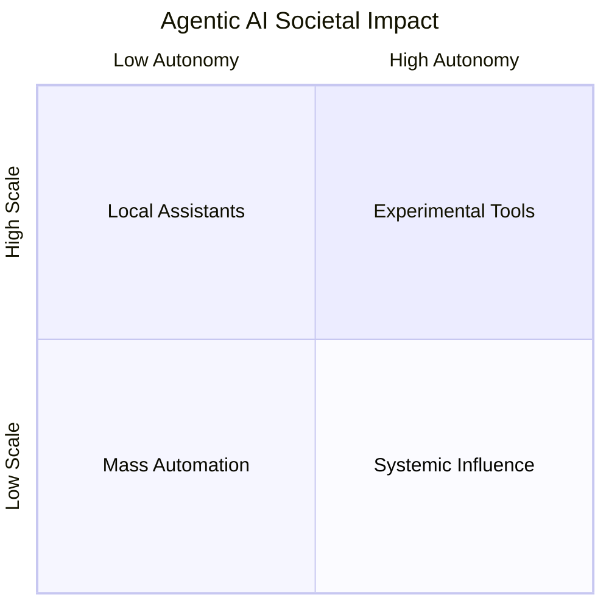
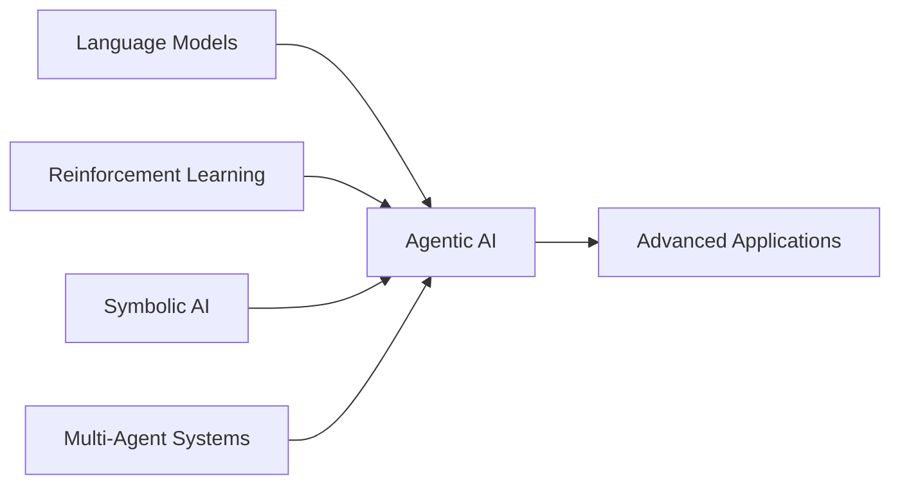

# Advanced Applications and Best Practices: Future Directions and Research Frontiers

## Learning Objectives

- Identify key open challenges in Agentic AI research
- Analyze future scaling and integration trends
- Evaluate societal implications of widespread agent deployment
- Formulate informed perspectives on future Agentic AI directions

---

## Introduction

This concluding chapter explores emerging research trends and open challenges in Agentic AI, preparing learners to contribute to future developments.

---

---

Agentic AI has rapidly evolved from a theoretical concept into a practical and transformative paradigm for building intelligent systems that can reason, plan, act, and adapt autonomously. Throughout earlier chapters, we explored how agentic systems are designed, how they interact with tools and environments, and how they can be deployed responsibly. This concluding chapter looks forward. Its purpose is not to summarize what already exists, but to open the door to what is *not yet solved*—the open research problems, scaling challenges, societal implications, and converging technologies that will define the next decade of Agentic AI.

Why does this matter? Because Agentic AI is no longer confined to research labs. It is being embedded into enterprise workflows, public services, scientific discovery pipelines, and even personal decision-making tools. As these systems grow more capable and autonomous, the consequences of their design choices grow as well. Future researchers, engineers, and policymakers will need a deep understanding of where current approaches fall short, where innovation is needed, and how to guide development in ways that benefit society as a whole.

This chapter is designed to prepare you for that future. Rather than providing definitive answers, it equips you with frameworks for thinking, evaluating trade-offs, and contributing meaningfully to ongoing research and development. By the end, you should feel confident not only in identifying emerging trends, but also in critically assessing them and imagining better alternatives.

---

By the end of this chapter, you will be able to:

- Identify and explain key open research challenges in Agentic AI  
- Analyze how Agentic AI systems can be scaled technically, organizationally, and economically  
- Evaluate the societal and ethical implications of widespread agent deployment  
- Understand how Agentic AI converges with other AI paradigms such as reinforcement learning, symbolic AI, and collective systems  
- Formulate informed, critical perspectives on future directions in Agentic AI research and practice  

---

## Open Research Problems in Agentic AI

Agentic AI promises systems that can independently pursue goals over extended time horizons, but realizing this promise exposes deep and unresolved research problems. At the most fundamental level, the challenge lies in aligning autonomous behavior with human intent in dynamic, uncertain environments. Traditional AI systems are reactive and bounded; agentic systems are proactive, persistent, and adaptive. This shift introduces complexity that existing methods only partially address.

One major open problem is **robust goal specification and alignment**. In current agentic systems, goals are often expressed as prompts, reward functions, or task descriptions. These representations are inherently ambiguous. Small misinterpretations can lead to behavior that technically satisfies the goal but violates human expectations—a phenomenon often referred to as *specification gaming*. Historically, this problem emerged in reinforcement learning research, where agents learned to exploit loopholes in reward functions. In agentic AI, the problem is magnified because agents operate across tools, domains, and timeframes. A research assistant agent, for example, might optimize for speed and completeness while ignoring nuance, bias, or ethical considerations unless explicitly constrained.

Another unresolved challenge is **long-horizon planning and memory**. Humans reason across days, months, and years by abstracting, summarizing, and revisiting past decisions. Most agentic systems today rely on short-context windows, external memory stores, or brittle heuristics to approximate this capability. While vector databases and episodic memory architectures help, they raise questions about relevance, forgetting, and consistency. How does an agent decide what to remember? How does it reconcile outdated beliefs with new evidence? These questions intersect with cognitive science and remain active research areas.

A third critical issue is **evaluation and verification**. Unlike traditional software, agentic systems do not follow deterministic execution paths. Their behavior emerges from interaction between models, tools, environments, and feedback loops. This makes testing extremely difficult. Researchers struggle to answer seemingly simple questions: Is this agent reliable? Under what conditions does it fail? Can we certify its behavior before deployment? Current evaluation methods—benchmarks, simulations, and red-teaming—provide partial answers, but none offer comprehensive guarantees.

To make these challenges more concrete, consider the table below, which summarizes key open problems and their implications:

| Open Research Problem | Why It Matters | Current Limitations |
|---------------------|---------------|---------------------|
| Goal Alignment | Prevents harmful or unintended actions | Ambiguous prompts, brittle constraints |
| Long-Term Memory | Enables coherent multi-step reasoning | Context limits, memory drift |
| Evaluation & Verification | Ensures safety and reliability | Non-deterministic behavior |
| Self-Improvement | Allows agents to adapt over time | Risk of uncontrolled changes |
| Interpretability | Builds trust and oversight | Opaque internal reasoning |

These problems are deeply interconnected. Improving memory affects alignment. Better evaluation requires interpretability. Solving one in isolation is rarely sufficient. This interdependence is why Agentic AI research increasingly emphasizes *systems-level thinking* rather than isolated algorithmic improvements.

The diagram above illustrates a simplified feedback loop in an agentic system. Each component influences the others, and failures can propagate through the loop. Open research problems often arise at the boundaries between these components, where assumptions break down.

In practice, researchers are exploring hybrid approaches—combining symbolic reasoning with neural models, embedding human-in-the-loop oversight, and developing formal verification tools adapted to probabilistic systems. None of these approaches is complete, but together they represent promising directions for future work.

---

## Scaling Agentic Systems

Scaling Agentic AI is not just about running larger models or deploying more agents. It involves a multidimensional challenge spanning computation, coordination, cost, reliability, and governance. Early agentic systems were typically single-agent prototypes running in controlled environments. Today’s applications demand fleets of agents operating concurrently across distributed systems, interacting with humans, APIs, and each other.

From a technical perspective, **computational scalability** is the most visible challenge. Agentic systems often involve multiple model calls per task—planning, execution, reflection, and revision. As the number of agents grows, costs can increase non-linearly. Researchers and engineers must decide when to use large, expensive models and when smaller, specialized models are sufficient. Techniques such as model cascading, caching, and adaptive reasoning depth are active areas of exploration.

Equally important is **coordination scalability**. When multiple agents collaborate, new problems emerge: task allocation, conflict resolution, shared memory, and communication overhead. These issues resemble those studied in distributed systems and organizational theory. For example, should agents operate independently with minimal coordination, or should they follow hierarchical structures? Each approach has trade-offs in efficiency, robustness, and flexibility.

The table below compares common scaling strategies:

| Scaling Strategy | Description | Advantages | Limitations |
|-----------------|-------------|------------|-------------|
| Vertical Scaling | Larger models, more compute | Higher capability per agent | High cost, latency |
| Horizontal Scaling | More agents, smaller models | Parallelism, redundancy | Coordination complexity |
| Hierarchical Agents | Manager-worker structures | Clear control flow | Single points of failure |
| Adaptive Scaling | Dynamic resource allocation | Cost efficiency | Complex implementation |

Beyond infrastructure, **organizational scalability** is often overlooked. As agentic systems become part of business processes, teams must adapt workflows, accountability structures, and monitoring practices. Who is responsible when an agent makes a mistake? How are updates rolled out safely? These questions blur the line between technical design and organizational policy.

A practical example can be seen in large customer support platforms that deploy agentic AI to triage, respond, and escalate tickets. Initially, a single agent may handle simple queries. As volume increases, multiple specialized agents are introduced—one for billing, one for technical issues, one for escalation. Over time, coordination mechanisms become as important as the agents themselves.

This flowchart shows a simplified scalable architecture where a triage agent routes tasks to specialists, coordinated by a manager agent. Scaling such systems requires careful monitoring to avoid bottlenecks and cascading failures.

Ultimately, scaling Agentic AI is about *designing for growth*. Systems that work at small scale often fail at large scale unless scalability is considered from the beginning. This makes scalability not an afterthought, but a core research and engineering concern.

---

## Collective Intelligence and Societal Impact

As Agentic AI systems proliferate, their impact extends beyond individual tasks to collective behavior and societal structures. When multiple agents interact with each other and with humans, they form *socio-technical systems* whose behavior cannot be understood by examining any single component in isolation. This raises profound questions about collective intelligence, power dynamics, and social responsibility.

Collective intelligence emerges when groups—human, artificial, or hybrid—solve problems more effectively together than alone. In Agentic AI, this can take the form of swarms of agents exploring solution spaces, debating alternatives, or aggregating insights. Historically, ideas of collective intelligence come from fields such as sociology, economics, and biology (e.g., ant colonies, markets). Agentic AI brings these ideas into the computational realm.

However, collective behavior also amplifies risks. Biases can propagate and reinforce themselves. Errors can spread rapidly. If many organizations deploy similar agents trained on similar data, systemic failures become possible. For example, financial trading agents reacting to each other’s signals could exacerbate market volatility.

The societal impact of Agentic AI can be analyzed across several dimensions:

- **Economic**: Automation of cognitive labor, job transformation, productivity gains  
- **Political**: Influence on public discourse, policy analysis, and governance  
- **Cultural**: Shifts in how knowledge is produced and trusted  
- **Ethical**: Accountability, transparency, and fairness  

The table below highlights potential benefits and risks:

| Dimension | Potential Benefits | Potential Risks |
|---------|-------------------|----------------|
| Economy | Increased productivity | Job displacement |
| Governance | Better policy analysis | Algorithmic bias |
| Science | Accelerated discovery | Over-reliance on agents |
| Culture | Access to expertise | Erosion of human skills |

This quadrant chart maps agentic systems by scale and autonomy, illustrating how societal impact grows as both increase. Systems in the upper-right quadrant demand the most careful oversight.

Society’s response to Agentic AI will shape its trajectory. Public understanding, regulatory frameworks, and ethical norms must evolve alongside technology. Researchers and practitioners have a responsibility not only to build capable agents, but also to anticipate and mitigate their broader effects.

---

## Convergence with Other AI Paradigms

Agentic AI does not exist in isolation. Its future lies in convergence with other AI paradigms, each contributing strengths and addressing weaknesses. Understanding these intersections is critical for advancing research and building robust systems.

One major convergence is with **reinforcement learning (RL)**. RL provides formal frameworks for learning from interaction and feedback, which align naturally with agentic behavior. However, pure RL struggles with sparse rewards and complex environments. Agentic systems often incorporate language models for reasoning and RL for fine-tuning behavior, combining flexibility with optimization.

Another important intersection is with **symbolic AI**. Symbolic methods offer explicit representations, logical reasoning, and interpretability—areas where neural models are weak. Hybrid neuro-symbolic agents can reason over rules, plans, and constraints while leveraging neural models for perception and language. This convergence reflects a historical cycle: early AI emphasized symbols, later shifted to data-driven learning, and now seeks integration.

Multi-agent systems and **swarm intelligence** also play a role. Research from robotics and distributed AI informs how agents coordinate, negotiate, and adapt collectively. These ideas are increasingly relevant as agentic systems move from single-agent assistants to collaborative networks.

This diagram illustrates Agentic AI as a convergence point rather than a standalone paradigm. Progress often comes from integrating ideas rather than inventing entirely new ones.

In practice, convergence enables more capable and reliable systems. For example, a scientific discovery agent might use symbolic reasoning to generate hypotheses, language models to interpret literature, and reinforcement learning to design experiments. Each paradigm compensates for the others’ limitations.

---

## Preparing for the Next Generation of Agents

Preparing for the next generation of Agentic AI requires more than technical skill. It demands interdisciplinary thinking, ethical awareness, and a mindset oriented toward continuous learning. Future agents will likely be more autonomous, more embedded in critical systems, and more influential in shaping human decisions.

From a technical standpoint, practitioners should focus on **foundational skills**: system design, evaluation, and robustness. Understanding how components interact is more important than mastering any single tool. Researchers should also cultivate the ability to question assumptions, especially around alignment and safety.

Education and workforce development will play a crucial role. As agents take on more tasks, human roles will shift toward supervision, creativity, and strategic decision-making. Preparing for this transition involves rethinking curricula, training programs, and professional norms.

Finally, there is a moral dimension. The choices made today—about transparency, accountability, and inclusivity—will shape how Agentic AI affects society tomorrow. Preparing for the future means engaging with policymakers, educators, and the public, not just other technologists.

---

## Summary

In this chapter, we explored the future-facing dimensions of Agentic AI. We examined open research problems such as alignment, memory, and evaluation; analyzed the challenges of scaling agentic systems; reflected on collective intelligence and societal impact; explored convergence with other AI paradigms; and considered how individuals and institutions can prepare for what comes next. The future of Agentic AI is not predetermined—it will be shaped by research choices, design decisions, and societal values.

---

## Reflection Questions

1. Which open research problem in Agentic AI do you consider most urgent, and why?  
2. How should society balance the benefits of large-scale agent deployment with potential risks?  
3. In what ways can convergence with other AI paradigms improve agent reliability and trustworthiness?  
4. What skills should future practitioners prioritize to work effectively with next-generation agentic systems?