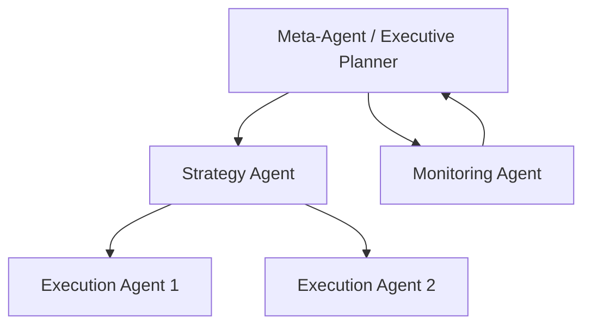
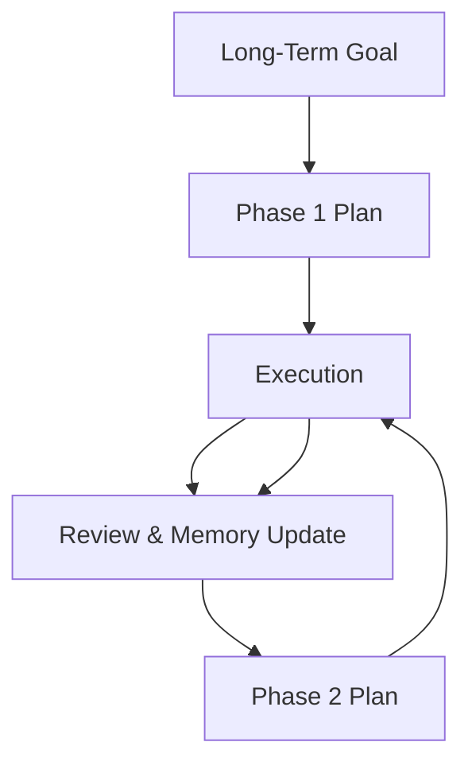
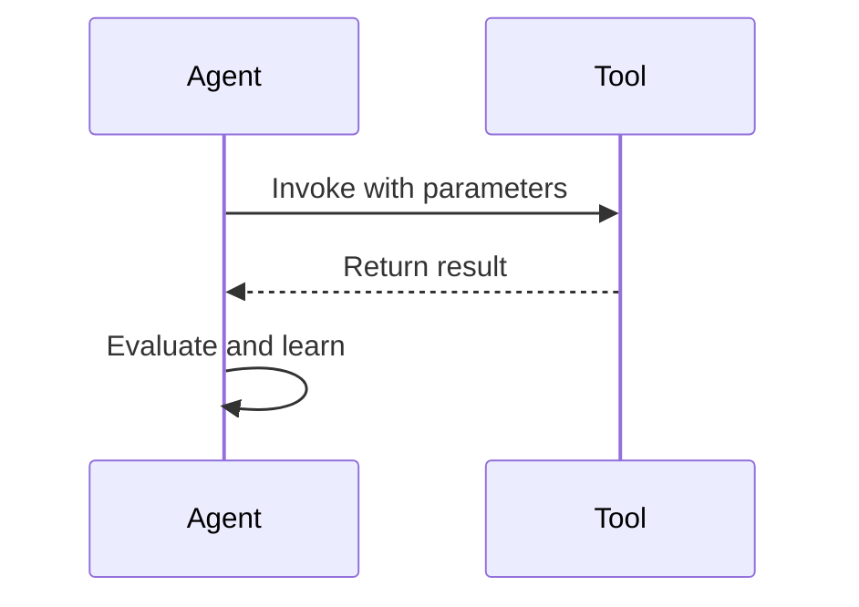
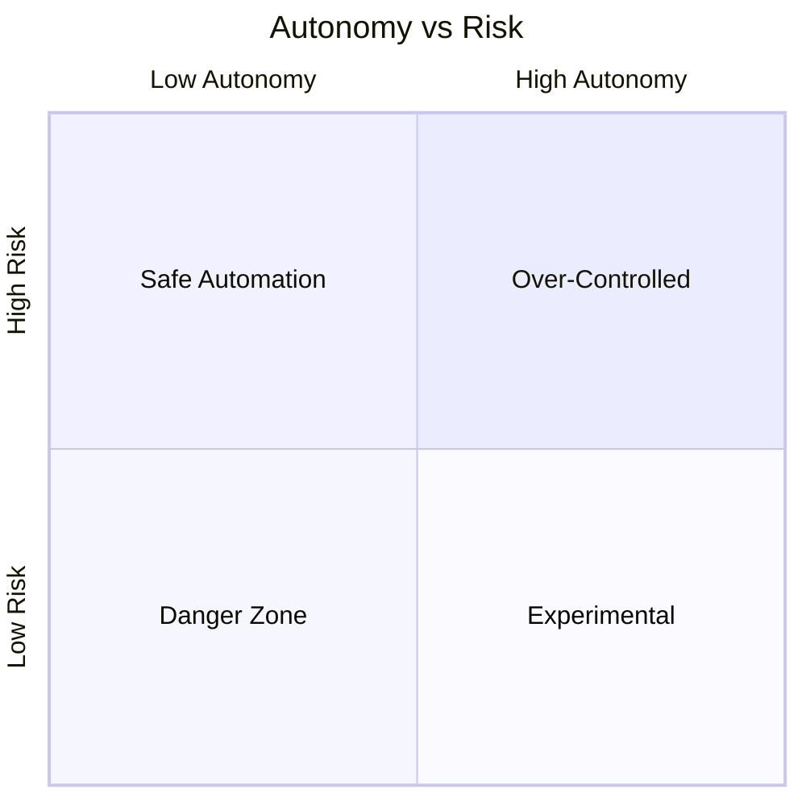

# Advanced Applications and Best Practices: Advanced Agentic AI Techniques

## Learning Objectives

- Explain advanced agentic design patterns
- Design agents capable of long-horizon reasoning
- Evaluate benefits and risks of self-improving agents
- Integrate LLMs effectively within agent architectures

---

## Introduction

This chapter introduces cutting-edge techniques that extend the capabilities of agentic systems.

---

---

As agentic AI systems move from experimental prototypes to real-world, mission-critical applications, their design must evolve beyond simple reactive or single-loop reasoning. Early agents—capable of following instructions, calling tools, or reacting to short-term goals—have demonstrated impressive potential. However, when these systems are asked to operate over long time horizons, coordinate multiple sub-goals, improve themselves, or act safely in complex environments, basic agent designs quickly reach their limits.

This chapter explores **advanced agentic AI techniques** that push beyond these limitations. We focus on architectural patterns, reasoning strategies, and governance practices that enable agents to plan over weeks or months, collaborate internally, integrate deeply with large language models (LLMs), and continuously improve—while still remaining performant, interpretable, and safe. These techniques are increasingly relevant in domains such as autonomous research assistants, enterprise automation, robotics, cybersecurity, and large-scale decision support systems.

Rather than treating these ideas as isolated tricks, this chapter emphasizes **design thinking**: why these techniques emerged, how they relate to each other, and what trade-offs they introduce. You will learn not only *what* advanced agentic systems can do, but *how* to design them responsibly and effectively.

---

By the end of this chapter, you will be able to:

- Explain advanced agentic design patterns such as hierarchical and meta-agent architectures  
- Design agents capable of long-horizon planning using memory and abstraction  
- Evaluate the benefits, risks, and governance challenges of self-improving agents  
- Integrate large language models effectively and safely within agent architectures  
- Analyze performance versus safety trade-offs in real-world agent deployments  

---

## Hierarchical and Meta-Agents

### From Single Agents to Organized Intelligence

Early agentic systems were typically **monolithic**: a single agent received an input, reasoned about it, and produced an output. While this design works well for short, well-defined tasks, it struggles as complexity increases. When goals become multi-layered—such as “launch a product,” “run a research program,” or “manage an IT infrastructure”—a single reasoning loop becomes brittle, slow, and error-prone.

Hierarchical and meta-agent architectures emerged as a response to this limitation. Inspired by organizational theory, cognitive science, and robotics, these architectures decompose intelligence into **layers of responsibility**. Instead of one agent doing everything, different agents specialize in planning, execution, monitoring, and learning. A higher-level agent coordinates lower-level agents, much like a manager overseeing a team.

This shift mirrors how humans handle complexity. A CEO does not personally write code, negotiate contracts, and monitor server uptime. Instead, they set goals, delegate tasks, and review outcomes. Hierarchical agent systems adopt this same principle to scale intelligence.

### Understanding Hierarchical Agent Architectures

A **hierarchical agent** system typically consists of:

- **High-level planning agents** that interpret objectives and break them into sub-goals  
- **Mid-level coordination agents** that manage workflows and dependencies  
- **Low-level execution agents** that perform concrete actions (tool calls, API requests, data processing)

Each layer operates at a different level of abstraction and time horizon. High-level agents may plan days or weeks ahead, while low-level agents operate in seconds or milliseconds.

Key characteristics of hierarchical agents include:

- Clear separation of concerns, reducing cognitive load per agent  
- Improved robustness, as failures can be isolated to specific layers  
- Better interpretability, since decisions can be traced through the hierarchy  

However, hierarchy also introduces overhead. Communication between agents must be carefully designed, and poorly defined roles can lead to duplication or conflict.

### Meta-Agents: Agents That Manage Agents

A **meta-agent** goes one step further. Rather than merely occupying the top of a fixed hierarchy, a meta-agent actively **reasons about the behavior of other agents**. It can:

- Decide which agents to invoke for a given task  
- Modify agent parameters or prompts  
- Detect failures or inefficiencies and reconfigure the system  

Meta-agents are especially powerful in dynamic environments where the “best” agent strategy changes over time. For example, in an autonomous research system, a meta-agent might notice that literature review agents are producing redundant summaries and adjust their scope or sampling strategy.

Historically, meta-agents draw inspiration from meta-cognition in psychology—thinking about thinking. In AI systems, this capability enables self-monitoring and adaptive control, which are essential for long-running tasks.

### Practical Examples and Analogies

To make this concrete, consider the analogy of a **hospital**:

- The hospital director (meta-agent) allocates resources and sets policies  
- Department heads (high-level agents) plan treatments and schedules  
- Doctors and nurses (execution agents) perform procedures  

If patient outcomes worsen, the director does not treat patients directly. Instead, they analyze reports, reorganize teams, or update protocols. Meta-agents play a similar role in AI systems.

In industry, hierarchical agents are used in:

- **Autonomous customer support**, where a planner agent routes queries to specialized resolution agents  
- **Robotics**, where task planners coordinate motion controllers and perception modules  
- **Enterprise automation**, where a central agent oversees finance, HR, and operations sub-agents  

### Advantages and Limitations

**Advantages**:
- Scalability to complex, multi-step objectives  
- Improved reliability through modularity  
- Easier debugging and auditing  

**Limitations**:
- Increased system complexity  
- Communication latency between agents  
- Risk of misalignment if goals are not clearly propagated  

---

## Long-Horizon Planning and Memory

### Why Long-Horizon Reasoning Is Hard

Many real-world problems cannot be solved in a single reasoning step. Planning a supply chain, conducting scientific research, or managing a personal investment portfolio all require decisions whose consequences unfold over long periods. Traditional agents, especially those relying on short-context LLM prompts, struggle with this **temporal depth**.

Long-horizon planning requires agents to:

- Maintain goals and constraints over time  
- Remember past decisions and outcomes  
- Anticipate delayed effects and uncertainty  

Without explicit support for memory and planning, agents tend to behave myopically—optimizing for immediate rewards while undermining long-term success.

### Types of Memory in Agentic Systems

Modern agentic systems use multiple forms of memory, each serving a different purpose:

| Memory Type | Purpose | Example |
|------------|--------|---------|
| Working memory | Short-term reasoning context | Current task steps |
| Episodic memory | Past experiences | Previous project outcomes |
| Semantic memory | General knowledge | Domain rules, facts |
| Procedural memory | Learned behaviors | Proven workflows |

This layered approach mirrors human cognition and allows agents to reason both locally and globally.

### Planning Across Time Horizons

Long-horizon planning often combines:

- **High-level goal decomposition**, breaking objectives into phases  
- **Intermediate checkpoints**, enabling evaluation and course correction  
- **Feedback loops**, where outcomes inform future plans  

Agents may use techniques such as tree search, plan-and-refine loops, or simulation-based forecasting. Importantly, plans are treated as *living artifacts*, not fixed scripts.

### Case Study: Long-Horizon Research Agent in Pharmaceutical Discovery

## Case Study: Accelerating Drug Discovery with Long-Horizon Agents

### Context

In 2023, a mid-sized pharmaceutical research organization faced increasing pressure to reduce the time required to identify viable drug candidates. Drug discovery is inherently long-horizon: hypotheses evolve over months, experiments fail unpredictably, and insights often emerge only after extensive iteration. The organization had experimented with LLM-based assistants for literature review but found them insufficient for sustained research programs.

The leadership team envisioned an autonomous research agent that could operate continuously—tracking hypotheses, proposing experiments, and learning from results—over several months. This required capabilities far beyond simple question answering.

### Problem

The core challenge was **temporal fragmentation**. Each research phase—literature review, compound screening, lab experimentation—used different tools and teams. Knowledge was lost between phases, leading to repeated mistakes and slow progress.

Traditional automation tools failed because they lacked memory and planning. They could summarize papers or analyze datasets, but they could not maintain a coherent research narrative over time. The organization needed an agent that could “remember why” decisions were made, not just “what” was done.

### Solution

The team designed a long-horizon agent with layered memory and hierarchical planning. At the top level, a planning agent maintained a multi-month research roadmap. Below it, specialized agents handled literature analysis, simulation, and experimental design.

Episodic memory stored experiment outcomes, while semantic memory captured domain knowledge about chemical interactions. After each experimental cycle, a review agent evaluated progress and updated the long-term plan.

### Results

Within six months, the system reduced redundant experiments by 30% and accelerated hypothesis refinement. Researchers reported that the agent acted like a “persistent colleague” who never forgot prior discussions.

However, the system also revealed limitations. Memory growth required careful pruning, and occasional planning errors required human intervention. Despite this, the overall impact was strongly positive.

### Lessons Learned

The case demonstrated that long-horizon planning is not about perfect foresight, but about **structured persistence**. Memory, review loops, and hierarchy were more important than raw model intelligence. The team also learned that human oversight remains essential, especially when plans span months.

---

## Tool-Using and Self-Improving Agents

### From Passive Reasoning to Active Capability

A defining feature of advanced agents is their ability to **use tools**—APIs, databases, code execution environments—to act on the world. Tool use transforms agents from passive advisors into active participants. When combined with learning mechanisms, agents can even improve their own performance over time.

Self-improving agents emerged from research in reinforcement learning and automated machine learning (AutoML). In agentic AI, self-improvement often focuses on:

- Better tool selection  
- Improved prompting strategies  
- Optimized workflows  

### How Tool-Using Agents Work

At a high level, tool-using agents follow a loop:

1. Interpret the task  
2. Decide whether a tool is needed  
3. Select and invoke the tool  
4. Evaluate the result  
5. Update memory or strategy  

### Self-Improvement Mechanisms

Self-improvement can be explicit or implicit:

- **Explicit learning**, such as tracking success metrics and updating policies  
- **Implicit adaptation**, such as refining prompts based on past outcomes  

While powerful, self-improvement introduces risks. An agent that optimizes aggressively may exploit loopholes or drift from intended goals.

### Best Practices and Pitfalls

| Aspect | Benefit | Risk |
|------|--------|------|
| Tool autonomy | Faster execution | Unintended actions |
| Self-optimization | Improved efficiency | Goal drift |
| Automated learning | Scalability | Reduced transparency |

---

## Integration with Large Language Models

### LLMs as Cognitive Engines

Large language models provide the reasoning, abstraction, and language understanding that underpin modern agentic systems. However, integrating LLMs effectively requires careful architectural choices. Treating an LLM as a monolithic “brain” often leads to inefficiency and unpredictability.

Instead, advanced systems use LLMs as **modular cognitive components**: planners, critics, summarizers, or translators.

### Architectural Integration Patterns

Common integration patterns include:

- **Planner-Executor**, where an LLM plans and tools execute  
- **Reflective loops**, where an LLM critiques its own output  
- **Multi-model ensembles**, combining models with different strengths  

### Practical Considerations

Key considerations include context window limits, cost management, and latency. Memory summarization and hierarchical prompting are common strategies to mitigate these constraints.

---

## Performance and Safety Trade-offs

### The Inherent Tension

As agents become more autonomous and capable, **performance and safety** often pull in opposite directions. Greater autonomy enables faster decision-making but reduces human oversight. More learning improves efficiency but increases unpredictability.

Understanding these trade-offs is essential for responsible deployment.

### Safety Mechanisms

Common safety strategies include:

- Permissioned tool use  
- Human-in-the-loop checkpoints  
- Behavioral constraints and audits  

### Balancing Act in Practice

Effective systems tune autonomy based on context. A customer support agent may act freely within predefined bounds, while a financial trading agent may require strict oversight.

---

## Summary

In this chapter, we explored advanced agentic AI techniques that enable systems to scale in complexity, duration, and capability. Hierarchical and meta-agent architectures provide structure and adaptability. Long-horizon planning and memory allow agents to persist and learn over time. Tool use and self-improvement transform agents into active, evolving systems. Deep integration with LLMs unlocks reasoning power, while careful attention to performance and safety ensures responsible use.

Together, these techniques form the foundation of next-generation agentic systems—powerful, flexible, and aligned with human goals.

---

## Reflection Questions

1. How does a hierarchical agent architecture change the way failures propagate through a system?  
2. What types of memory are most critical for long-horizon planning in your domain of interest?  
3. Where should self-improvement be limited or constrained, and why?  
4. How would you balance autonomy and safety differently for consumer-facing versus internal agents?  
5. Which advanced technique in this chapter do you expect to become most important in the next five years, and why?