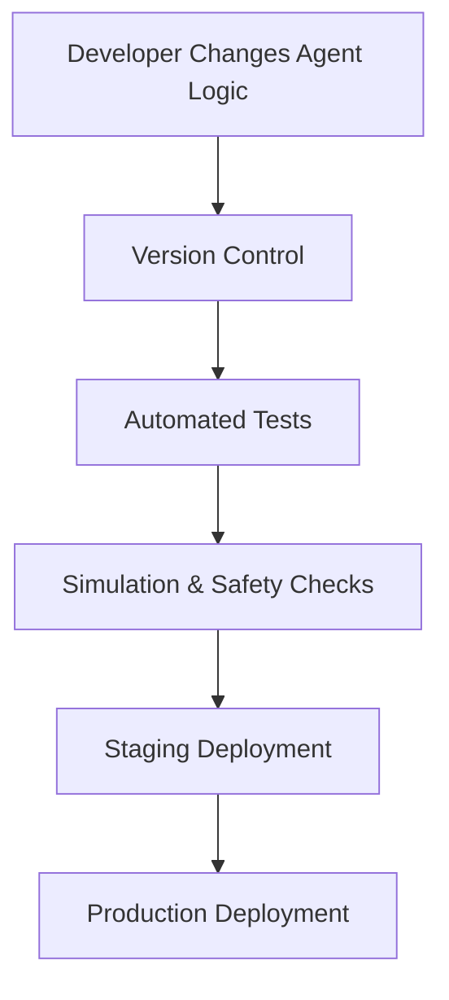
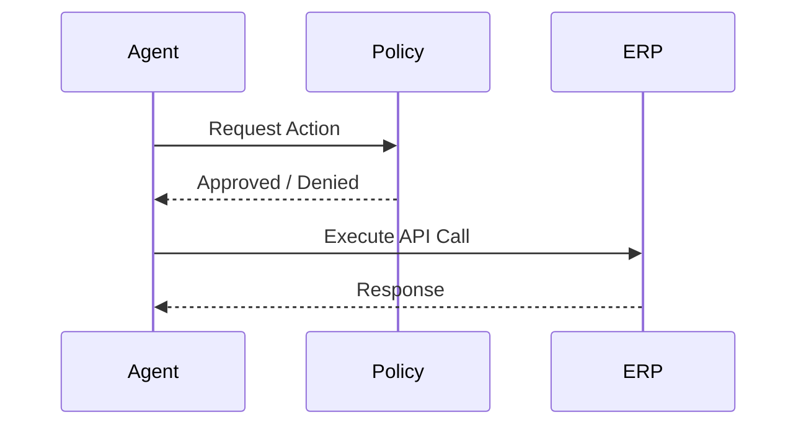
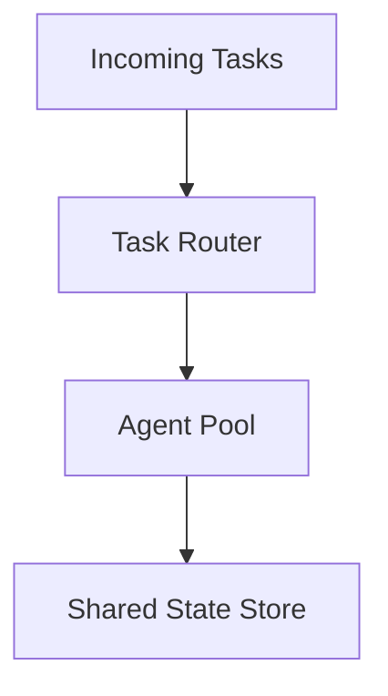
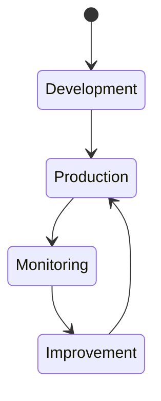

# Operationalizing Agentic AI: Deployment and System Integration

## Learning Objectives

- Deploy agentic systems into production environments
- Design monitoring strategies for autonomous agents
- Optimize performance and scalability of agentic solutions

---

## Introduction

This chapter covers the practical aspects of integrating agentic systems into existing infrastructures and workflows.

---

---

Agentic AI systems move beyond simple prediction or response generation. They **plan, decide, act, and learn over time**, often interacting with tools, APIs, databases, and humans. While designing intelligent agents is intellectually exciting, **the real challenge begins when these agents must run reliably in production environments**.

Operationalizing agentic AI means embedding autonomous or semi-autonomous agents into **real-world infrastructures**—cloud platforms, enterprise systems, security frameworks, and business workflows. This introduces practical questions:

- How do we deploy agentic systems safely and reliably?
- How do we integrate agents with legacy enterprise software?
- How do we observe, debug, and control agents that make their own decisions?
- How do we scale agents while maintaining performance and cost efficiency?
- How do we evolve agentic systems as business needs change?

This chapter focuses on these **practical, operational concerns**, bridging the gap between experimental agent prototypes and production-grade systems that organizations can trust.

---

By the end of this chapter, you will be able to:

- Deploy agentic systems into production environments using robust architectures and pipelines  
- Design observability and monitoring strategies tailored to autonomous agents  
- Optimize performance, reliability, and scalability of agentic AI solutions  
- Integrate agents into enterprise systems and workflows responsibly  
- Plan for long-term maintenance and evolution of agent-based systems  

---

## Deployment Architectures and Pipelines

Deploying agentic AI systems is fundamentally different from deploying traditional machine learning models. Instead of a single prediction endpoint, agentic systems often involve **long-running processes**, **tool orchestration**, **state management**, and **decision loops**. Choosing the right deployment architecture is therefore critical for reliability and scalability.

### Understanding Deployment Patterns for Agentic Systems

At a high level, agentic systems can be deployed using several architectural patterns. Each pattern reflects how much autonomy the agent has and how tightly it is coupled with other systems.

| Deployment Pattern | Description | Best Use Cases | Trade-offs |
|--------------------|------------|---------------|-----------|
| Embedded Agent | Agent runs inside an existing application | Simple automation, assistants | Limited scalability |
| Service-Based Agent | Agent exposed as a standalone service | Enterprise workflows | Network latency |
| Event-Driven Agent | Agent triggered by events or messages | Asynchronous workflows | Debug complexity |
| Multi-Agent Platform | Multiple agents coordinate via orchestration | Complex reasoning systems | Higher operational overhead |

An analogy helps clarify this:  
- An **embedded agent** is like a calculator inside a spreadsheet—useful but constrained.  
- A **service-based agent** is like a cloud API—flexible and reusable.  
- A **multi-agent platform** is closer to a team of employees coordinating through meetings and emails.

### Deployment Pipelines for Agentic AI

Unlike static models, agents evolve frequently. Prompt changes, tool updates, and policy refinements require **continuous deployment pipelines** that emphasize safety and rollback.

A typical agent deployment pipeline includes:

- Code and prompt versioning
- Automated testing (unit + simulation)
- Staged environments (dev → staging → production)
- Guardrail validation before release

### Infrastructure Considerations

Agentic systems often require infrastructure beyond traditional ML hosting:

- **State storage** for memory and long-term context
- **Task queues** for asynchronous planning and execution
- **Secrets management** for API keys and credentials
- **Policy engines** for enforcing constraints

| Infrastructure Component | Purpose | Common Technologies |
|--------------------------|---------|---------------------|
| State Store | Agent memory and context | Redis, PostgreSQL |
| Task Queue | Async execution | Kafka, SQS |
| Secrets Vault | Secure credentials | Vault, AWS Secrets Manager |
| Policy Layer | Safety & compliance | OPA, custom rules |

---

## Integration with Enterprise Systems

Agentic AI only creates value when it integrates seamlessly with existing enterprise systems. These systems—CRMs, ERPs, ticketing tools, and data warehouses—are often complex, regulated, and fragile. Integration must therefore be **carefully designed and governed**.

### Integration Models and Patterns

Agents can interact with enterprise systems using different integration approaches:

| Integration Model | How It Works | Strengths | Risks |
|------------------|-------------|-----------|-------|
| API-Based | Agent calls system APIs | Clean and scalable | API limitations |
| RPA-Based | Agent drives UI automation | Works with legacy systems | Fragile |
| Event-Based | Agent subscribes to events | Decoupled | Event complexity |
| Human-in-the-Loop | Agent suggests actions | High trust | Slower execution |

A helpful analogy is comparing agents to **junior employees**:
- API-based integration is like giving them direct system access.
- Human-in-the-loop is like requiring manager approval.

### Designing Safe Enterprise Integrations

Because agents act autonomously, guardrails are essential:

- **Permission scoping**: Agents should only access what they need.
- **Action validation**: Sensitive actions require confirmation.
- **Audit logging**: Every action must be traceable.

### Case Study: Agent-Assisted IT Operations

An enterprise IT team deploys an agent to handle incident tickets:

- Reads tickets from ServiceNow
- Diagnoses issues using logs
- Suggests remediation steps
- Executes fixes only after approval

This hybrid approach balances **efficiency and trust**, allowing gradual adoption.

---

## Observability and Monitoring of Agents

Observability is often underestimated in agentic AI. Because agents reason and act dynamically, failures may emerge as **unexpected behaviors rather than explicit errors**. Effective monitoring focuses on **decisions, actions, and outcomes**, not just system health.

### What Makes Agent Observability Unique

Traditional monitoring tracks metrics like CPU and latency. Agent observability must also track:

- Reasoning traces
- Tool usage patterns
- Goal success rates
- Policy violations

| Observability Signal | What It Reveals | Example |
|---------------------|----------------|---------|
| Decision Logs | Agent reasoning | Chose tool A over B |
| Action History | Execution path | API calls made |
| Outcome Metrics | Effectiveness | Task success rate |
| Safety Events | Risk exposure | Policy violations |

### Instrumenting Agents for Visibility

To achieve this, agents should be instrumented with structured logging and tracing:

Practical techniques include:

- Logging intermediate thoughts (where appropriate)
- Tagging actions with unique trace IDs
- Capturing before-and-after system states

### Alerting and Debugging Agent Behavior

Monitoring systems should support **behavioral alerts**, such as:

- Excessive retries
- Repeated failed plans
- Unexpected tool usage

This enables teams to debug agents much like investigating human process errors—by reconstructing **what the agent believed and why it acted**.

---

## Performance Optimization and Scaling

Agentic systems are often more resource-intensive than traditional ML services. They may perform multiple reasoning steps, call external tools, and maintain long-lived contexts. Optimization is therefore both a **cost and reliability concern**.

### Identifying Performance Bottlenecks

Common bottlenecks include:

- Excessive LLM calls
- Large context windows
- Slow external tools
- Poor task decomposition

| Bottleneck | Symptom | Optimization Strategy |
|-----------|---------|----------------------|
| LLM Calls | High latency | Caching, batching |
| Context Size | High cost | Memory pruning |
| Tool Latency | Slow tasks | Async execution |
| Overplanning | Inefficiency | Simplified plans |

### Scaling Strategies for Agentic Systems

Scaling agents is not just about adding more replicas. It requires understanding **agent state and coordination**.

Common strategies include:

- Stateless agents with externalized memory
- Agent pools with task routing
- Hierarchical agents (manager + workers)

### Cost-Aware Optimization

A practical example:  
A customer support agent is optimized by caching answers to common questions and limiting reasoning depth for low-risk tickets—reducing cost by 40% without impacting quality.

---

## Maintenance and System Evolution

Agentic systems are not “set-and-forget” solutions. As environments change, agents must be **maintained, audited, and evolved**.

### Continuous Improvement of Agent Behavior

Maintenance activities include:

- Updating prompts and policies
- Adding or retiring tools
- Retraining supporting models
- Refining safety constraints

| Maintenance Activity | Frequency | Impact |
|---------------------|-----------|--------|
| Prompt Updates | Weekly | Behavior quality |
| Tool Changes | Monthly | Capability |
| Policy Reviews | Quarterly | Safety |
| Architecture Refactors | Yearly | Scalability |

### Managing Agent Drift and Risk

Agents may drift over time as data, tools, or objectives change. Regular evaluations and regression tests help detect unintended behaviors early.

### Planning for Long-Term Evolution

Organizations should treat agents as **long-lived digital workers**:

- Define ownership and accountability
- Establish decommissioning plans
- Maintain documentation and runbooks

This mindset ensures sustainability and trust.

---

## Summary

Operationalizing agentic AI requires more than clever algorithms. It demands **robust deployment architectures**, **safe enterprise integration**, **deep observability**, **thoughtful performance optimization**, and **ongoing maintenance**. By treating agents as evolving systems—rather than static models—organizations can unlock their full potential while managing risk responsibly.

---

## Reflection Questions

1. What deployment architecture would best suit an agent operating in a regulated industry, and why?  
2. How does agent observability differ from traditional application monitoring?  
3. What trade-offs exist between autonomy and control when integrating agents into enterprise systems?  
4. How would you design a safe rollout plan for a new autonomous agent in production?  

---