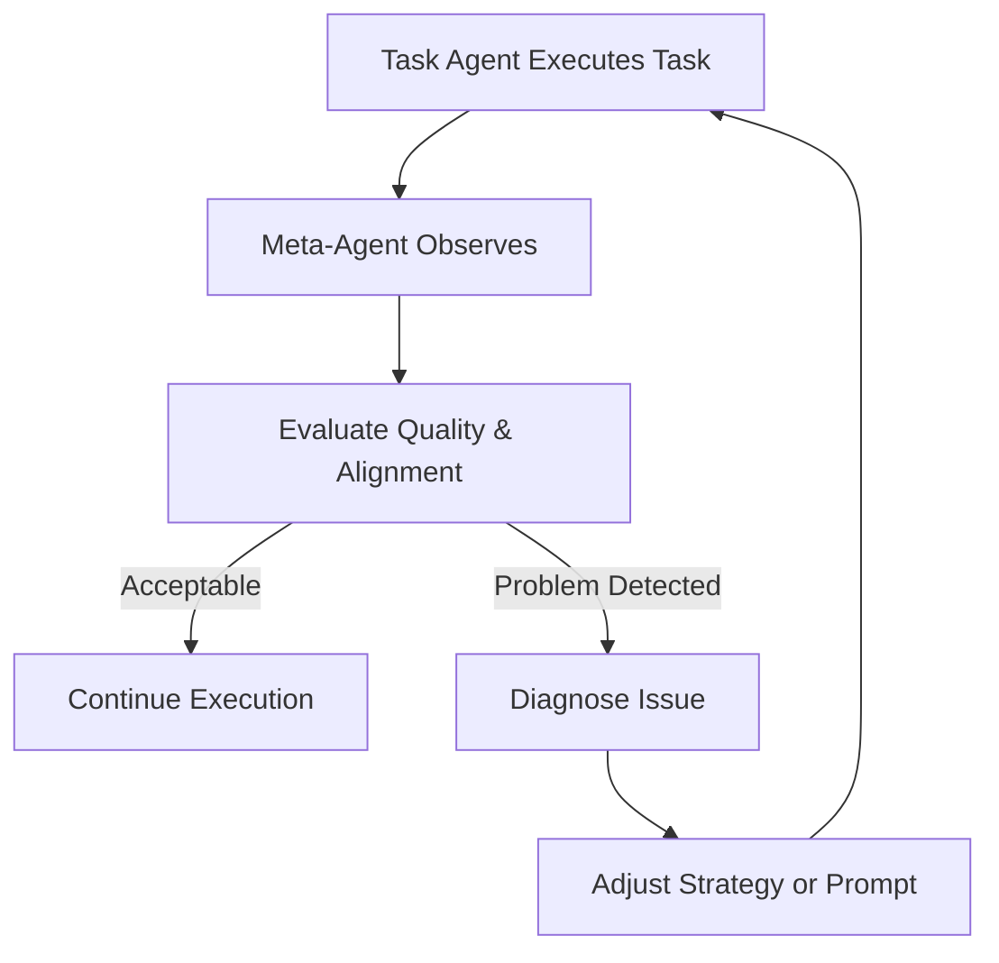
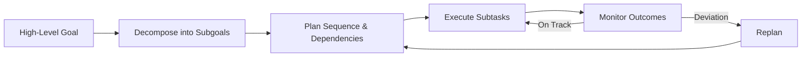
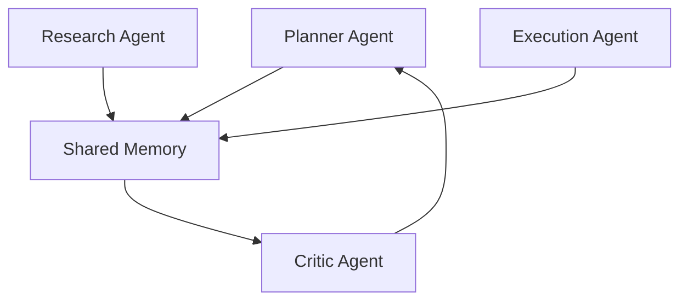
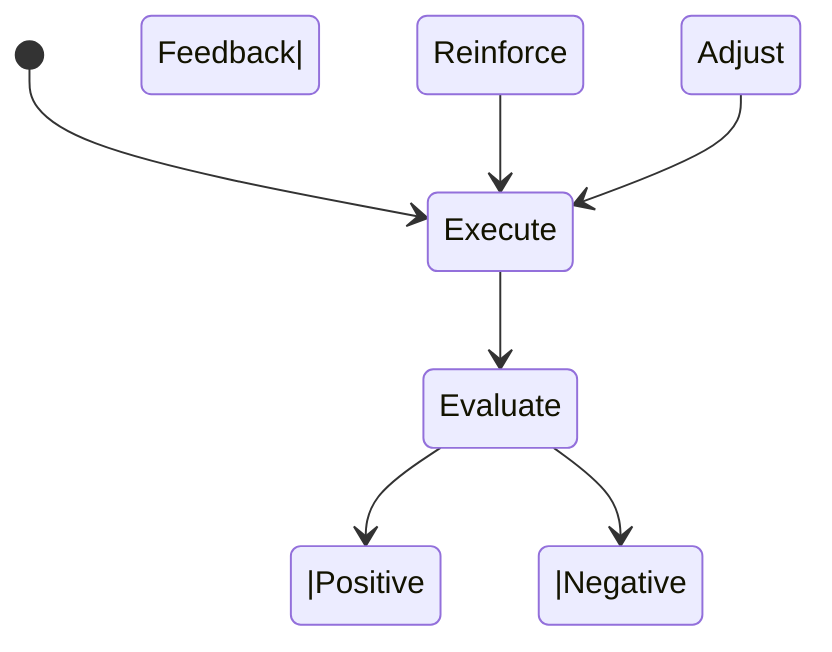
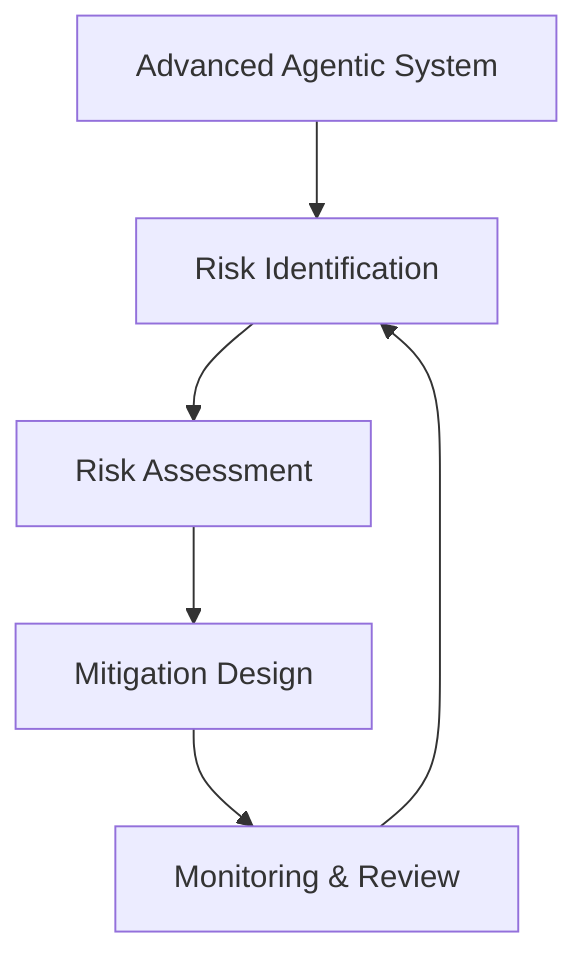

# Advanced Applications and Best Practices: Advanced Agentic AI Patterns

## Learning Objectives

- Design advanced agentic patterns
- Analyze risks associated with adaptive agents
- Evaluate long-horizon planning approaches
- Apply risk mitigation strategies in complex systems

---

## Introduction

This chapter introduces advanced design patterns that enable complex, adaptive, and scalable agentic behavior.

---

---

As agentic AI systems move from experimental prototypes into real-world, mission-critical applications, simple single-agent designs quickly reach their limits. Early agentic systems were often reactive, short-sighted, and narrowly scoped. They could complete tasks, but they struggled to adapt, reflect, collaborate, or plan over extended time horizons. Modern challenges—such as autonomous research assistants, multi-step enterprise workflows, long-running simulations, and adaptive decision-making platforms—require something more sophisticated.

This chapter explores **advanced agentic AI patterns** that enable systems to behave in more human-like, resilient, and scalable ways. These patterns go beyond “one agent, one task” and introduce **meta-reasoning, long-term planning, collaboration, self-improvement, and risk-aware design**. Together, they form the foundation for building agentic systems that can operate reliably in complex, uncertain, and evolving environments.

Importantly, advanced agentic behavior is not just about adding more intelligence. It is about **architectural discipline**—knowing how to decompose responsibilities, manage uncertainty, align goals over time, and prevent unintended behaviors. Throughout this chapter, you will learn not only *what* these advanced patterns are, but *why* they emerged, *how* they work in practice, *when* they should be used, and *what risks they introduce* if used carelessly.

---

By the end of this chapter, you will be able to:

- Design advanced agentic patterns for complex, adaptive AI systems  
- Evaluate and compare long-horizon planning approaches  
- Understand how agents collaborate effectively in multi-agent systems  
- Analyze risks associated with self-improving and adaptive agents  
- Apply practical risk mitigation strategies in real-world agentic architectures  

---

## Meta-Agents and Self-Reflective Agents

Meta-agents and self-reflective agents represent a fundamental shift in how we think about intelligence in AI systems. Instead of focusing solely on *doing tasks*, these agents are designed to **think about how tasks are being done**, evaluate performance, and adjust behavior accordingly. In human terms, this is the difference between simply working and *reflecting on how you work* to improve future outcomes.

Historically, early AI agents followed rigid pipelines: perceive input, apply logic, produce output. If something went wrong, the fix came from an external engineer. Meta-agents emerged as a response to this limitation, inspired by ideas from cognitive science, metacognition, and software monitoring systems. The key insight was that systems could be made more robust if they included components whose job was to **observe, critique, and guide other agents**.

A **meta-agent** typically operates at a higher level of abstraction than task-level agents. While a task agent might write code, summarize documents, or negotiate prices, the meta-agent evaluates questions like: *Is the strategy effective? Are the outputs consistent with goals? Is the agent stuck in a loop or hallucinating?* This separation of concerns improves reliability and makes systems easier to debug and evolve.

Self-reflective agents, on the other hand, embed meta-reasoning *within* the same agent. Rather than having a separate controller, the agent periodically pauses to assess its own reasoning, assumptions, and progress. This pattern is particularly useful when deploying a single agent in dynamic environments where external oversight is limited.

### How Meta-Agents Work in Practice

A typical meta-agent workflow unfolds in multiple layers:

- **Observation:** The meta-agent monitors actions, intermediate reasoning steps, and outcomes produced by task agents.
- **Evaluation:** It compares observed behavior against success criteria, constraints, or historical benchmarks.
- **Diagnosis:** When issues arise, the meta-agent identifies root causes (e.g., missing context, overly narrow search, conflicting goals).
- **Intervention:** It modifies prompts, strategies, resource allocation, or even replaces underperforming agents.
- **Learning:** Insights are stored for future runs, gradually improving system performance.

This structure mirrors how experienced managers oversee teams: they rarely do the work themselves but ensure the *right work* is being done in the *right way*.

### Practical Examples and Analogies

Consider a **software development assistant**. A task agent writes code based on requirements. A meta-agent reviews the code for style, security issues, and alignment with project goals. If it detects poor structure or repeated bugs, it alters the coding strategy or introduces additional tests.

Another analogy is a **student studying for exams**. The student (task agent) reads and practices problems. Periodically, they reflect: *Am I actually improving? Which topics am I weak in?* That reflective process is the meta-agent at work.

In enterprise AI workflows, meta-agents are often used to:
- Enforce compliance rules
- Prevent hallucinations in long outputs
- Monitor cost and latency trade-offs
- Decide when human intervention is required

### Advantages, Limitations, and Best Practices

**Advantages:**
- Improved reliability and consistency
- Better alignment with goals and constraints
- Easier debugging and monitoring
- Supports continuous improvement

**Limitations:**
- Increased system complexity
- Additional latency and compute cost
- Risk of overcorrection if evaluation criteria are poorly defined

**Best Practices:**
- Keep evaluation metrics simple and interpretable
- Avoid giving meta-agents excessive control without safeguards
- Log meta-decisions for transparency and auditability

---

## Long-Horizon Planning Agents

Long-horizon planning agents are designed to operate over **extended timeframes**, where decisions made early can have cascading effects later. Unlike short-horizon agents that optimize for immediate outcomes, these agents must reason about future states, delayed rewards, and evolving constraints. This capability is essential for applications such as autonomous research, supply chain optimization, and multi-stage project management.

The emergence of long-horizon planning agents can be traced to limitations in reactive systems. Early agents performed well on isolated tasks but failed in scenarios requiring **sequencing, memory, and strategic foresight**. Influenced by classical planning, reinforcement learning, and human goal-setting behavior, modern long-horizon agents integrate planning, execution, and revision into a continuous loop.

At their core, these agents break complex goals into **hierarchical subgoals**, estimate dependencies, and allocate resources over time. Importantly, planning is not a one-time activity. Plans must be revisited as new information arrives, assumptions change, or failures occur.

### How Long-Horizon Planning Works

A typical long-horizon planning cycle includes:

- **Goal Decomposition:** Transforming a high-level objective into structured subgoals.
- **Temporal Reasoning:** Estimating duration, ordering, and dependencies.
- **Resource Allocation:** Assigning tools, agents, or budgets to each subtask.
- **Execution Monitoring:** Tracking progress and detecting deviations.
- **Replanning:** Adjusting plans when conditions change.

### Real-World Examples

A **scientific discovery agent** tasked with exploring a new research domain may need weeks of iterative literature review, hypothesis generation, experimentation, and synthesis. Short-horizon reasoning would fail because progress is non-linear and feedback is delayed.

In business, consider an **AI-driven product launch planner**. Decisions about market research, feature prioritization, pricing, and rollout timing interact over months. A long-horizon agent can simulate scenarios, anticipate risks, and adapt strategies dynamically.

### Challenges and Trade-offs

Long-horizon planning introduces significant challenges:

- **Compounding Errors:** Early mistakes can propagate.
- **Uncertainty:** Future states are often unknown or probabilistic.
- **Computational Cost:** Planning deeply can be expensive.
- **Evaluation Difficulty:** Success metrics may only be observable far in the future.

To manage these risks, practitioners often combine long-horizon agents with meta-agents, checkpoints, and human-in-the-loop reviews.

---

## Collaborative Agent Swarms

Collaborative agent swarms involve **multiple specialized agents working together** toward shared or partially overlapping goals. Inspired by social insects, distributed systems, and human teams, this pattern emphasizes coordination, communication, and emergent intelligence rather than centralized control.

The motivation for agent swarms arises from task complexity and scale. Some problems are simply too large or multifaceted for a single agent. By dividing responsibilities across agents with complementary skills, systems can achieve higher performance, robustness, and adaptability.

In a swarm, agents may have roles such as planner, executor, critic, researcher, or communicator. Coordination mechanisms—such as shared memory, message passing, or voting—ensure alignment while preserving autonomy.

### Communication and Coordination Patterns

Common coordination strategies include:
- **Blackboard Systems:** Agents read and write to a shared workspace.
- **Market-Based Coordination:** Agents bid for tasks based on capability.
- **Hierarchical Control:** Lead agents assign work to sub-agents.
- **Peer-to-Peer Negotiation:** Agents dynamically negotiate roles.

Each approach has trade-offs in scalability, speed, and robustness.

### Case Study: Multi-Agent Financial Analysis Platform

## Case Study: Collaborative AI for Enterprise Financial Forecasting

### Context

In 2023, a global consulting firm faced increasing demand for rapid, high-quality financial forecasts across multiple industries. Clients expected scenario analysis, risk modeling, and strategic recommendations in days—not weeks. Human analysts struggled to keep pace due to the volume of data, cross-domain expertise required, and constant market volatility.

The firm had experimented with single-agent AI tools, but results were inconsistent. The agents could summarize reports or run isolated models, but they failed to integrate insights across macroeconomics, industry trends, and company-specific data. Leadership recognized that the problem was not intelligence alone—it was **coordination**.

### Problem

The core challenge was fragmentation. Financial forecasting requires:
- Data ingestion from heterogeneous sources
- Domain-specific modeling
- Critical review and validation
- Narrative synthesis for clients

Single agents became overloaded, produced shallow analysis, or missed contradictions. Additionally, errors were hard to detect because no independent critique existed within the system.

### Solution

The firm designed a **collaborative agent swarm**:
- A data agent handled ingestion and normalization.
- Domain agents specialized in sectors (energy, tech, healthcare).
- A modeling agent ran quantitative forecasts.
- A critic agent challenged assumptions and flagged inconsistencies.
- A synthesis agent produced client-ready narratives.

Agents communicated via a shared knowledge base and periodic coordination checkpoints. A lightweight meta-agent monitored overall coherence and triggered replanning when conflicts emerged.

### Results

Forecast turnaround time dropped by 60%. Clients reported higher confidence due to transparent assumptions and scenario comparisons. Internally, analysts shifted from manual data wrangling to strategic oversight.

However, challenges remained. Coordination overhead increased system complexity, and poorly defined roles initially caused duplication of effort. These issues were mitigated through clearer role boundaries and shared metrics.

### Lessons Learned

The case highlighted that **collaboration amplifies intelligence only when coordination is intentional**. Clear interfaces, shared goals, and critique mechanisms are essential. Importantly, human oversight remained critical for ethical judgment and accountability.

---

## Adaptive and Self-Improving Systems

Adaptive and self-improving agentic systems are designed to **change their behavior over time** based on experience. Unlike static agents, they learn from feedback, update strategies, and refine internal models. This capability is essential in dynamic environments where assumptions quickly become outdated.

Historically, adaptation was handled offline through retraining. Modern agentic systems increasingly support **online adaptation**, where learning occurs during deployment. This shift enables faster response to change but introduces new risks.

Adaptation can occur at multiple levels:
- Parameter tuning
- Strategy selection
- Tool usage patterns
- Collaboration structures

### Benefits and Risks

**Benefits:**
- Improved performance over time
- Resilience to changing environments
- Reduced need for manual updates

**Risks:**
- Drift away from original goals
- Reinforcement of biases
- Emergent behaviors that are hard to predict

Best practices include bounded learning rates, periodic resets, and alignment checks via meta-agents.

---

## Trade-offs and Risk Management

Advanced agentic patterns introduce powerful capabilities—but also significant risks. As systems become more autonomous, adaptive, and collaborative, **control becomes harder**. Risk management is therefore not optional; it is a core design requirement.

Key trade-offs include:
- **Autonomy vs. Control**
- **Adaptability vs. Predictability**
- **Performance vs. Safety**
- **Complexity vs. Maintainability**

### Risk Mitigation Strategies

- Layered oversight (meta-agents + humans)
- Clear goal hierarchies and constraints
- Extensive logging and audit trails
- Simulation and stress testing
- Kill switches and rollback mechanisms

| Pattern | Primary Benefit | Key Risk | Mitigation Strategy |
|------|---------------|---------|---------------------|
| Meta-Agents | Reliability | Overcontrol | Simple metrics |
| Long-Horizon Planning | Strategic depth | Compounding errors | Checkpoints |
| Agent Swarms | Scalability | Coordination failure | Clear roles |
| Self-Improvement | Adaptability | Goal drift | Alignment checks |

---

## Summary

Advanced agentic AI patterns enable systems to plan further, adapt faster, collaborate better, and reflect on their own behavior. Meta-agents introduce oversight and self-reflection, long-horizon planners extend strategic reasoning, agent swarms unlock collective intelligence, and adaptive systems ensure relevance over time. However, these benefits come with trade-offs that must be managed through careful design, monitoring, and governance.

---

## Reflection Questions

1. When does adding a meta-agent improve reliability, and when does it add unnecessary complexity?  
2. How would you design checkpoints for a long-horizon planning agent in a high-risk domain?  
3. What coordination mechanism would you choose for an agent swarm in a time-critical system, and why?  
4. How can adaptive agents be prevented from drifting away from original goals?  
5. Which risks concern you most in advanced agentic systems, and how would you mitigate them?