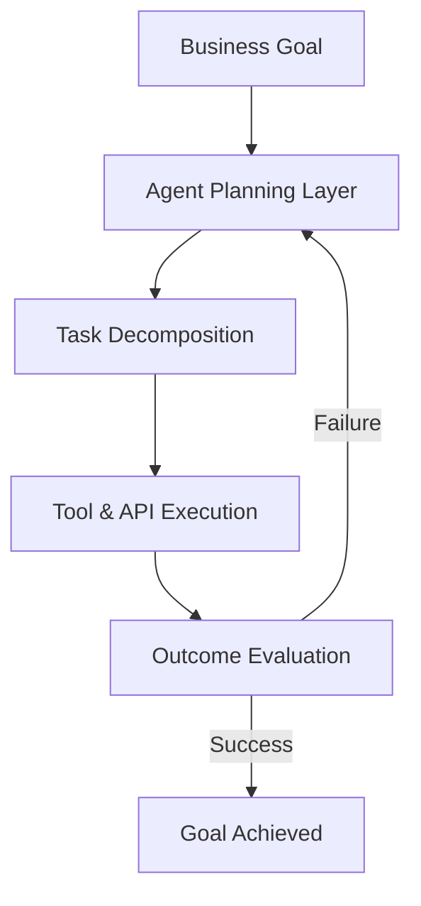
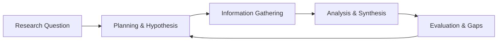
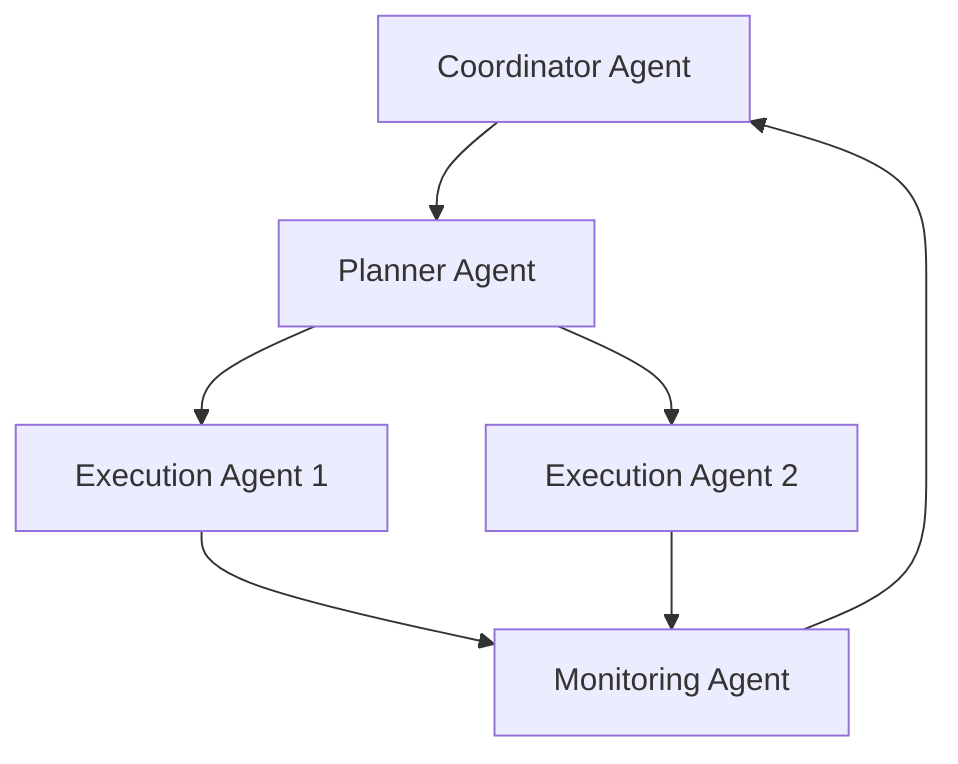
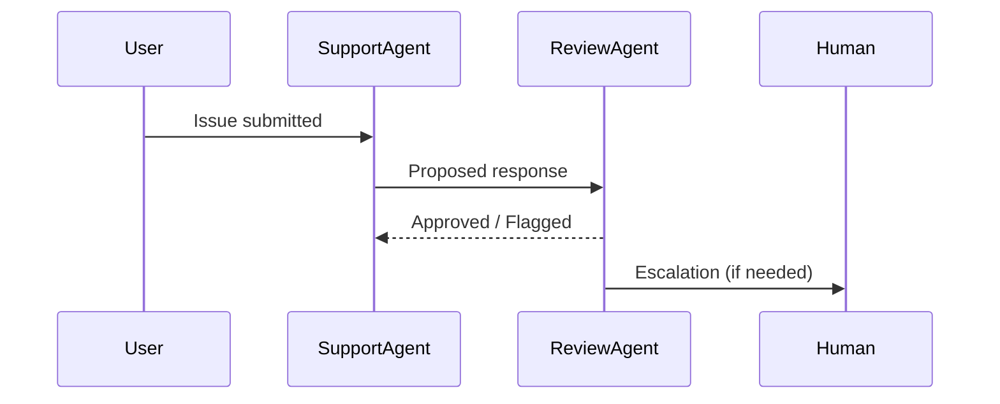
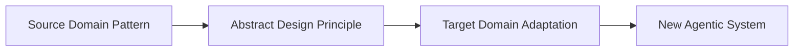

# Advanced Applications and Future Directions: Advanced Use Cases and Case Studies

## Learning Objectives

- Analyze real-world agentic AI case studies
- Evaluate design decisions and outcomes
- Transfer lessons learned across domains

---

## Introduction

This chapter examines complex, real-world implementations of Agentic AI across industries, highlighting lessons learned.

---

---

As Agentic AI systems move beyond experimental prototypes into real-world deployment, their true value—and complexity—becomes visible. In controlled demos, an agent that plans, reasons, and acts autonomously may seem straightforward. In enterprise environments, research organizations, and large-scale platforms, however, these systems must operate under constraints such as reliability, governance, collaboration, cost, and human trust. This chapter explores how Agentic AI is applied at scale across industries and what lessons emerge from these advanced implementations.

Rather than focusing on theoretical architectures alone, this chapter examines **how agentic systems are actually designed, deployed, and evaluated in practice**. We look at enterprise automation, autonomous knowledge work, and large multi-agent ecosystems, before diving into concrete case studies and cross-domain design transfer. Throughout, the emphasis is on *why certain design decisions were made*, *how outcomes were measured*, and *what can be reused or adapted in other contexts*.

---

By the end of this chapter, you will be able to:

- Analyze real-world case studies of Agentic AI across different industries  
- Evaluate design decisions, trade-offs, and outcomes in complex agentic systems  
- Identify patterns and best practices that generalize across domains  
- Transfer agentic design principles from one application area to another  

---

## Agentic AI in Enterprise Automation

Enterprise automation is one of the earliest and most impactful domains for Agentic AI. Unlike traditional robotic process automation (RPA), which relies on rigid scripts, agentic systems introduce autonomy, reasoning, and adaptation into business workflows. This shift enables organizations to automate not just repetitive tasks, but *decision-rich processes* that previously required human judgment.

In a typical enterprise setting, an agentic system may handle tasks such as invoice reconciliation, IT incident triage, supply chain optimization, or customer support escalation. These tasks involve ambiguity, incomplete data, and changing priorities—conditions where static automation fails. Agentic AI systems address this by combining perception (data ingestion), planning (goal decomposition), action (tool usage), and reflection (learning from outcomes).

A key reason enterprises adopt agentic systems is **resilience**. When upstream systems change—such as a new ERP interface or a revised policy—agents can often adapt through reasoning rather than breaking entirely. This adaptability reduces maintenance costs and increases long-term return on investment.

### How Enterprise Agentic Automation Works

At a high level, enterprise agentic automation involves layered decision-making rather than linear workflows. Instead of “if-this-then-that” logic, agents continuously evaluate goals, constraints, and feedback.

In practice, this means:

- The **business goal** (e.g., reduce invoice processing time) is defined at a high level.
- The agent **breaks the goal into tasks**, such as extracting data, validating rules, and triggering payments.
- Tools like databases, APIs, and internal systems are used dynamically.
- Outcomes are evaluated, and the agent retries or escalates when needed.

### Comparing Traditional Automation and Agentic Automation

The distinction between traditional automation and agentic automation becomes clearer when comparing their characteristics.

| Dimension | Traditional RPA | Agentic AI Automation |
|---------|-----------------|----------------------|
| Decision Logic | Fixed rules | Dynamic reasoning |
| Adaptability | Low | High |
| Handling Exceptions | Manual escalation | Autonomous retries and learning |
| Maintenance Cost | High over time | Lower with adaptation |
| Scope of Tasks | Simple, repetitive | Complex, judgment-based |

Another important comparison is how humans interact with these systems.

| Aspect | Scripted Automation | Agentic Systems |
|------|---------------------|----------------|
| Human Role | Designer & fixer | Supervisor & collaborator |
| Transparency | Low (hardcoded rules) | Medium–High (explainable reasoning) |
| Trust Model | Binary (works or fails) | Gradual (confidence builds over time) |

### Enterprise Case Example: Finance Operations

Consider a multinational company automating accounts payable. Instead of scripting every vendor exception, an agentic system:

- Reads invoices in multiple formats and languages  
- Cross-checks amounts against contracts and purchase orders  
- Flags anomalies and proposes resolutions  
- Learns common exception patterns over time  

This approach reduced processing time by over 40% while also improving compliance. The key lesson is that **agentic automation thrives where rules are incomplete but goals are clear**.

---

## Autonomous Research and Knowledge Work

Knowledge work—research, analysis, and synthesis—has traditionally been difficult to automate. These tasks require contextual understanding, iterative exploration, and judgment. Agentic AI changes this by enabling systems that can independently explore information spaces, form hypotheses, and refine outputs over time.

Autonomous research agents are increasingly used in domains such as market intelligence, scientific literature review, legal discovery, and policy analysis. Unlike simple search tools, these agents *plan research strategies*, decide what sources to consult, and adapt their approach based on findings.

What makes this powerful is not just speed, but **cognitive leverage**. Agents can explore more alternatives, track more details, and maintain longer reasoning chains than human researchers working alone. Humans remain essential, but their role shifts from information gathering to sense-making and decision validation.

### The Research Agent Lifecycle

Autonomous research follows a cyclical pattern rather than a linear one.

This loop allows agents to:

- Revisit assumptions when evidence contradicts them  
- Expand or narrow scope dynamically  
- Improve output quality through iteration  

### Human–Agent Collaboration in Knowledge Work

Despite high autonomy, effective research agents are rarely fully independent. Human oversight ensures relevance, ethics, and strategic alignment.

| Task | Human Researcher | Agentic Research System |
|----|------------------|-------------------------|
| Defining Goals | Primary | Assisted |
| Data Collection | Limited | Extensive |
| Pattern Detection | Moderate | High |
| Interpretation | High | Moderate |
| Final Judgment | Primary | Supportive |

Another useful distinction is between *assistive* and *autonomous* research modes.

| Mode | Description | Typical Use |
|----|-------------|-------------|
| Assistive | Agent supports human-driven research | Academic, policy work |
| Semi-Autonomous | Agent proposes insights, human validates | Market analysis |
| Fully Autonomous | Agent runs end-to-end research | Monitoring, alerts |

### Example: Market Intelligence Agent

A technology firm deployed a research agent to monitor competitors. The agent:

- Tracked news, patents, and financial reports  
- Identified emerging product strategies  
- Generated weekly insight briefs  

Humans reviewed and refined outputs, but over time trusted the agent’s prioritization. The result was faster strategic response with fewer analysts required—demonstrating how **agentic systems augment, rather than replace, expert judgment**.

---

## Multi-Agent Systems at Scale

As tasks grow in complexity, a single agent becomes insufficient. Multi-agent systems (MAS) distribute responsibilities across specialized agents that collaborate toward shared goals. At scale, this resembles an organization rather than a single worker.

Large-scale MAS are used in logistics, simulation, gaming, smart cities, and large enterprise platforms. Each agent may have a role—planner, executor, monitor, or negotiator—allowing the system to parallelize work and manage complexity.

However, scaling agents introduces new challenges: coordination overhead, conflict resolution, and emergent behavior. Designing these systems requires careful consideration of communication protocols and governance mechanisms.

### Architecture of a Scaled Multi-Agent System

This architecture highlights:

- A **coordinator** for alignment  
- Specialized agents for planning and execution  
- Feedback loops to detect failures or inefficiencies  

### Coordination Strategies

Different systems use different coordination strategies, each with trade-offs.

| Strategy | Description | Pros | Cons |
|-------|-------------|------|------|
| Centralized | Single coordinator agent | Simple control | Bottleneck risk |
| Decentralized | Peer-to-peer negotiation | Robust | Complex logic |
| Hierarchical | Multi-level control | Scalable | Design complexity |

Another critical design choice is communication style.

| Communication Type | Example | Use Case |
|------------------|---------|----------|
| Synchronous | Real-time messaging | Time-critical tasks |
| Asynchronous | Message queues | Large-scale systems |
| Shared Memory | Common state store | Simulation, planning |

### Real-World Example: Logistics Optimization

A global logistics provider used hundreds of agents to manage routing, inventory, and delivery scheduling. Each agent optimized local decisions, while higher-level agents ensured global efficiency. The system reduced delivery delays but initially faced instability due to conflicting objectives—highlighting the importance of **aligned reward structures** in multi-agent design.

---

## Case Study Analysis and Outcomes

Understanding agentic systems requires systematic case study analysis. Successful implementations are rarely perfect; they evolve through iteration, failure, and learning. Evaluating outcomes helps identify what truly matters in design.

Case studies typically assess technical performance, business impact, and human factors. Importantly, many failures stem not from model limitations, but from misaligned incentives or unclear success metrics.

### Common Evaluation Dimensions

| Dimension | Key Questions |
|--------|---------------|
| Effectiveness | Did the system achieve its goals? |
| Efficiency | Were resources used optimally? |
| Robustness | How did it handle edge cases? |
| Trust | Did users rely on it appropriately? |

Another lens focuses on *design decisions versus outcomes*.

| Design Choice | Observed Outcome |
|-------------|-----------------|
| High autonomy | Faster results, higher risk |
| Human-in-the-loop | Slower, but more trusted |
| Modular agents | Easier maintenance |

### Example Case: Customer Support Automation

An e-commerce company deployed an agentic support system. Initially, full autonomy led to inconsistent responses. Introducing a review agent and human escalation improved satisfaction scores. The lesson: **gradual autonomy often outperforms immediate full autonomy**.

---

## Cross-Domain Transfer of Agentic Designs

One of the most powerful aspects of Agentic AI is the transferability of design patterns. While domains differ, many underlying challenges—planning, uncertainty, coordination—are shared. Recognizing these similarities allows practitioners to reuse proven architectures.

For example, a planning-and-execution loop used in robotics can be adapted to financial forecasting. Likewise, multi-agent negotiation strategies from gaming can inform supply chain coordination.

### Transferable Design Patterns

| Pattern | Original Domain | Transferred To |
|------|----------------|---------------|
| Planning–Execution Loop | Robotics | Enterprise automation |
| Reviewer Agent | Content moderation | Customer support |
| Decentralized Agents | Traffic simulation | Cloud resource allocation |

Another useful perspective is identifying *what must change* during transfer.

| Aspect | Usually Reusable | Usually Domain-Specific |
|-----|------------------|-------------------------|
| Agent roles | ✅ | |
| Communication patterns | ✅ | |
| Tools & APIs | | ✅ |
| Success metrics | | ✅ |

### Why Cross-Domain Transfer Matters

Cross-domain learning accelerates innovation and reduces risk. Instead of reinventing solutions, teams can adapt existing agentic designs, shortening development cycles. The key is understanding *why a design worked* in its original context and adjusting assumptions accordingly.

---

## Summary

This chapter explored advanced, real-world applications of Agentic AI, emphasizing enterprise automation, autonomous knowledge work, large-scale multi-agent systems, and cross-domain learning. Through case studies and comparisons, we saw that successful agentic systems balance autonomy with oversight, specialization with coordination, and innovation with trust.

The most important takeaway is that Agentic AI is not just a technical challenge—it is a *systems design discipline*. Outcomes depend as much on goals, incentives, and human integration as on algorithms. By studying real implementations, practitioners can design more resilient, adaptable, and transferable agentic systems.

---

## Reflection Questions

1. In which enterprise processes would agentic automation add the most value compared to traditional automation, and why?  
2. How should organizations decide the appropriate level of autonomy for research agents?  
3. What risks increase as multi-agent systems scale, and how can they be mitigated?  
4. Which agentic design pattern from another domain could be applied to your field, and what adaptations would be required?