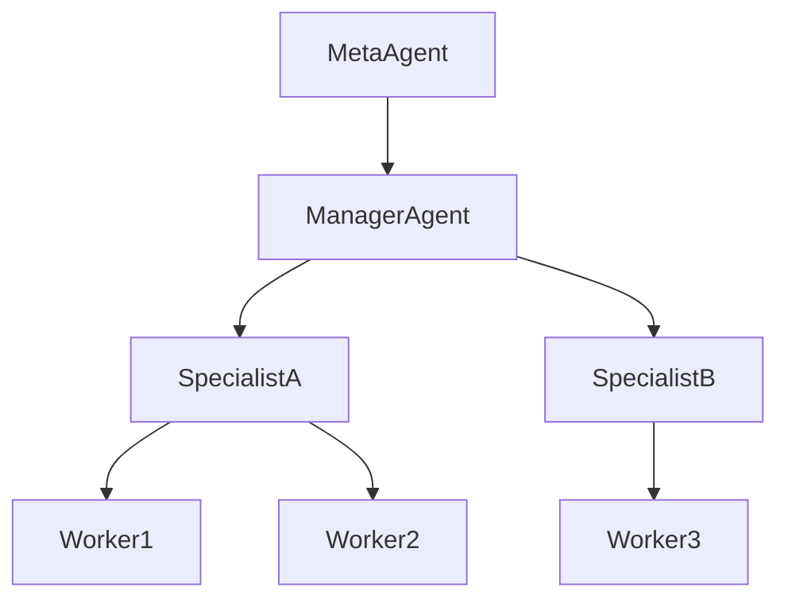
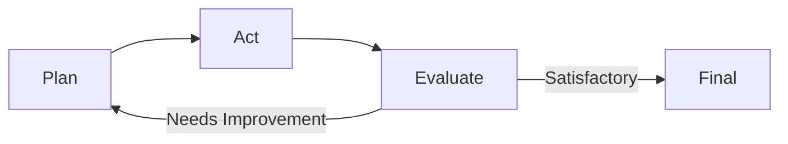
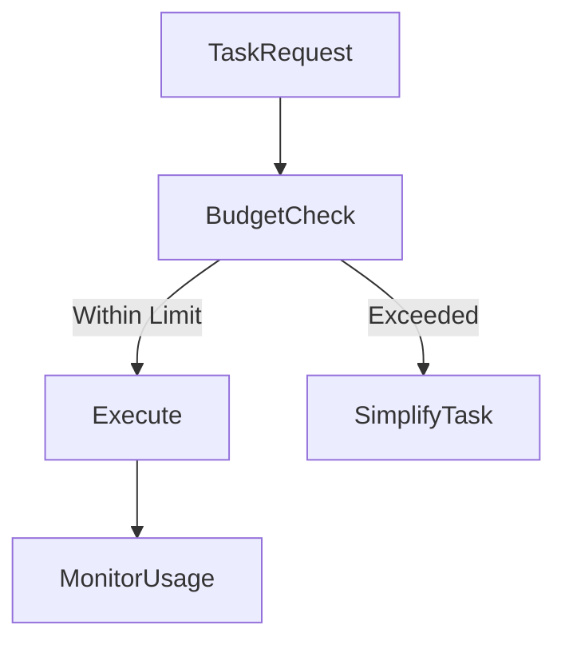
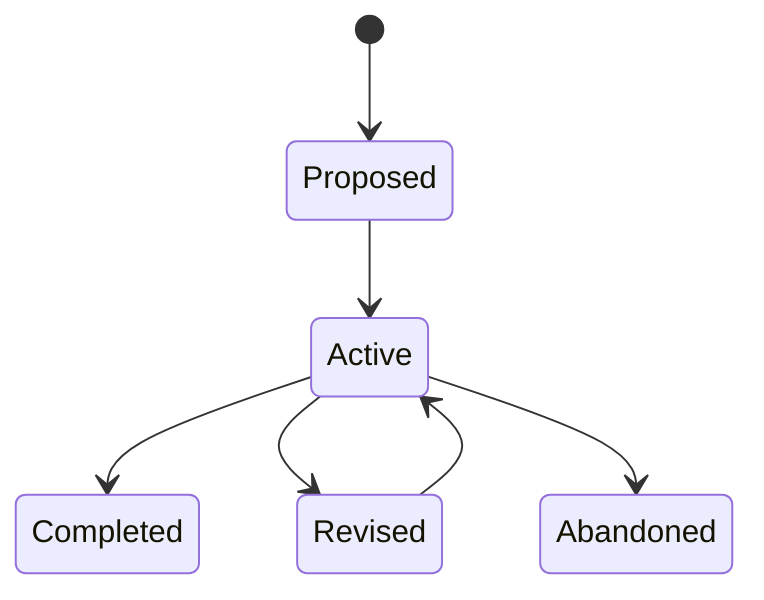
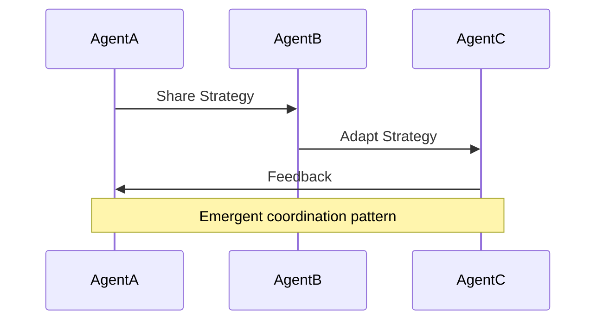

# Advanced Applications and Future Directions: Advanced Design Patterns and Optimization

## Learning Objectives

- Design advanced agentic patterns for complex systems
- Optimize resource usage and performance
- Analyze and manage emergent behaviors

---

## Introduction

This chapter introduces sophisticated patterns and optimization techniques for high-performing agentic systems.

---

As agentic systems move from simple task automation to complex, autonomous decision-makers, their design must evolve accordingly. Early agent designs often focus on single goals, linear workflows, and limited tool usage. However, real-world environments are dynamic, uncertain, and resource-constrained. To perform effectively in such conditions, agents must be organized hierarchically, reason about their own performance, manage costs, adapt goals over time, and—perhaps most challenging—handle emergent behaviors that arise from interactions at scale.

This chapter explores **advanced design patterns and optimization techniques** that enable high-performing agentic systems. Rather than focusing on basic agent construction, we examine how multiple agents can be composed, how they can reflect on their own actions, how resources can be optimized, and how designers can both harness and control emergent behaviors. These ideas are essential for building production-grade systems such as autonomous research assistants, multi-agent simulations, enterprise workflow automation, and large-scale AI-driven decision platforms.

---

By the end of this chapter, you will be able to:

- Design advanced agentic patterns suitable for complex, real-world systems  
- Apply hierarchical and meta-agent architectures to improve scalability and robustness  
- Optimize computational, financial, and time-based resources in agentic systems  
- Understand and manage emergent behaviors resulting from agent interactions  
- Design adaptive goal management mechanisms that respond to changing environments  

---

## Hierarchical and Meta-Agent Designs

Hierarchical agent design is inspired by how humans and organizations solve complex problems. Instead of one individual handling everything, responsibilities are divided across roles, with higher-level decision-makers coordinating lower-level specialists. In agentic systems, this translates into **layers of agents**, each with different scopes of authority and abstraction. Lower-level agents execute specific tasks, while higher-level agents focus on planning, prioritization, and evaluation.

At the core of this approach is the idea of **decomposition**. A complex goal—such as “conduct market research and produce a strategic report”—is broken into sub-goals like data collection, trend analysis, and summarization. Each sub-goal can be assigned to a specialized agent. A **manager agent** oversees progress, resolves conflicts, and integrates results. This reduces cognitive load on individual agents and improves overall system reliability.

Meta-agents extend this idea further. A **meta-agent** does not directly solve the problem domain; instead, it reasons *about other agents*. It can decide which agents to invoke, how to configure them, and when to stop or retry tasks. In practice, meta-agents act like orchestration layers or “AI project managers,” monitoring performance metrics and adjusting strategies dynamically.

### Example: Enterprise Document Processing

Imagine an enterprise system that processes thousands of legal documents daily:

- Worker agents extract clauses, entities, and references  
- Analyst agents interpret extracted data  
- A manager agent assigns workloads and validates outputs  
- A meta-agent monitors accuracy, cost, and latency, adjusting strategies as needed  

### Common Hierarchical Roles

| Agent Role        | Responsibility                         | Level of Abstraction |
|-------------------|----------------------------------------|----------------------|
| Worker Agent      | Execute atomic tasks                   | Low                  |
| Specialist Agent  | Handle domain-specific reasoning       | Medium               |
| Manager Agent     | Coordinate tasks and resolve conflicts | High                 |
| Meta-Agent        | Optimize agent usage and strategies    | Very High            |

### Hierarchical Structure Visualization

**Why this matters:** Hierarchical and meta-agent designs improve scalability, fault tolerance, and interpretability. They allow systems to grow in complexity without becoming brittle or opaque.

---

## Tool-Oriented and Self-Reflective Agents

Modern agents rarely operate in isolation. They interact with tools such as databases, APIs, code interpreters, and external services. **Tool-oriented agents** are designed with explicit mechanisms for selecting, invoking, and evaluating tools as part of their reasoning process. Rather than embedding all logic internally, they delegate specialized operations to external tools.

Self-reflective agents take this a step further by **evaluating their own performance**. After completing a task, they assess whether the outcome meets quality criteria, whether a different approach might be better, or whether additional information is needed. This reflection loop mirrors human problem-solving: try, evaluate, adjust.

A common pattern combines tool usage with reflection. For example, an agent may attempt to answer a question, use a search tool to gather evidence, generate an answer, and then critique its own response for gaps or inconsistencies. If issues are found, the agent repeats the cycle with improved prompts or alternative tools.

### Reflection Loop in Practice

### Tool-Oriented vs Self-Reflective Agents

| Aspect                | Tool-Oriented Agents                  | Self-Reflective Agents               |
|-----------------------|---------------------------------------|--------------------------------------|
| Primary Focus         | Effective tool usage                  | Performance evaluation               |
| Key Capability        | Selecting and invoking tools          | Self-critique and adjustment         |
| Typical Use Case      | Data retrieval, computation           | Quality assurance, learning          |
| Risk                  | Over-reliance on tools                | Increased computation cost           |

### Case Study: Automated Research Assistant

A research assistant agent might:

- Use search tools to gather sources  
- Use summarization tools to condense content  
- Reflect on whether sources are diverse and credible  
- Re-run searches if gaps are detected  

**Why this matters:** Tool-oriented and self-reflective agents are more robust and adaptable. They reduce hallucinations, improve accuracy, and enable continuous improvement without explicit retraining.

---

## Resource Optimization and Cost Control

As agentic systems scale, resource usage becomes a critical concern. Each agent invocation consumes time, compute, and often financial resources. Without careful design, costs can grow exponentially. **Resource optimization** focuses on balancing performance with efficiency, ensuring that agents deliver value proportional to their expense.

One foundational strategy is **selective activation**. Not every task requires the most powerful model or the full agent hierarchy. Lightweight agents can handle routine tasks, while heavyweight agents are reserved for complex reasoning. Caching results, reusing intermediate outputs, and setting execution budgets are also common optimization techniques.

Cost control is not just about reducing expenses—it is about **predictability**. Systems should have clear limits on maximum spend and latency. Meta-agents often play a role here, monitoring usage patterns and enforcing constraints such as “maximum tokens per task” or “maximum retries.”

### Optimization Strategies Overview

| Strategy              | Description                              | Benefit                    |
|-----------------------|------------------------------------------|----------------------------|
| Model Tiering         | Use different models for different tasks | Lower average cost         |
| Caching               | Reuse previous results                   | Reduced latency            |
| Early Stopping        | Stop when confidence is sufficient       | Avoid wasted computation  |
| Budget Constraints    | Hard limits on resource usage             | Cost predictability        |

### Resource Allocation Flow

### Real-World Analogy

Think of resource optimization like managing household expenses. You don’t use premium services for every need. Instead, you match the cost to the importance of the task. Agentic systems require the same discipline to remain sustainable.

---

## Adaptive Goal Management

Traditional systems operate with fixed goals defined at design time. In contrast, advanced agentic systems must **adapt goals dynamically** based on context, feedback, and changing priorities. Adaptive goal management allows agents to revise, defer, or abandon goals when conditions change.

This process typically involves three layers: goal generation, goal evaluation, and goal revision. Agents continuously assess whether a goal is still relevant, achievable, or valuable. For example, if a data source becomes unavailable, an agent may switch to an alternative objective that still satisfies higher-level intentions.

Adaptive goals are especially important in long-running systems such as autonomous monitoring, personal assistants, or strategic planning tools. Without adaptation, agents risk pursuing outdated or counterproductive objectives.

### Goal Lifecycle

### Fixed vs Adaptive Goals

| Dimension          | Fixed Goals                     | Adaptive Goals                   |
|--------------------|----------------------------------|----------------------------------|
| Flexibility        | Low                              | High                              |
| Responsiveness     | Slow to change                   | Context-aware                     |
| Complexity         | Easier to implement              | More complex logic                |
| Suitability        | Static environments              | Dynamic environments              |

**Why this matters:** Adaptive goal management prevents wasted effort and improves alignment with real-world conditions. It enables agents to behave more like intelligent collaborators rather than rigid machines.

---

## Emergent Behavior and Control

When multiple agents interact, the system may exhibit behaviors that were not explicitly programmed. This phenomenon, known as **emergent behavior**, can be beneficial or harmful. Examples include spontaneous collaboration, unexpected optimization strategies, or, conversely, feedback loops and resource contention.

Emergence arises from local interactions following simple rules. Just as traffic jams emerge from individual driver behaviors, agentic systems can develop patterns that are difficult to predict from individual agent logic alone. Understanding this is crucial for designing safe and effective multi-agent systems.

Control mechanisms aim to **guide emergence without suppressing it entirely**. Techniques include introducing global constraints, monitoring system-level metrics, and using intervention agents that step in when behaviors exceed acceptable bounds.

### Emergence Control Mechanisms

| Mechanism              | Purpose                              | Example                         |
|------------------------|--------------------------------------|----------------------------------|
| Global Constraints     | Limit harmful behaviors              | Rate limits                     |
| Monitoring Agents      | Detect anomalies                     | Pattern detection               |
| Intervention Policies  | Correct undesirable dynamics         | Forced resets                   |

### Interaction-Induced Emergence

**Why this matters:** Emergent behavior is both a risk and an opportunity. Systems that ignore it may become unstable, while systems that understand and guide it can achieve surprising levels of efficiency and creativity.

---

## Summary

This chapter explored advanced patterns and optimization strategies for building high-performing agentic systems. We examined hierarchical and meta-agent designs that improve scalability, tool-oriented and self-reflective agents that enhance robustness, and resource optimization techniques that ensure sustainability. We also discussed adaptive goal management as a foundation for long-term autonomy and the challenges of emergent behavior in multi-agent environments.

Together, these concepts move agentic systems beyond simple automation toward resilient, adaptive, and intelligent ecosystems.

---

## Reflection Questions

1. How might a meta-agent improve reliability in a mission-critical system?  
2. What trade-offs exist between self-reflection and resource efficiency?  
3. Can emergent behavior ever be fully controlled, or should it be guided instead?  
4. In what types of applications are adaptive goals essential rather than optional?  

Reflecting on these questions will help you internalize the design principles and apply them effectively in real-world systems.