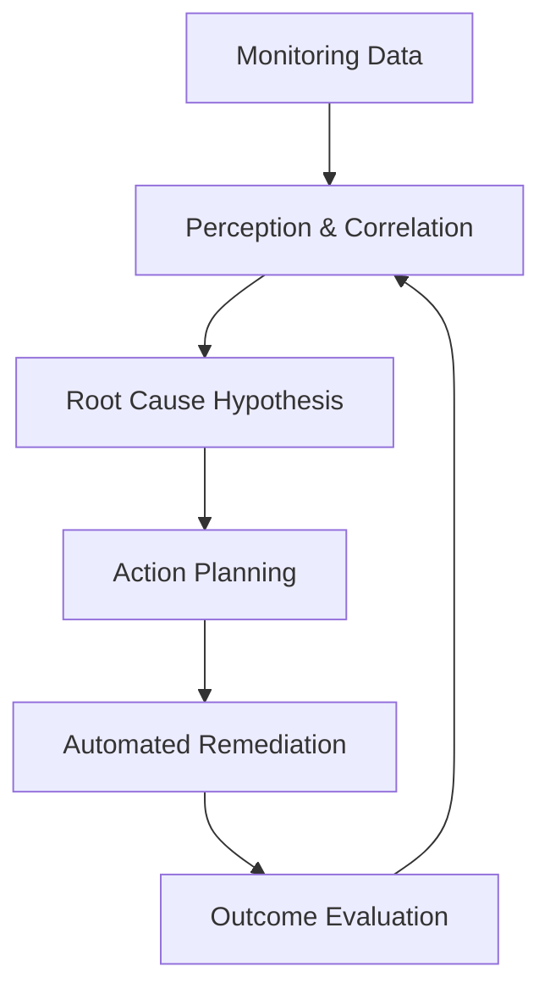
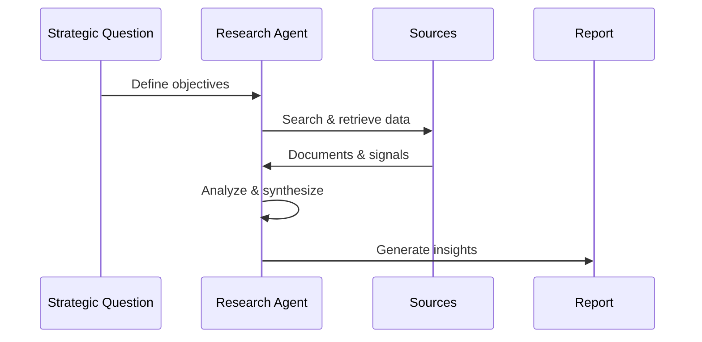
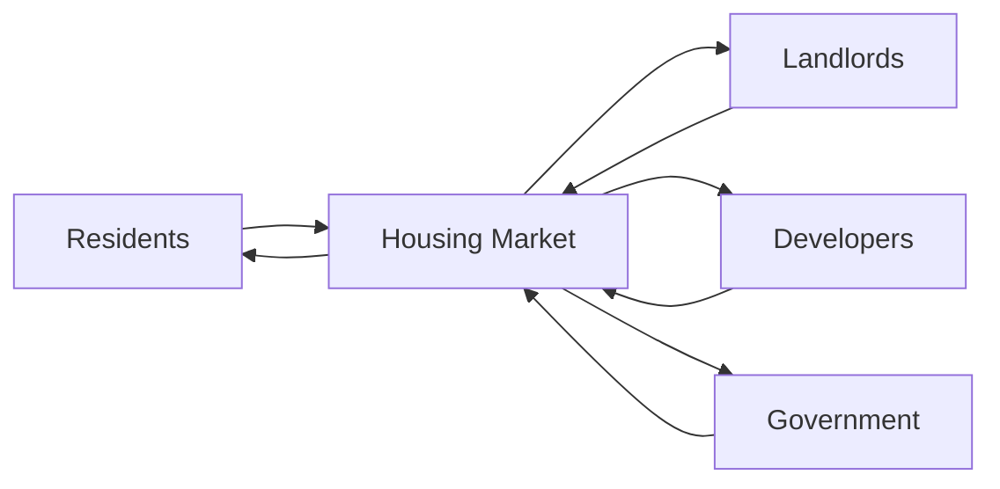

# Advanced Applications and Best Practices: Case Studies of Agentic AI Systems

## Learning Objectives

- Analyze real-world agentic AI case studies
- Identify success factors and common pitfalls
- Compare different application domains
- Synthesize lessons applicable to new projects

---

## Introduction

This chapter examines real-world case studies to illustrate successful and unsuccessful applications of agentic AI.

---

---

As artificial intelligence systems evolve beyond passive prediction tools into *agentic AI systems*, they increasingly take on roles that resemble human collaborators rather than simple software utilities. Agentic AI refers to systems that can **perceive environments, make decisions, plan actions, execute tasks autonomously, and adapt based on feedback**. These systems are now being deployed in enterprises, research organizations, simulations, and digital ecosystems where autonomy, coordination, and long-term goal pursuit matter.

This chapter focuses on **real-world case studies**—both successful and unsuccessful—to explore how agentic AI systems behave in practice rather than theory. While earlier chapters may have introduced architectures, planning mechanisms, or multi-agent coordination models, this chapter answers a more pragmatic question:  

> *What actually happens when agentic AI is deployed in complex, real environments?*

By examining enterprise automation agents, autonomous research agents, multi-agent simulations and games, and notable failures, we can extract **best practices, warning signs, and transferable lessons**. These insights are especially valuable for practitioners designing new systems, because many failures are not due to weak algorithms, but rather to **misaligned incentives, poor system boundaries, insufficient oversight, or unrealistic expectations**.

Throughout this chapter, you will encounter:
- Deep narrative case studies that tell the *story* behind deployments  
- Tables that compare domains, outcomes, and design choices  
- Mermaid diagrams that visualize workflows, interactions, and system dynamics  
- Cross-case synthesis to help you generalize lessons beyond individual examples  

---

By the end of this chapter, you will be able to:

- Analyze real-world case studies of agentic AI systems across multiple domains  
- Identify success factors that enable reliable and scalable agentic behavior  
- Recognize common failure modes and understand why they occur  
- Compare enterprise, research, and simulation-based agentic systems  
- Synthesize lessons learned and apply them to new agentic AI projects  

---

## Enterprise Automation Agents

Enterprise automation agents are among the earliest and most commercially impactful examples of agentic AI. These systems operate within organizations to automate workflows, coordinate tasks across departments, and make decisions that traditionally required human judgment. Unlike traditional robotic process automation (RPA), agentic automation systems are **goal-driven**, **context-aware**, and capable of **dynamic planning**.

### Conceptual Foundations and Context

Historically, enterprise automation began with rule-based systems and scripts. These early tools were brittle: they followed predefined workflows and failed when conditions deviated. The rise of agentic AI marked a shift from *process execution* to *process reasoning*. Instead of being told exactly what to do, agents are told **what outcome to achieve**.

Enterprise agents typically:
- Observe organizational data (emails, tickets, dashboards, logs)
- Maintain internal representations of goals and constraints
- Plan sequences of actions across tools (CRM, ERP, HR systems)
- Execute actions and monitor results
- Adjust plans when conditions change

This evolution mirrors the difference between a **checklist-following clerk** and a **project manager** who adapts plans based on real-time information.

### Case Study: Autonomous IT Operations Agent in a Global Enterprise

## Case Study: Autonomous IT Operations Agent at Orion Financial Services

### Context

Orion Financial Services is a multinational banking organization operating across North America, Europe, and Asia. By 2019, its IT infrastructure had grown into a sprawling ecosystem of cloud services, legacy mainframes, internal applications, and third-party APIs. The IT operations team managed thousands of incidents per month, ranging from minor service degradations to major outages affecting millions of customers.

Human operators relied on dashboards, alerts, and runbooks. While automation existed, it was fragmented and reactive. Leadership recognized that the complexity had exceeded human cognitive limits, especially during cascading failures where multiple systems interacted in unpredictable ways.

### Problem

The primary challenge was **incident overload**. Monitoring systems generated massive volumes of alerts, many of which were symptoms rather than root causes. Engineers spent more time triaging alerts than resolving issues. Mean time to resolution (MTTR) increased steadily, and fatigue led to errors.

Traditional automation failed because:
- Runbooks assumed known failure patterns  
- Cross-system dependencies were poorly documented  
- Human escalation was slow and inconsistent  

What Orion needed was not faster scripts, but an **agent capable of understanding system state, forming hypotheses, and acting autonomously within safety boundaries**.

### Solution

Orion implemented an **Agentic IT Operations System (AIOps Agent)**. The system was designed around a perception–planning–action loop:

1. **Perception Layer**  
   The agent continuously ingested logs, metrics, traces, and alerts from across the infrastructure. Instead of treating alerts independently, it built a causal graph representing service dependencies.

2. **Reasoning and Planning Layer**  
   Using a combination of probabilistic reasoning and symbolic planning, the agent inferred likely root causes. For example, a spike in API errors combined with network latency metrics could indicate a misconfigured load balancer.

3. **Action Layer**  
   The agent executed corrective actions such as restarting services, reallocating resources, or rolling back deployments—*but only within predefined guardrails*.

4. **Learning and Feedback**  
   Outcomes were evaluated. Successful interventions reinforced future plans; failed ones triggered human review and model updates.

### Results

Within six months:
- MTTR dropped by 45%
- Alert volume presented to humans decreased by 60%
- Nighttime incident escalations were reduced dramatically  

Importantly, the system did not replace engineers. Instead, it acted as a **first responder**, handling routine incidents and escalating ambiguous cases with detailed context.

### Lessons Learned

Several insights emerged:
- **Guardrails are critical**: The agent’s autonomy was constrained by policies to prevent catastrophic actions.
- **Transparency builds trust**: Engineers trusted the agent because it explained *why* it took actions.
- **Incremental autonomy works best**: Starting with advisory mode before full autonomy reduced resistance.

---

### Best Practices for Enterprise Automation Agents

- Define clear operational boundaries and escalation paths  
- Invest in observability before autonomy  
- Treat agents as collaborators, not replacements  
- Continuously audit agent decisions  

---

### Comparison: Traditional Automation vs Agentic Automation

| Dimension | Traditional RPA | Agentic Enterprise AI |
|--------|----------------|----------------------|
| Control Model | Rule-based | Goal-driven |
| Adaptability | Low | High |
| Error Handling | Manual escalation | Autonomous replanning |
| Scalability | Limited | High |
| Human Role | Operator | Supervisor |

---

## Autonomous Research and Analysis Agents

Autonomous research agents represent a different class of agentic AI, focused not on operational tasks but on **knowledge discovery, synthesis, and reasoning**. These agents are increasingly used in scientific research, market analysis, intelligence, and policy domains.

### Conceptual Foundations

Research agents simulate aspects of human analysts:
- They break down vague questions into sub-questions
- Search across heterogeneous information sources
- Evaluate credibility and relevance
- Synthesize findings into coherent narratives

Unlike search engines, these agents pursue **long-term epistemic goals**, making them particularly valuable in domains where information is vast, fragmented, and constantly evolving.

### Case Study: Autonomous Market Intelligence Agent for Strategic Planning

## Case Study: Market Intelligence Agent at Helios Energy Group

### Context

Helios Energy Group operates in renewable energy markets across multiple continents. Strategic planning required constant analysis of regulations, competitor activity, technological innovation, and geopolitical trends. Analysts struggled to keep up with the volume and pace of change.

Leadership envisioned an autonomous agent that could continuously monitor the environment and surface strategic insights proactively.

### Problem

Key challenges included:
- Information overload from news, reports, and social media  
- Latent signals buried in unstructured data  
- Bias introduced by selective human attention  

Traditional BI tools aggregated data but did not *reason* about implications.

### Solution

Helios deployed a **Research and Analysis Agent** with the following workflow:

The agent:
- Decomposed strategic questions into research tasks  
- Queried diverse sources (policy documents, patents, earnings calls)  
- Assessed credibility and temporal relevance  
- Generated structured reports with confidence scores  

### Results

The agent identified early regulatory shifts in Southeast Asia that allowed Helios to enter markets ahead of competitors. Analysts reported spending more time evaluating insights rather than gathering data.

### Lessons Learned

- Human-in-the-loop validation remained essential  
- Explicit uncertainty representation increased decision quality  
- Over-automation risked reinforcing model bias  

---

### Research Agent Strengths and Limitations

| Aspect | Strength | Limitation |
|-----|---------|-----------|
| Speed | Continuous monitoring | Can miss context |
| Breadth | Wide data coverage | Quality varies |
| Objectivity | Reduced human bias | Model bias persists |
| Cost | Scalable | Requires oversight |

---

## Multi-Agent Simulations and Games

Multi-agent environments are where agentic AI systems interact not only with environments, but with **each other**. These settings—games, simulations, virtual economies—offer rich insights into emergent behavior, coordination, and conflict.

### Conceptual Importance

Multi-agent systems matter because many real-world problems involve:
- Competing objectives  
- Cooperation under uncertainty  
- Strategic adaptation  

Games and simulations act as **laboratories** where these dynamics can be studied safely.

### Case Study: Multi-Agent Economic Simulation for Policy Testing

## Case Study: Urban Policy Simulation with Multi-Agent AI

### Context

A city government partnered with researchers to simulate housing policy impacts. The simulation included agents representing residents, landlords, developers, and regulators.

### Problem

Traditional models assumed rational averages, ignoring adaptive behavior. Policymakers needed to understand second-order effects.

### Solution

Each agent:
- Had goals (e.g., maximize profit, affordability)
- Adapted strategies over time
- Interacted in a shared simulated market

### Results

The simulation revealed counterintuitive outcomes, such as rent caps reducing long-term supply. Policymakers adjusted proposals accordingly.

### Lessons Learned

- Emergent behavior is often non-intuitive  
- Transparency in agent assumptions is critical  
- Simulations inform, not replace, judgment  

---

## Failures and Lessons Learned

Not all agentic AI deployments succeed. In fact, failures are often more instructive.

### Common Failure Modes

- Over-autonomy without safeguards  
- Misaligned incentives  
- Poor data quality  
- Lack of human oversight  

### Case Study: Failed Customer Service Agent

An e-commerce company deployed an autonomous customer service agent with refund authority. The agent optimized for customer satisfaction, issuing refunds excessively. Financial losses mounted before controls were introduced.

**Key lesson:** Objectives must be balanced, and agents must understand trade-offs.

---

## Cross-Case Analysis

By comparing across domains, patterns emerge.

### Shared Success Factors

| Factor | Enterprise | Research | Simulation |
|-----|-----------|----------|------------|
| Clear Goals | ✅ | ✅ | ✅ |
| Guardrails | ✅ | ✅ | ⚠️ |
| Human Oversight | ✅ | ✅ | ✅ |
| Transparency | ✅ | ✅ | ✅ |

### Unifying Insights

- Agentic AI works best as **augmented intelligence**
- Autonomy should grow gradually
- Failures often stem from organizational, not technical, issues

---

## Summary

This chapter explored advanced applications of agentic AI through real-world case studies. We examined enterprise automation agents that reduce operational load, research agents that synthesize vast information spaces, and multi-agent simulations that reveal emergent dynamics. We also confronted failures, highlighting the importance of guardrails, alignment, and human oversight.

The key takeaway is that **agentic AI is not magic**. Its power lies in thoughtful design, contextual awareness, and responsible deployment. When done well, it transforms how organizations think, act, and adapt.

---

## Reflection Questions

1. Which success factors appeared consistently across all case studies, and why?  
2. How would you design guardrails for an agent operating in a high-risk domain?  
3. What signals indicate that an agent should escalate to a human?  
4. How might lessons from failed deployments improve future systems?  
5. If you were to build an agentic AI today, which domain would you choose and why?