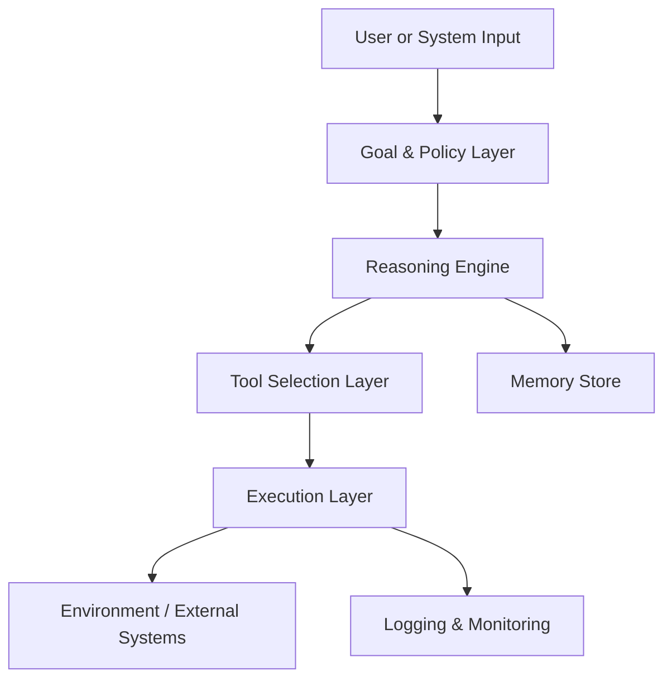
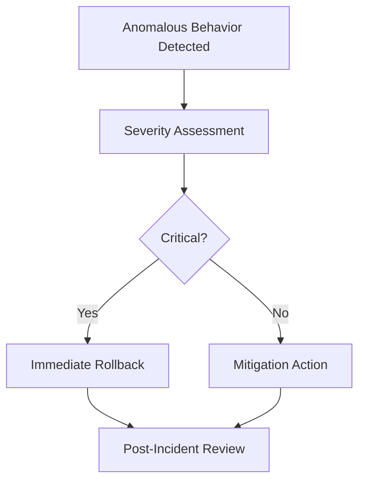

# Advanced Applications and Best Practices: Best Practices for Production Agentic AI

## Learning Objectives

- Apply best practices in production system design
- Design testing and validation pipelines
- Evaluate organizational readiness for agentic AI
- Implement continuous improvement processes

---

## Introduction

This chapter consolidates best practices for building reliable, safe, and effective agentic AI in production environments.

---


---


As agentic AI systems move from experimental prototypes to mission-critical production environments, the stakes rise dramatically. Unlike traditional machine learning models that passively generate predictions, **agentic AI systems actively plan, decide, act, and adapt**—often interacting with real users, enterprise systems, and even other autonomous agents. This shift introduces an entirely new class of risks and opportunities. A poorly designed agent can cause cascading failures, security incidents, reputational damage, or costly downtime. A well-designed agent, however, can operate reliably at scale, continuously improve, and unlock entirely new business capabilities.

This chapter consolidates **best practices for building reliable, safe, and effective agentic AI in production environments**. Rather than focusing on algorithms alone, we take a holistic view that includes system design principles, rigorous testing strategies, deployment pipelines, incident response planning, and organizational readiness. These practices have emerged from hard-earned lessons across software engineering, safety-critical systems, DevOps, and real-world AI deployments.

You should think of this chapter as a **practical field guide**. It explains not only *what* to do, but *why* these practices matter, *how* to implement them step by step, and *when* to apply them depending on context. We will use concrete examples, detailed case studies, tables, and diagrams to make abstract ideas tangible. By the end, you should feel confident designing production-grade agentic AI systems that are trustworthy, maintainable, and aligned with organizational goals.

---


By the end of this chapter, you will be able to:

- Apply proven best practices in production agentic AI system design  
- Design comprehensive testing and validation pipelines for agent behavior  
- Implement deployment, monitoring, and continuous improvement processes  
- Design effective incident response and rollback strategies for AI systems  
- Evaluate and strengthen organizational readiness for agentic AI adoption  

---

## Design Principles and Checklists

Building production-grade agentic AI starts long before deployment. It begins with **design principles**—shared assumptions and constraints that shape every architectural decision. Historically, many AI failures in production can be traced not to model quality, but to unclear responsibilities, hidden coupling between components, or missing safety boundaries. Agentic systems magnify these risks because they combine reasoning, memory, tools, and autonomy into a single loop.

At its core, a design principle is a **preventive measure**. Just as civil engineers design bridges with load limits and redundancy, AI engineers must design agents with bounded authority, explicit goals, and observable behavior. Early agent experiments often prioritized capability over control. In production, the balance shifts decisively toward **predictability, auditability, and resilience**.

### Core Principles for Production Agentic AI

One foundational principle is **explicit goal and scope definition**. An agent must have a clearly articulated objective and well-defined boundaries. Ambiguous goals often lead to emergent behaviors that are impressive in demos but dangerous in real systems. For example, an operations agent tasked with “optimize costs” without constraints may aggressively shut down critical services. In practice, goals should be decomposed into measurable objectives, constraints, and stop conditions.

Another critical principle is **separation of concerns**. Agentic systems typically include multiple components: reasoning engines, memory stores, tool interfaces, and policy layers. When these responsibilities are tightly coupled, changes in one area can unpredictably affect others. By isolating concerns—for example, separating decision logic from execution—you enable safer iteration and easier debugging.

A third principle is **defensive autonomy**. This means assuming that the agent will eventually encounter ambiguous, adversarial, or unexpected situations. Defensive autonomy introduces safeguards such as permission checks, human-in-the-loop approvals, rate limits, and fallback behaviors. The idea is not to remove autonomy, but to **shape it safely**, much like guardrails on a highway.

Finally, **observability by design** is essential. Traditional software often adds logging as an afterthought. Agentic AI must treat observability as a first-class feature. Every decision, tool call, and state transition should be traceable. This is the only way to debug failures, audit behavior, and build trust with stakeholders.

### Design Checklist for Production Readiness

To operationalize these principles, teams often rely on structured design checklists. These checklists act as cognitive aids, ensuring that critical questions are addressed before implementation begins.

**Typical design checklist items include:**

- Goal clarity  
  - Is the agent’s objective explicitly defined and measurable?  
  - Are there clear success and failure conditions?  

- Authority boundaries  
  - What systems can the agent read from or write to?  
  - Are there irreversible actions, and how are they protected?  

- Safety constraints  
  - What actions require human approval?  
  - Are there rate limits or budget caps?  

- Failure handling  
  - What happens if a tool fails or returns invalid data?  
  - Does the agent degrade gracefully?  

- Observability  
  - Are decisions logged with sufficient context?  
  - Can behaviors be replayed or simulated post hoc?  

### Table: Design Principles vs. Common Failure Modes

| Design Principle            | Addresses Failure Mode                     | Example Impact |
|----------------------------|--------------------------------------------|----------------|
| Explicit goals             | Goal drift, unintended optimization         | Prevents destructive “optimization” |
| Separation of concerns     | Hidden coupling, brittle changes            | Easier debugging and updates |
| Defensive autonomy         | Unsafe actions, runaway behavior            | Reduced blast radius |
| Observability by design    | Black-box failures                          | Faster incident resolution |

### Visualizing a Well-Designed Agent Architecture



This diagram highlights how responsibilities are separated while remaining connected through well-defined interfaces.

---

## Testing and Validation Strategies

Testing agentic AI is fundamentally different from testing traditional software. Instead of verifying fixed outputs for fixed inputs, we must validate **behavior across a space of possible situations**. Historically, early AI systems relied heavily on manual testing or ad hoc evaluation. In production, this approach quickly breaks down because agents operate continuously, adaptively, and often non-deterministically.

Testing strategies for agentic AI therefore evolved to borrow from **software testing, simulation science, and safety engineering**. The goal is not to eliminate all failures—which is impossible—but to understand failure modes, quantify risk, and ensure failures are controlled and recoverable.

### Layers of Testing for Agentic Systems

The most effective testing strategies use **multiple layers**, each addressing different types of risk. Unit tests validate individual components such as prompt templates, tool wrappers, or policy rules. Integration tests examine how components interact—for example, whether the reasoning engine correctly interprets tool responses. Scenario tests simulate realistic workflows, often using synthetic environments or recorded data.

Beyond these, **behavioral and adversarial testing** has become increasingly important. These tests deliberately stress the agent with ambiguous instructions, contradictory data, or malicious inputs. The purpose is to observe how the agent behaves under pressure and whether safeguards activate as expected.

Crucially, testing does not end before deployment. Continuous validation monitors live behavior against expected patterns. When deviations occur, alerts trigger investigation or automated mitigation.

### Table: Testing Types and Their Purpose

| Testing Type          | Focus Area                     | Example |
|----------------------|--------------------------------|---------|
| Unit testing         | Individual components          | Tool wrapper returns valid JSON |
| Integration testing | Component interactions         | Reasoning → tool → memory |
| Scenario testing    | End-to-end workflows           | Customer support conversation |
| Adversarial testing | Stress and misuse cases        | Prompt injection attempts |
| Live monitoring     | Production behavior            | Drift detection |

### Simulation as a Testing Superpower

Simulation deserves special emphasis. In many domains—finance, healthcare, logistics—it is unsafe or expensive to test agents directly in production. Simulated environments allow teams to explore thousands of scenarios quickly. For example, a logistics agent can be tested against simulated supply chain disruptions, weather events, and demand spikes long before it controls real inventory.

Simulation also supports **counterfactual analysis**: asking “what would the agent have done if conditions were slightly different?” This capability is invaluable for understanding near-misses and refining policies.

### Visualizing a Testing Pipeline


---

## Case Study: Validating a Customer Support Agent at Scale

### Context

In 2024, a global SaaS company introduced an agentic AI system to handle first-line customer support. The company served millions of users across multiple time zones, and support costs were rising rapidly. Leadership saw agentic AI as a way to provide instant, 24/7 responses while freeing human agents to handle complex cases.

The initial prototype performed well in demos. It could answer common questions, reset passwords, and even diagnose configuration issues. Encouraged by early results, the team prepared for production rollout. However, senior engineers raised concerns: the agent had never been tested at realistic scale or against adversarial user behavior.

### Problem

The primary risk was **unpredictable behavior under edge cases**. Customers often phrased questions ambiguously, mixed multiple issues in one message, or expressed frustration in emotionally charged language. There was also a risk of prompt injection, where users might try to manipulate the agent into revealing internal information.

Traditional QA processes—manual testing and scripted test cases—were insufficient. The team needed a way to systematically explore thousands of conversational paths and ensure that failures were safe and recoverable.

### Solution

The team designed a multi-layered testing strategy. First, they built extensive unit tests for prompt templates and tool integrations, ensuring consistent formatting and error handling. Next, they created a simulation environment that replayed anonymized historical chat logs, allowing the agent to respond as if it were in live conversations.

They also introduced adversarial testing. Internal red teams attempted to break the agent by crafting malicious prompts, contradictory instructions, and emotionally charged messages. Each failure was logged, categorized, and traced back to a root cause—often unclear policy rules or missing constraints.

Finally, they deployed the agent in a staged rollout. Initially, it handled only low-risk queries and always required human approval before sending responses. Over time, as confidence grew, autonomy was gradually increased.

### Results

Within three months, the agent handled 45% of incoming support tickets without human intervention. Average response time dropped from hours to seconds. Importantly, the rate of critical incidents—cases where the agent gave incorrect or unsafe advice—remained below 0.1%.

The testing framework also proved reusable. When new features were added, the same simulation and adversarial tests caught regressions early, preventing production incidents.

### Lessons Learned

The team learned that **testing is not a phase, but a continuous capability**. Simulation and adversarial testing were particularly valuable, revealing issues that no one had anticipated. They also found that staged autonomy builds trust—both internally and with customers.

---

## Deployment and Continuous Improvement

Deploying agentic AI to production is not a one-time event; it is the beginning of a lifecycle. Historically, many AI systems failed because teams treated deployment as “done” rather than as the start of continuous learning and adaptation. Agentic systems amplify this challenge because their behavior evolves as environments, data, and user expectations change.

### Progressive Deployment Strategies

Best practice favors **progressive deployment**. Instead of releasing full autonomy immediately, teams introduce agents gradually. Common techniques include shadow mode (agent observes but does not act), canary releases (agent handles a small percentage of traffic), and feature flags that allow instant rollback.

This approach mirrors practices from DevOps and site reliability engineering. The goal is to limit the blast radius of failures while collecting real-world data.

### Continuous Improvement Loops

Once deployed, agents should be embedded in a **feedback loop**. Logs, user feedback, and performance metrics feed into regular reviews. These reviews may result in prompt updates, policy changes, or retraining of underlying models.

Crucially, improvement must be disciplined. Uncontrolled prompt tweaks can introduce regressions. Mature teams treat prompts and policies as versioned artifacts, subject to code review and testing.

### Table: Deployment Strategies Compared

| Strategy        | Risk Level | Use Case |
|----------------|------------|----------|
| Big bang       | High       | Rarely recommended |
| Canary release | Medium     | Gradual confidence building |
| Shadow mode    | Low        | Early validation |
| Feature flags  | Variable   | Rapid rollback |

### Visualizing Continuous Improvement

```mermaid
cycle
    A[Production Behavior] --> B[Monitoring & Metrics]
    B --> C[Analysis & Review]
    C --> D[Design Updates]
    D --> E[Testing & Validation]
    E --> A
```

---

## Incident Response and Rollback

No matter how careful the design, incidents will occur. Production-grade agentic AI systems must therefore be built with **incident response in mind**. Historically, many organizations reacted to AI failures ad hoc, leading to prolonged outages and loss of trust. Modern best practices emphasize preparation, clarity, and speed.

### Preparing for Incidents

Preparation begins with **clear ownership**. Every agent should have an on-call owner responsible for monitoring and response. Runbooks should define what constitutes an incident, how severity is assessed, and which actions are authorized.

Equally important is **rollback capability**. Agents should be deployable in versions, with the ability to revert instantly to a known-safe state. This may involve disabling certain tools, reducing autonomy, or switching to a rule-based fallback.

### Responding to Live Incidents

When an incident occurs, the priority is containment. Observability tools help teams quickly understand what the agent did and why. In some cases, the safest response is to pause the agent entirely. In others, a targeted rollback suffices.

After resolution, **post-incident analysis** is critical. The goal is not blame, but learning. Teams should ask: What signals were missed? Which safeguards failed? How can detection and response be improved?

### Visualizing Incident Response Flow



---

## Organizational Readiness

Technology alone does not determine success. Many agentic AI initiatives fail because organizations are **not ready**—culturally, operationally, or ethically. Organizational readiness encompasses skills, governance, incentives, and shared understanding.

### Skills and Roles

Production agentic AI requires hybrid expertise. Teams must combine machine learning, software engineering, domain knowledge, and risk management. New roles often emerge, such as AI product owners, prompt engineers, and AI reliability engineers.

### Governance and Ethics

Clear governance structures define who can deploy agents, what approvals are required, and how ethical considerations are addressed. Without governance, teams may move fast but create long-term risk.

### Change Management

Finally, organizations must prepare people. Employees may fear automation or mistrust AI decisions. Transparent communication, training, and gradual rollout help build confidence and adoption.

### Table: Readiness Dimensions

| Dimension        | Key Questions |
|------------------|--------------|
| Skills           | Do teams have cross-functional expertise? |
| Governance       | Are decision rights clear? |
| Infrastructure   | Can systems support monitoring and rollback? |
| Culture          | Is experimentation balanced with safety? |

---

## Summary

Production agentic AI demands a shift in mindset—from experimentation to engineering discipline. By applying strong design principles, rigorous testing, progressive deployment, robust incident response, and organizational readiness, teams can unlock the power of agentic AI while managing its risks. The practices in this chapter are not optional extras; they are foundational to building systems that are trustworthy, resilient, and effective in the real world.

---

## Reflection Questions

1. Which design principles are most critical for your current or planned agentic AI system, and why?  
2. How would you design a testing strategy that balances coverage with practicality?  
3. What signals would indicate that your organization is not yet ready for production agentic AI?  
4. How would your team respond if an agent caused a high-impact incident tomorrow?