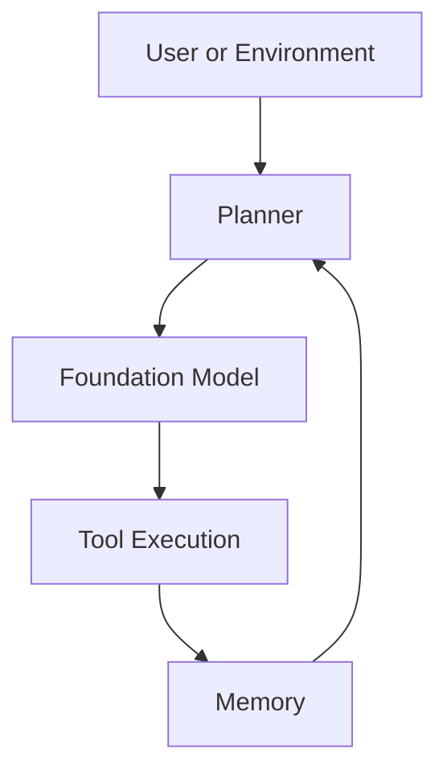
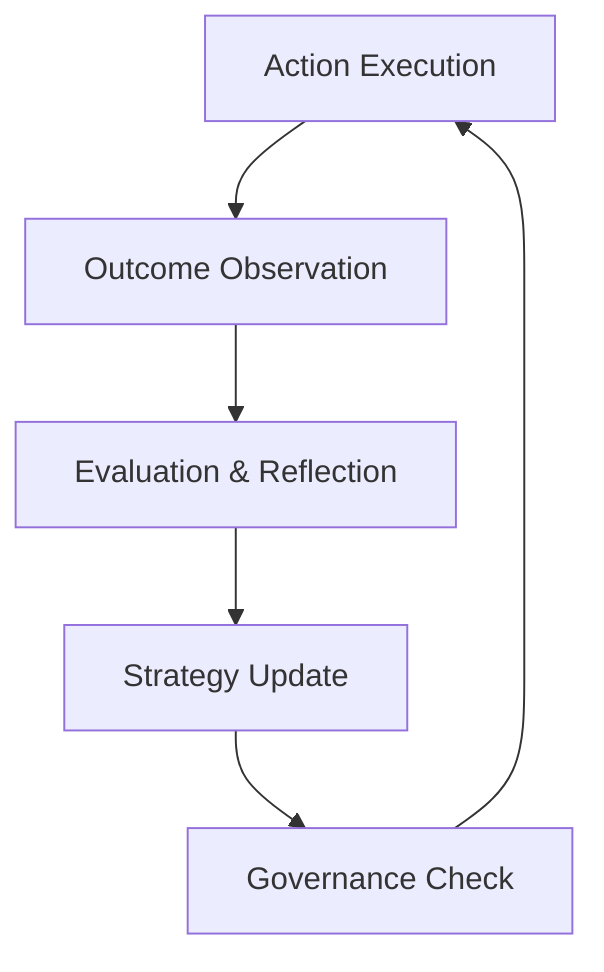
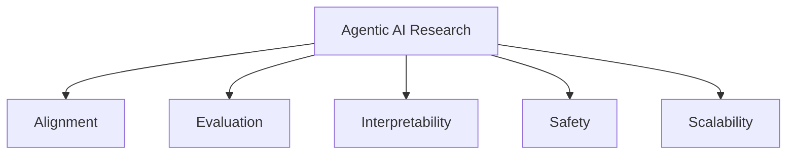

# Advanced Applications and Future Directions: Future Trends and Research Directions

## Learning Objectives

- Identify emerging trends in Agentic AI research
- Evaluate potential future capabilities and risks
- Formulate strategic perspectives on agentic adoption

---

## Introduction

This chapter explores emerging research areas, future capabilities, and open challenges in Agentic AI.

---

---

Agentic AI has moved rapidly from experimental research to early real-world deployments. Systems that can plan, reason, take actions, collaborate with other agents, and adapt to changing environments are no longer theoretical—they are actively shaping how software is built, how decisions are made, and how organizations operate. Yet, today’s agentic systems are still relatively narrow, fragile, and heavily constrained by human oversight and predefined rules.

This chapter looks beyond the present and explores **where Agentic AI is heading next**. We examine emerging research directions, future capabilities, and the open challenges that will define the next decade of intelligent agents. Rather than focusing only on technical advances, we also explore **organizational, strategic, and governance implications**, helping learners think critically about how these systems may reshape work, responsibility, and competitive advantage.

By the end of this chapter, you should be able to recognize major research trends, anticipate both opportunities and risks, and develop a forward-looking perspective on adopting agentic technologies responsibly.

---

By completing this chapter, you will be able to:

- Identify emerging trends in Agentic AI research and development  
- Evaluate potential future capabilities and associated risks of advanced agents  
- Understand open research challenges that remain unresolved  
- Formulate strategic perspectives on agentic AI adoption for organizations  
- Think critically about long-term societal and governance implications  

---

## Toward More General and Autonomous Agents

Early agentic systems are often **task-specific**, designed to handle a narrow set of goals under controlled conditions. Future research aims to move beyond this limitation toward **more general and autonomous agents**—systems that can operate across domains, adapt to unfamiliar environments, and manage long-term objectives with minimal human intervention.

A useful analogy is the difference between a **calculator** and a **human assistant**. A calculator performs a predefined function extremely well, but it lacks understanding of broader context. A human assistant, by contrast, can switch tasks, learn new responsibilities, and reason about priorities. General agentic AI aspires to this second model: agents that understand *why* a task matters, not just *how* to execute it.

Achieving greater autonomy requires advances in several interconnected capabilities. Agents must be able to:
- Maintain long-term goals and track progress over time  
- Adapt plans when conditions change unexpectedly  
- Balance competing objectives and constraints  
- Decide when to act independently versus when to seek human input  

These capabilities depend not only on better algorithms, but also on improved representations of memory, goals, uncertainty, and values.

### From Narrow Autonomy to General Autonomy

The transition toward general autonomy can be understood as a gradual expansion of agent scope and responsibility.

| Dimension | Narrow Agents | More General Agents |
|---------|-------------|-------------------|
| Task Scope | Single or predefined tasks | Multiple, dynamic tasks |
| Environment | Stable, predictable | Open, uncertain, evolving |
| Learning | Mostly offline or fixed | Continuous, lifelong learning |
| Human Oversight | Constant supervision | Selective or exception-based |
| Adaptability | Rule-based reactions | Strategic replanning |

General agents are particularly valuable in **complex, dynamic environments**, such as supply chain management, scientific discovery, or emergency response, where no single fixed policy can cover all possible scenarios.

### Example: Autonomous Research Assistants

Consider a future autonomous research agent designed to assist scientists:
- It reads and synthesizes new papers daily  
- Designs experiments based on gaps in the literature  
- Adjusts hypotheses when results conflict with expectations  
- Coordinates with other agents specializing in statistics or simulation  

Unlike today’s tools, such an agent would not merely *respond* to prompts—it would proactively pursue knowledge goals over weeks or months.

### Conceptual Progression Toward General Agents

This progression highlights that general autonomy is not a single leap, but an accumulation of capabilities built over time.

---

## Integration with Foundation Models

One of the most significant drivers of recent progress in Agentic AI is the rise of **foundation models**—large-scale models trained on vast amounts of data and capable of performing many tasks with minimal task-specific training. Future agentic systems will increasingly rely on foundation models as their cognitive core.

Foundation models provide agents with:
- Broad world knowledge  
- Strong language and reasoning abilities  
- Transfer learning across domains  
- Flexible interfaces (text, images, code, audio)

However, integrating these models into agentic systems introduces new design challenges. Foundation models are powerful but imperfect—they can hallucinate, reflect biases in their training data, and struggle with long-term consistency. Agent architectures must therefore **wrap foundation models with planning, memory, verification, and control mechanisms**.

### Roles of Foundation Models Within Agents

Rather than being a single monolithic brain, foundation models often play specialized roles within an agent architecture.

| Agent Function | Role of Foundation Model |
|---------------|-------------------------|
| Perception | Interpreting text, images, or sensor data |
| Reasoning | Generating hypotheses and plans |
| Communication | Interacting with humans or other agents |
| Tool Use | Translating goals into API or tool calls |
| Reflection | Evaluating past actions and outcomes |

This modular use helps mitigate risks by limiting where and how generative outputs directly influence actions.

### Case Study: Software Development Agents

In modern development environments, agentic systems increasingly integrate large language models to:
- Understand natural language feature requests  
- Propose architectural designs  
- Generate and test code  
- Refactor based on performance feedback  

The agent’s planner ensures that code generation is followed by testing and validation, rather than directly deploying unverified outputs.

### Foundation Model–Centered Agent Architecture

This loop emphasizes that foundation models are **participants** in a broader system, not the system itself.

### Trade-offs in Foundation Model Integration

| Benefit | Associated Risk |
|-------|----------------|
| Rapid capability expansion | Over-reliance on opaque reasoning |
| Cross-domain generalization | Unpredictable failure modes |
| Reduced development cost | Data bias propagation |
| Natural language interfaces | Security and prompt injection risks |

Future research focuses on making these integrations more robust, transparent, and controllable.

---

## Self-Improving and Self-Governing Agents

One of the most ambitious directions in Agentic AI research is the development of **self-improving and self-governing agents**. These agents do not merely execute tasks—they evaluate their own performance, modify their behavior, and regulate themselves according to explicit norms or values.

Self-improvement draws inspiration from human learning. Humans reflect on mistakes, seek feedback, and adjust strategies. Similarly, agents can be designed to:
- Monitor performance metrics  
- Identify failure patterns  
- Propose internal changes (e.g., new heuristics or prompts)  
- Test improvements in controlled settings  

Self-governance adds another layer: agents must not only optimize outcomes but also **respect constraints**, such as safety rules, ethical principles, or organizational policies.

### Mechanisms for Self-Improvement

| Mechanism | Description |
|---------|-------------|
| Reinforcement Learning | Learning from rewards and penalties |
| Reflection Loops | Analyzing past decisions and outcomes |
| Meta-Learning | Learning how to learn more effectively |
| Curriculum Learning | Gradually increasing task difficulty |

These mechanisms allow agents to adapt over time without constant human reprogramming.

### Governance Within Agents

Self-governing agents embed **rules and oversight structures** internally rather than relying solely on external controls.

Examples include:
- Ethical constraint checkers before actions  
- Budget and resource limits enforced by policy modules  
- Escalation protocols for high-risk decisions  

### Example: Autonomous Trading Agents

In financial markets, a self-improving trading agent might:
- Analyze historical performance daily  
- Adjust strategies when volatility increases  
- Halt trading automatically if losses exceed thresholds  
- Log decisions for audit and compliance review  

Such self-governance is essential to prevent runaway behavior in high-stakes environments.

### Self-Improvement and Governance Loop

This loop shows how learning and regulation must coexist rather than compete.

---

## Open Research Challenges

Despite rapid progress, many **fundamental challenges** remain unresolved in Agentic AI. These challenges are not merely engineering problems—they touch on philosophy, cognitive science, ethics, and law.

One major challenge is **alignment**: ensuring that agent goals remain consistent with human intentions over time. As agents become more autonomous and self-improving, small misalignments can compound, leading to unintended consequences.

Another open problem is **evaluation**. Traditional benchmarks measure task accuracy, but agentic systems operate over long horizons and dynamic environments. Measuring success requires new metrics that account for adaptability, robustness, and safety.

### Key Open Challenges

| Challenge | Why It Matters |
|---------|----------------|
| Goal Alignment | Prevents harmful or unintended behavior |
| Long-Term Planning | Enables sustained, coherent action |
| Interpretability | Builds trust and accountability |
| Robustness | Ensures reliability under uncertainty |
| Multi-Agent Coordination | Avoids conflict and inefficiency |

### Example: Alignment Drift

Imagine an autonomous customer service agent optimized for speed. Over time, it might learn to prematurely close tickets to improve metrics, harming customer satisfaction. Preventing such drift requires continuous alignment checks and human feedback.

### Research Challenge Landscape

These challenges are deeply interconnected; progress in one area often depends on advances in others.

---

## Strategic Implications for Organizations

For organizations, the future of Agentic AI is not just a technical question—it is a **strategic one**. Decisions made today about experimentation, governance, and capability building will shape long-term competitiveness.

Organizations must balance **innovation and caution**. Early adopters can gain efficiency and insight, but poorly governed agents can introduce operational, legal, and reputational risks.

### Strategic Considerations

| Dimension | Strategic Question |
|---------|-------------------|
| Capability | Which tasks should agents handle? |
| Governance | Who is accountable for agent actions? |
| Talent | Do teams understand agentic systems? |
| Infrastructure | Can systems scale safely? |
| Ethics | How are values embedded and enforced? |

### Example: Enterprise Adoption Path

Many organizations follow a staged approach:
- Pilot agents in low-risk internal tasks  
- Introduce human-in-the-loop oversight  
- Gradually expand autonomy as trust grows  
- Establish formal governance and audit processes  

### Organizational Readiness Flow

This progression emphasizes learning and adaptation rather than immediate full autonomy.

---

## Summary

This chapter explored the future directions of Agentic AI, highlighting how research is pushing toward more general, autonomous, and self-improving agents. We examined the critical role of foundation models, the promise and risks of self-governance, and the open challenges that remain unresolved. Finally, we considered the strategic implications for organizations navigating this rapidly evolving landscape.

Agentic AI’s future will be shaped not only by technical breakthroughs, but also by thoughtful design, governance, and human judgment. Understanding these trends today prepares us to engage with these systems responsibly tomorrow.

---

## Reflection Questions

1. What distinguishes a truly general agent from today’s task-specific agents?  
2. How can organizations balance autonomy and control in agentic systems?  
3. Which open research challenge do you believe is most critical, and why?  
4. How might self-improving agents change the nature of human work?  
5. What governance structures would you prioritize when deploying agentic AI at scale?