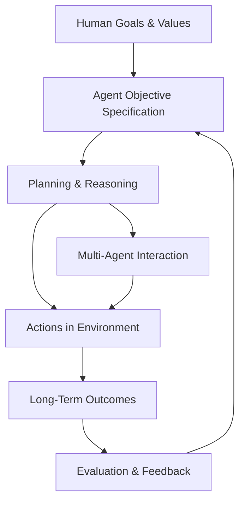
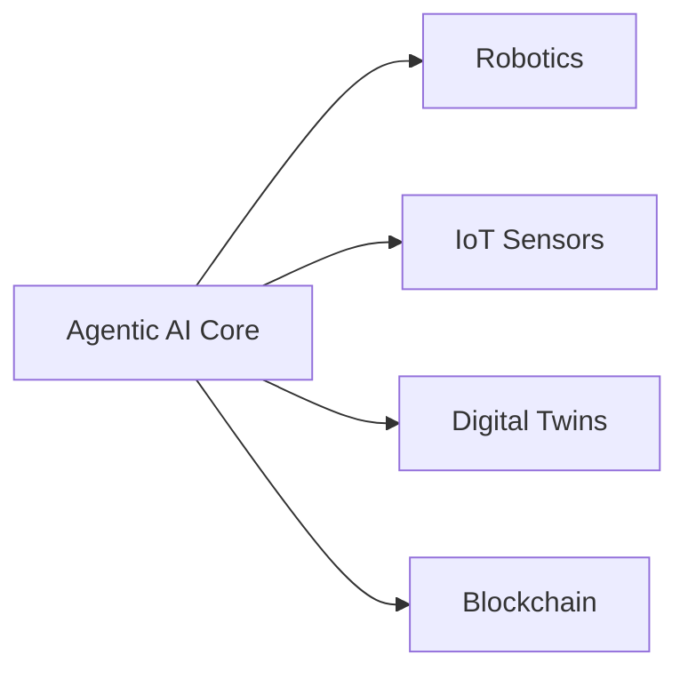
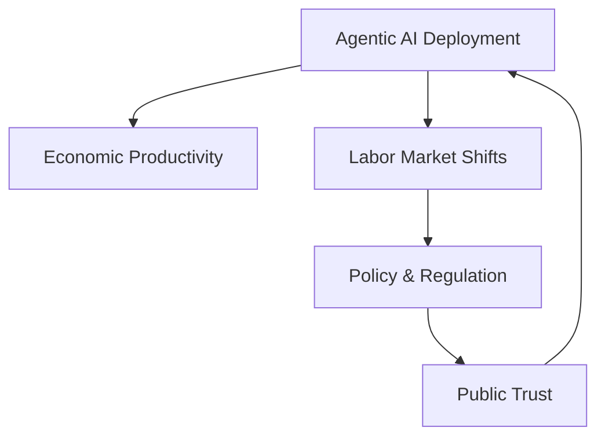
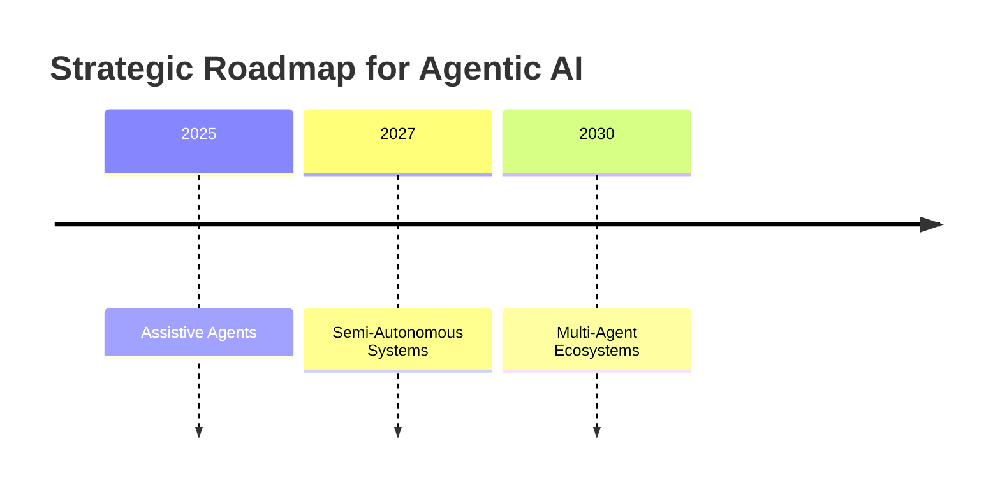

# Advanced Applications and Best Practices: Future Directions of Agentic AI

## Learning Objectives

- Identify key open research challenges
- Analyze future trends in agentic AI
- Evaluate societal impacts of widespread autonomy
- Develop strategic roadmaps for future systems

---

## Introduction

This chapter explores emerging research, open challenges, and future trajectories of Agentic AI.

---

---

Agentic AI represents a fundamental shift in how artificial intelligence systems are designed, deployed, and governed. Unlike traditional AI systems that operate as passive tools—responding to inputs with predefined or learned outputs—agentic AI systems are proactive, goal-driven, and capable of autonomous decision-making over extended periods of time. They can plan, act, reflect, adapt, and collaborate with humans and other agents in dynamic environments.

As organizations increasingly experiment with autonomous agents for software development, scientific research, logistics, healthcare, finance, and governance, a critical question emerges: **where is agentic AI heading next, and how do we prepare for it responsibly?** This chapter explores the future trajectories of agentic AI by examining unresolved research challenges, the complexities of scaling autonomy, integration with emerging technologies, societal and economic implications, and the need for deliberate strategic roadmapping.

Rather than focusing only on technical capabilities, this chapter takes a holistic view. Agentic AI does not evolve in a vacuum—it co-evolves with institutions, markets, regulations, and cultural expectations. Understanding future directions therefore requires both deep technical insight and broad systems thinking.

---

By the end of this chapter, you will be able to:

- Identify key open research challenges in agentic AI and explain why they remain unresolved  
- Analyze future trends related to scaling autonomy and intelligence in multi-agent systems  
- Evaluate the societal, economic, and ethical impacts of widespread autonomous agents  
- Understand how agentic AI integrates with emerging technologies such as robotics, IoT, and digital twins  
- Develop strategic roadmaps for designing, deploying, and governing future agentic AI systems  

---

## Open Research Problems in Agentic AI

Agentic AI has made remarkable progress in recent years, particularly with the rise of large language models and tool-using agents. However, beneath these impressive demonstrations lies a landscape of unresolved research problems that limit reliability, scalability, and trustworthiness. These challenges are not merely engineering inconveniences; they strike at the core of what it means for an artificial system to act autonomously in the real world.

One of the most fundamental open problems is **robust goal alignment**. In theory, an agent is designed to pursue goals specified by humans. In practice, goals are often ambiguous, incomplete, or context-dependent. An agent optimizing a poorly specified objective may behave in ways that technically satisfy the goal while violating human intent—a phenomenon sometimes described as “specification gaming.” This problem becomes more severe as agents gain more autonomy, longer planning horizons, and access to powerful tools. Unlike traditional software bugs, misalignment can manifest as perfectly logical but socially undesirable behavior.

Another unresolved challenge is **long-horizon reasoning and memory**. Many current agents perform well in short interactions but struggle when tasks require maintaining context over days, weeks, or months. Humans rely on layered memory systems—short-term attention, episodic memory, procedural habits, and long-term values. Agentic AI systems, by contrast, often rely on brittle context windows or external memory stores that lack coherent structure. This makes it difficult for agents to learn from experience in a stable and cumulative way, leading to repetitive mistakes or inconsistent behavior.

A third major research problem concerns **verification and evaluation**. Traditional AI systems can be evaluated using benchmarks with clear success metrics. Agentic systems, however, operate in open-ended environments where success is subjective, multi-dimensional, and evolving. How do we rigorously test an autonomous research agent, a financial trading agent, or a policy advisory agent? The lack of standardized evaluation frameworks makes it difficult to compare approaches, identify failure modes, and certify systems for high-stakes deployment.

Finally, there is the issue of **multi-agent coordination and emergent behavior**. When multiple agents interact—whether cooperating or competing—unexpected dynamics can arise. These dynamics may be beneficial (e.g., spontaneous specialization) or harmful (e.g., collusion, runaway feedback loops). Understanding and controlling emergent behavior remains an open research frontier that draws from game theory, complexity science, and social simulation.

### Common Open Research Challenges at a Glance

| Research Problem | Why It Matters | Key Difficulties | Real-World Implications |
|------------------|---------------|------------------|-------------------------|
| Goal alignment | Prevents harmful or unintended behavior | Ambiguous objectives, value pluralism | Safety, trust, regulation |
| Long-term memory | Enables learning from experience | Context limits, memory drift | Reliability over time |
| Evaluation & benchmarks | Ensures system quality | Open-ended tasks, subjectivity | Deployment readiness |
| Multi-agent dynamics | Affects scalability | Emergent behavior, coordination | Market stability, governance |

### Why These Problems Persist

These challenges persist not because of a lack of effort, but because they sit at the intersection of multiple disciplines. Solving alignment requires insights from ethics and cognitive science. Memory architectures draw on neuroscience and systems engineering. Evaluation demands new philosophical and methodological frameworks. As a result, progress is often incremental and fragmented.

To visualize how these problems interact, consider the following conceptual diagram:

This diagram highlights a critical insight: **failures can occur at any stage**, and weaknesses compound over time. Improving agentic AI therefore requires systemic solutions rather than isolated fixes.

---

## Scaling Autonomy and Intelligence

Scaling agentic AI is not simply a matter of making models larger or faster. It involves increasing an agent’s capacity to operate independently, handle complexity, and adapt across domains—without losing control, reliability, or alignment. This makes scaling autonomy fundamentally different from scaling perception or pattern recognition.

Historically, AI systems were scaled by increasing data and parameters, leading to better performance on narrow tasks. Agentic systems, however, must scale along multiple dimensions simultaneously: reasoning depth, action space, temporal horizon, and social interaction. An agent that schedules meetings is qualitatively different from one that manages a supply chain or conducts scientific experiments. Each increase in autonomy introduces new failure modes and governance challenges.

One key dimension of scaling is **hierarchical agency**. Humans manage complexity by decomposing goals into subgoals and delegating tasks. Similarly, scalable agentic systems often rely on hierarchies of agents, where higher-level agents set objectives and lower-level agents execute specialized tasks. While this improves efficiency, it also introduces coordination overhead and the risk of miscommunication between layers.

Another critical issue is **resource allocation and cost control**. Highly autonomous agents may consume significant computational resources, especially if they engage in extensive planning, simulation, or self-reflection. Without careful constraints, an agent might overthink trivial decisions or pursue marginal improvements at disproportionate cost. Designing agents that are not only intelligent but also economical is an underexplored challenge.

A third scaling challenge involves **generalization across contexts**. As autonomy increases, agents are exposed to novel situations that differ from their training environments. Robust generalization requires not only large models, but also mechanisms for uncertainty estimation, fallback strategies, and human escalation when confidence is low.

### Approaches to Scaling Autonomy

| Approach | Description | Advantages | Limitations |
|--------|-------------|------------|-------------|
| Model scaling | Larger neural networks | Improved reasoning | High cost, diminishing returns |
| Agent hierarchies | Delegated sub-agents | Modularity, scalability | Coordination complexity |
| Tool augmentation | External tools & APIs | Expanded capabilities | Tool misuse risk |
| Human-in-the-loop | Oversight checkpoints | Safety, trust | Reduced autonomy |

### Case Study: Scaling an Autonomous Research Agent in Biotechnology

## Case Study: The BioDiscovery Agent Initiative

### Context

In the late 2020s, a mid-sized biotechnology company faced mounting pressure to accelerate drug discovery while controlling research costs. Traditional laboratory workflows involved teams of scientists manually reviewing literature, designing experiments, and iterating based on results—a process that could take years for a single viable candidate. Advances in agentic AI suggested a new possibility: an autonomous research agent capable of operating across literature review, hypothesis generation, and experimental planning.

The company assembled a cross-functional team of AI researchers, biologists, and compliance officers to explore this vision. Their goal was not to replace scientists, but to scale scientific reasoning by embedding it into an autonomous system that could operate continuously.

### Problem

Early prototypes revealed significant challenges. While the agent could summarize papers and suggest experiments, it struggled with long-term coherence. Hypotheses generated one week were forgotten or contradicted the next. Worse, when given broad objectives like “identify promising cancer targets,” the agent produced an overwhelming number of low-quality suggestions, consuming computational resources without clear progress.

Traditional automation tools were insufficient because the problem was not just data processing—it required judgment, prioritization, and learning from failure. The team realized that scaling autonomy required a fundamentally different architecture.

### Solution

The solution involved introducing a **hierarchical agent structure**. At the top level, a “research director” agent maintained long-term goals, success criteria, and memory of past outcomes. Beneath it, specialized sub-agents handled literature mining, pathway analysis, and experiment design. Each sub-agent operated semi-autonomously but reported back through structured summaries.

The team also implemented **budget-aware reasoning**, where each agent was allocated a computational budget tied to expected value. If an analysis exceeded its budget without producing insights, it was automatically halted or escalated for human review. Human scientists remained in the loop at key decision points, especially before committing to expensive wet-lab experiments.

### Results

Within six months, the system demonstrated measurable improvements. Literature review time dropped by 60%, and the number of high-quality experimental hypotheses increased significantly. Importantly, the system’s mistakes became more predictable and easier to diagnose, thanks to explicit hierarchies and logging.

However, limitations remained. The agent occasionally fixated on fashionable research topics, reflecting biases in the literature. Long-term learning improved but still required periodic human intervention to recalibrate priorities.

### Lessons Learned

The project demonstrated that **scaling autonomy is as much about structure and governance as it is about intelligence**. Hierarchies, budgets, and checkpoints were essential for making the system usable. The team concluded that future progress would depend on tighter integration between autonomous agents and human institutional processes.

---

## Integration with Emerging Technologies

Agentic AI becomes exponentially more powerful when integrated with other emerging technologies. On its own, an agent can reason and plan; when connected to robotics, IoT, digital twins, and decentralized systems, it can perceive, act, and optimize across the physical and digital worlds.

One of the most impactful integrations is with **robotics**. Embodied agents operate under constraints that purely digital agents do not face: physics, safety, and real-time uncertainty. This forces more grounded reasoning and often leads to more interpretable behavior. However, it also raises the stakes, as mistakes can cause physical harm.

Another important integration is with **digital twins**—virtual replicas of physical systems such as factories, cities, or ecosystems. Agentic AI can simulate actions in a digital twin before executing them in reality, reducing risk and enabling long-horizon planning. For example, an urban planning agent might test traffic policy changes in simulation before recommending real-world implementation.

Agentic AI also intersects with **blockchain and decentralized infrastructure**, particularly for coordination among agents owned by different stakeholders. Smart contracts can encode rules, incentives, and accountability mechanisms that govern agent interactions without centralized control.

### Technology Integration Landscape

| Technology | Role in Agentic AI | Benefits | Risks |
|-----------|------------------|----------|-------|
| Robotics | Physical embodiment | Grounded intelligence | Safety, liability |
| IoT | Real-time sensing | Situational awareness | Security vulnerabilities |
| Digital twins | Simulation & planning | Risk reduction | Model inaccuracies |
| Blockchain | Decentralized coordination | Trust, transparency | Complexity |

---

## Societal and Economic Impact

The widespread deployment of agentic AI will reshape societies in ways comparable to industrialization or the internet revolution. These impacts will not be uniformly positive or negative; they will depend on policy choices, institutional readiness, and cultural values.

Economically, agentic AI promises significant productivity gains. Autonomous agents can operate continuously, coordinate across organizations, and optimize complex systems such as logistics networks or energy grids. However, these gains may be unevenly distributed. Roles involving routine coordination, analysis, or decision-making are particularly vulnerable to displacement, while new roles emerge in oversight, system design, and ethics.

Socially, agentic AI challenges traditional notions of responsibility and agency. When an autonomous system makes a decision that causes harm, who is accountable—the developer, the operator, or the organization that deployed it? Legal and regulatory frameworks are only beginning to grapple with these questions.

There is also a risk of **autonomy concentration**, where a small number of organizations control highly capable agents that influence markets, information flows, or political processes. Without transparency and oversight, this could exacerbate inequality and erode democratic institutions.

### Societal Impact Dimensions

| Dimension | Potential Benefits | Potential Risks |
|----------|-------------------|-----------------|
| Labor | Productivity, new jobs | Job displacement |
| Governance | Efficient policy analysis | Accountability gaps |
| Inequality | Access to services | Power concentration |
| Trust | Reliable systems | Loss of human control |

---

## Strategic Roadmapping

Given the complexity and stakes of agentic AI, organizations cannot afford ad hoc experimentation. Strategic roadmapping provides a structured approach to aligning technical development with organizational goals, ethical principles, and regulatory realities.

A roadmap typically unfolds in phases. Early phases focus on **assistive agents** with limited autonomy and strong human oversight. Later phases gradually introduce greater independence, multi-agent coordination, and integration with critical systems. At each stage, feedback loops and governance mechanisms must be strengthened.

Effective roadmaps also incorporate **capability thresholds**—explicit criteria that must be met before advancing autonomy. These may include alignment metrics, robustness tests, and societal impact assessments. Importantly, roadmaps should be living documents, updated as technology and context evolve.

### Example Roadmap Phases

| Phase | Agent Capability | Oversight Level | Key Risks |
|------|------------------|----------------|-----------|
| Assistive | Task-level help | High | Over-reliance |
| Semi-autonomous | Goal execution | Medium | Misalignment |
| Fully autonomous | System-level control | Low | Systemic risk |

---

## Summary

This chapter explored the future directions of agentic AI through multiple lenses: unresolved research challenges, the complexities of scaling autonomy, integration with emerging technologies, societal and economic impacts, and the need for strategic roadmapping. A recurring theme is that progress in agentic AI is not purely technical—it is deeply intertwined with human values, institutions, and long-term consequences.

Agentic AI holds immense promise, but realizing that promise responsibly requires humility, foresight, and deliberate design. The future will be shaped not only by what these agents can do, but by how thoughtfully we choose to deploy them.

---

## Reflection Questions

1. Which open research problem in agentic AI do you believe is most critical, and why?  
2. How can organizations balance the benefits of autonomy with the need for accountability?  
3. In what ways might agentic AI exacerbate or reduce social inequality?  
4. What governance mechanisms would you include in a strategic roadmap for deploying autonomous agents in a high-stakes domain?