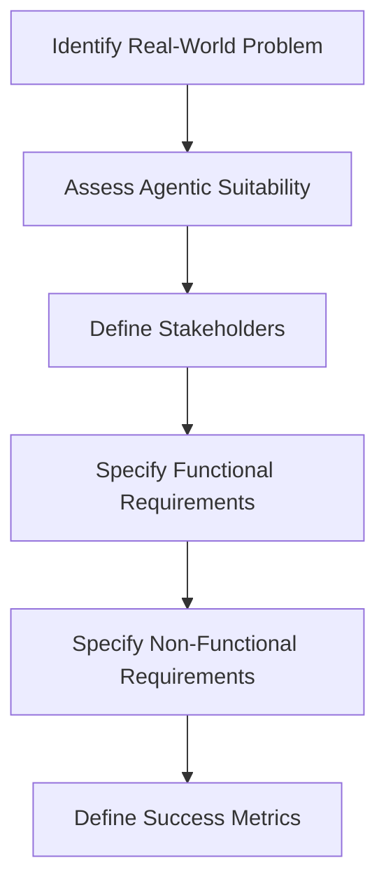
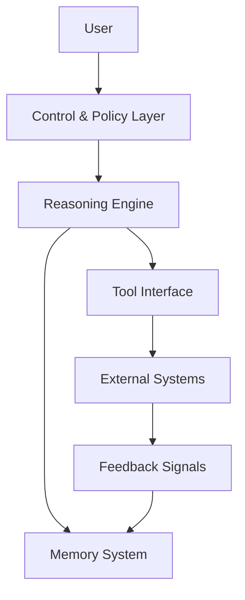
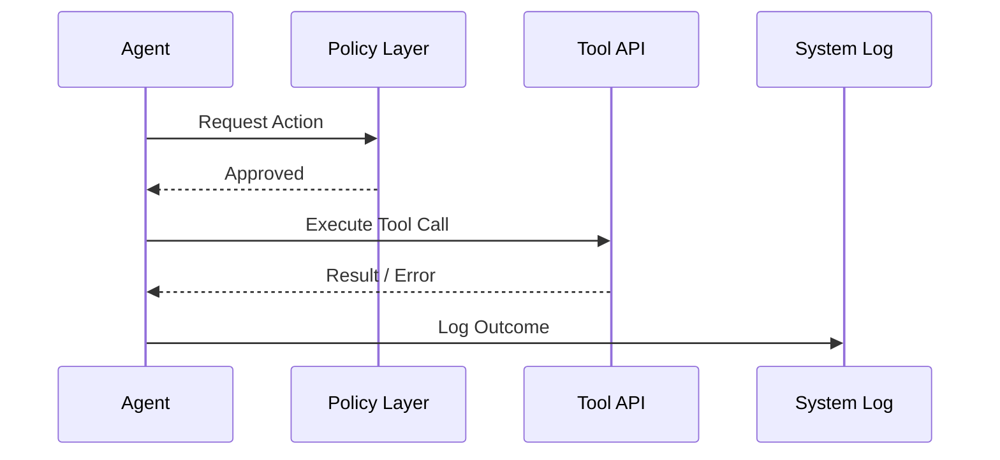
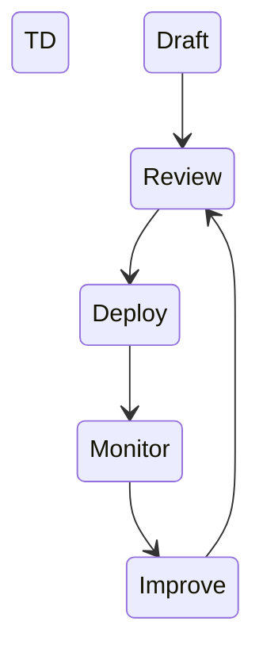
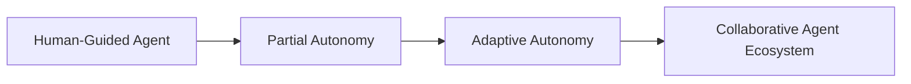

# Advanced Applications and Future Directions: Capstone: Designing an End-to-End Agentic System

## Learning Objectives

- Design a complete agentic system from concept to evaluation
- Justify architectural and ethical design choices
- Critically assess system performance and improvement paths

---

## Introduction

This capstone chapter synthesizes all prior learning through the design and evaluation of a complete Agentic AI system.

---

# Advanced Applications and Future Directions  

---

## Capstone: Designing an End-to-End Agentic System

---

This capstone chapter brings together everything learned throughout your journey into Agentic AI and applies it in a practical, holistic way. Rather than focusing on individual techniques or components in isolation, this chapter challenges you to **design, justify, and evaluate a complete end-to-end agentic system**—from identifying a real-world problem to planning future enhancements.

Agentic systems are more than just large language models wrapped in code. They involve **goal formulation, planning, tool use, memory, feedback loops, safety constraints, and governance mechanisms** working together coherently. Designing such a system requires not only technical understanding, but also thoughtful reasoning about trade-offs, ethics, reliability, and long-term evolution.

Think of this chapter as the equivalent of an architectural capstone in engineering or a final studio project in design. By the end, you should be able to confidently explain **why your system is designed the way it is**, **how it operates**, and **how it could be improved responsibly over time**.

---

By the end of this chapter, you will be able to:

- Design a complete agentic system from problem definition to evaluation
- Translate real-world needs into clear system requirements and success metrics
- Justify architectural, implementation, and ethical design choices
- Critically assess system performance, risks, and improvement paths
- Reflect on future directions for scaling, autonomy, and governance in agentic AI

---

## Problem Selection and Requirement Analysis

Designing an effective agentic system starts long before any code is written. The most important early decision is **choosing the right problem**—one that genuinely benefits from agentic behavior rather than simple automation or a single model inference.

A good agentic problem typically has **open-ended goals, dynamic environments, multiple steps, and uncertainty**. For example, a customer support chatbot that only answers FAQs may not need an agentic architecture. In contrast, a system that triages support tickets, gathers missing information, escalates issues, and learns from outcomes is a strong candidate for agentic design. The agent must make decisions, adapt to context, and coordinate actions over time.

Once a problem is selected, requirement analysis translates a vague idea into **clear, testable expectations**. This includes understanding stakeholders, defining success criteria, and identifying constraints. A useful analogy is building a house: before choosing materials or floor plans, you must understand who will live there, how the space will be used, and what limitations exist (budget, location, regulations).

### Functional vs. Non-Functional Requirements

Requirements can be broadly divided into two categories, both equally important.

| Requirement Type | Description | Example in an Agentic System |
|------------------|-------------|-------------------------------|
| Functional | What the system should do | Generate plans, call tools, ask clarifying questions |
| Non-Functional | How the system should behave | Response time, reliability, safety, transparency |

Functional requirements describe **capabilities**, while non-functional requirements describe **qualities**. An agent that produces correct plans but takes five minutes per decision may be unusable in practice.

### Stakeholder and Environment Analysis

Understanding the broader context helps prevent misalignment later.

- **Primary users**: Who interacts directly with the agent?
- **Secondary stakeholders**: Who is affected indirectly (e.g., customers, regulators)?
- **Operational environment**: APIs, data sources, latency constraints, legal boundaries

Consider a healthcare triage agent. Its environment includes electronic health records, clinical guidelines, and regulatory constraints like HIPAA. These factors heavily shape what the agent can and cannot do.

### Example Problem Definition

> *Design an agentic system that assists small business owners by monitoring cash flow, forecasting risks, suggesting actions, and executing approved financial tasks.*

This problem requires planning, tool use, long-term memory, and human-in-the-loop approval—making it ideal for a capstone agentic system.

---

### Problem Framing Flow

---

## System Architecture and Design Decisions

Once requirements are clear, the next step is translating them into a **coherent system architecture**. Architecture defines how components interact, where intelligence lives, and how control flows through the system. Good architecture makes systems understandable, extensible, and safe.

At a high level, most agentic systems consist of a **core reasoning loop** supported by memory, tools, and control mechanisms. The central design question is not “Which model is best?” but rather **“How should responsibilities be distributed?”** Overloading a single component leads to brittle systems, while overly fragmented designs increase complexity.

A helpful mental model is to think of the agent as a team rather than a single worker. One component reasons, another stores knowledge, another executes actions, and a supervisor enforces rules.

### Core Architectural Components

| Component | Role | Design Considerations |
|----------|------|-----------------------|
| Reasoning Engine | Interprets goals and decides next actions | Model choice, prompt design, reasoning style |
| Memory System | Stores context, history, and learned knowledge | Short-term vs. long-term, retrieval strategy |
| Tool Interface | Executes actions in the external world | Security, error handling, observability |
| Control & Policy Layer | Enforces constraints and approvals | Safety rules, human oversight |
| Feedback Loop | Evaluates outcomes and updates behavior | Metrics, learning cadence |

Each component should have a **clear responsibility**. For example, memory should not decide actions, and the reasoning engine should not directly bypass safety checks.

### Centralized vs. Modular Architectures

Different architectural styles suit different problems.

| Architecture Style | Strengths | Trade-offs |
|--------------------|-----------|------------|
| Centralized Agent | Simple, fast to prototype | Hard to scale, less interpretable |
| Modular Agents | Clear separation of concerns | More coordination complexity |
| Hierarchical Agents | Scales well for complex tasks | Requires careful orchestration |

For the cash-flow assistant example, a **hierarchical architecture** works well: a high-level planner sets goals, while specialized sub-agents handle forecasting, reporting, and execution.

### Architectural Overview Diagram

This diagram highlights an important principle: **no direct path from reasoning to execution without policy checks**.

---

## Implementation and Integration Planning

With architecture defined, attention shifts to **how the system will actually be built and integrated**. Implementation planning is about sequencing work, managing dependencies, and reducing risk through incremental development.

A common mistake is attempting to build the entire agent at once. Instead, successful teams adopt a **layered and iterative approach**, validating assumptions early. For example, before implementing long-term memory, you might test whether short-term context alone achieves acceptable performance.

Integration planning is equally critical. Agentic systems rarely operate in isolation; they depend on APIs, databases, user interfaces, and monitoring tools. Each integration point introduces potential failure modes that must be anticipated.

### Phased Implementation Strategy

| Phase | Focus | Outcome |
|------|-------|---------|
| Prototype | Core reasoning loop | Proof of concept |
| Expansion | Memory and tools | Functional agent |
| Hardening | Safety and reliability | Production readiness |
| Optimization | Performance and cost | Scalable deployment |

Each phase should end with **explicit validation criteria**, such as task success rates or user satisfaction scores.

### Tool Integration and Error Handling

Tools are how agents act in the world, but they are also a major source of risk. APIs fail, inputs are malformed, and outputs may be ambiguous. Robust agents treat tools as **unreliable collaborators**, not infallible functions.

Best practices include:

- Explicit tool contracts (inputs, outputs, failure modes)
- Retry and fallback strategies
- Logging every tool invocation for auditability

### Integration Sequence Diagram

This sequence emphasizes governance even during routine actions.

---

## Evaluation, Safety, and Governance

Evaluation is not an afterthought—it is an ongoing process that shapes how an agent evolves. Unlike traditional software, agentic systems can behave unpredictably, making **continuous evaluation and governance essential**.

Evaluation begins with defining **what “good” looks like**. Metrics should align with the original requirements and capture both performance and risk. For example, task completion rate alone is insufficient if the agent occasionally produces unsafe actions.

### Evaluation Dimensions

| Dimension | Example Metrics | Why It Matters |
|---------|----------------|----------------|
| Effectiveness | Task success rate | Measures usefulness |
| Efficiency | Time, cost per task | Impacts scalability |
| Safety | Policy violations | Prevents harm |
| Transparency | Explainability scores | Builds trust |

Evaluation should combine **automated tests, simulations, and human review**. No single method is sufficient on its own.

### Safety Mechanisms

Safety in agentic systems is multi-layered:

- **Pre-action checks**: Validate plans before execution
- **Runtime monitoring**: Detect anomalous behavior
- **Post-hoc review**: Analyze logs and outcomes

Human-in-the-loop controls are especially important for high-impact actions, such as financial transactions or medical recommendations.

### Governance Lifecycle Diagram

This lifecycle reinforces that governance is **continuous**, not a one-time gate.

---

## Reflection and Future Enhancements

Designing an end-to-end agentic system is as much about reflection as it is about execution. After deployment and evaluation, teams should step back and ask: **What assumptions held true, and which did not?** This reflective practice distinguishes mature agentic systems from experimental prototypes.

One key reflection area is **autonomy calibration**. Early systems often start with limited autonomy and heavy oversight. Over time, as confidence grows, certain decisions may be safely automated. This gradual expansion reduces risk while enabling greater efficiency.

Future enhancements often fall into three categories:

| Enhancement Area | Example Improvements | Impact |
|------------------|----------------------|--------|
| Intelligence | Better planning, reasoning | Higher task success |
| Infrastructure | Caching, batching, scaling | Lower cost, latency |
| Governance | Adaptive policies | Safer autonomy |

Another important direction is **learning from experience**. Incorporating feedback loops that allow agents to refine strategies—while staying within governance boundaries—is an active area of research and practice.

### Future Roadmap Visualization

This roadmap highlights a realistic progression rather than a sudden leap to full autonomy.

---

## Summary

In this capstone chapter, you designed a complete agentic system from the ground up. You began by selecting an appropriate problem and translating it into clear requirements. You then crafted a thoughtful architecture, planned implementation and integration, and established robust evaluation and governance mechanisms. Finally, you reflected on lessons learned and future directions.

The key takeaway is that **agentic system design is a socio-technical discipline**. Technical excellence must be balanced with ethical judgment, safety considerations, and long-term adaptability. Mastery comes not from any single component, but from how all parts work together responsibly.

---

## Reflection Questions

1. What characteristics make a problem well-suited (or poorly suited) for an agentic system?
2. Which architectural trade-offs did you find most challenging to justify, and why?
3. How would your evaluation strategy change if the system operated in a high-risk domain?
4. Where should human oversight remain mandatory, even as autonomy increases?
5. If you revisited this system in two years, what would you upgrade first—and why?

---